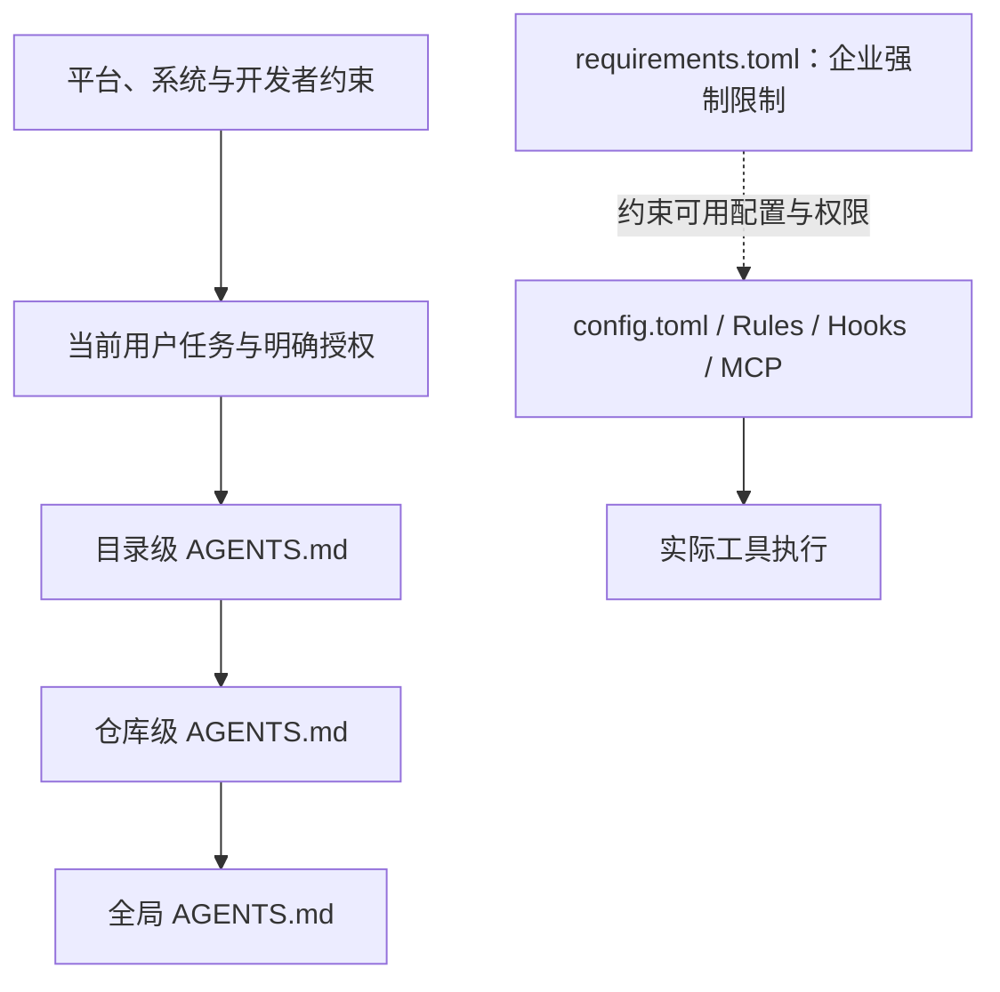

# Codex 可配置入口地图

本页帮助工程师按“要解决的问题”选择 Codex 的配置入口，形成系统的提示词优化认知。它是维护者导航，不是每次任务都应加载的运行时规则。

## 先按目标选择，而不是先写 Prompt

| 想达成的目标 | 首选入口 | 不宜使用 |
| --- | --- | --- |
| 只影响当前 task 的目标、背景、验收条件或一次性限制 | 当前 Prompt / task | 全局文件、Skill。 |
| 所有仓库都适用的沟通、证据与协作习惯 | 全局 `AGENTS.md` | 仓库的技术规范或业务事实。 |
| 团队约定、仓库命令、代码入口、模块或架构边界 | 仓库/目录 `AGENTS.md` | 个人全局配置。 |
| 客户端默认模型、权限、沙箱、MCP、功能开关或 Profile | `config.toml` | `AGENTS.md`。 |
| 高频、可识别且有固定步骤的工作流 | Skill | 超长 `AGENTS.md` 或重复 Prompt。 |
| 需要分发的 Skills、MCP、Hook、资源和安装元数据 | Plugin | 手工复制多份本地配置。 |
| 从外部系统取数或在外部系统执行动作 | MCP / connector | 在 Prompt 中描述接口细节或复制敏感数据。 |
| 工具调用前后必须机械执行的检查 | Hook | 仅靠模型遵守的自然语言规则。 |
| 某类命令必须自动允许、每次确认或禁止 | `.rules` | 宽泛的 `AGENTS.md` 命令约束。 |
| 企业级不可绕过的安全与访问限制 | `requirements.toml` | 用户级配置。 |
| 跨 task 保留的有用背景 | Memories | 业务规则、密钥或需要严格执行的流程。 |
| 定时提醒、巡检或后续跟进 | Automation | 常驻 Prompt。 |

核心边界是：`AGENTS.md` 约束行为，Skill 封装流程，MCP 提供数据与动作，Hook/Rules 实施机械约束，`config.toml` 配置客户端运行方式。它们互补，不互相替代。

## 配置层与优先级

上图只描述通常的决策关系：不同类型配置有各自的合并和限制规则，不能把所有文件理解成单一的文本优先级。尤其是 `requirements.toml` 约束安全敏感设置，命令 Rules 以更严格的结果为准；它们不是“更长的 Prompt”。

### 1. 当前 Prompt / task

用于本次需求本身：目标、背景、影响范围、验收方式和一次性约束。它优先于持久项目指令，但不应重写安全边界或让模型把假设当作事实。对于排障，用户给出的猜测应明确写成线索，例如“请核实 A 是否导致 B”，而不是“根因是 A”。

### 2. `AGENTS.md`：持久指令

| 层级 | 位置 | 重点 |
| --- | --- | --- |
| 全局 | `~/.codex/AGENTS.md` | 个人协作偏好、证据标准、沟通方式。 |
| 项目 | `<repo>/AGENTS.md` | 团队命令、架构与交付规则、代码导航。 |
| 目录 | `<repo>/<subdir>/AGENTS.md` | 模块专属边界和例外。 |
| 临时覆盖 | 同层 `AGENTS.override.md` | 短期覆盖，完成后应删除。 |

Codex 会从全局开始，再从仓库根目录走到当前工作目录；更靠近工作目录的项目指令后合并。文件应短、具体、可执行。用它记录重复出现的误解和审查反馈，但不要把详细流程、产品资料或大段文档复制进去。详见 [全局 `AGENTS.md` 指南](global-agents-guidance.md)。

### 3. `config.toml`：客户端默认行为

常用位置为 `~/.codex/config.toml`；受信任项目可以在 `<repo>/.codex/config.toml` 提供项目覆盖。全局文件适合个人默认的模型、推理强度、审批/沙箱偏好、MCP、Profile、功能开关及日志/通知等客户端设置；项目文件只应放确实需要团队共享的项目默认值。

项目配置不能覆盖机器本地的认证、模型提供商、通知和遥测等敏感或机器级设置。使用 `config.toml` 时优先查阅当前版本的配置参考，不要从旧示例猜测键名或合并方式。

### 4. Skill：可复用的任务方法

当同一类任务反复需要“先读什么、怎么核实、调用哪些工具、输出什么”时，创建或安装一个 Skill。Skill 的描述负责让 Codex 知道何时使用，`SKILL.md` 负责完整流程，还可带参考资料、模板和脚本。

示例：Spring 事故诊断、跨服务链路上下文加载、发布前审查。它比把多页步骤放进全局或项目 `AGENTS.md` 更节省默认上下文，也更不容易让无关任务被重流程拖慢。

### 5. Plugin：分发组合能力

Plugin 是可安装的分发单元，可打包 Skill，并按需包含 MCP、Hook、资源、应用或市场元数据。团队希望共享一个完整工作流时优先 Plugin；仅个人单机实验时可以从普通本地 Skill 或 `config.toml` 开始。安装插件前应审查其包含的工具、数据访问范围和触发条件。

### 6. MCP：外部数据与动作

MCP server 为 Codex 提供受控工具，例如查询文档、工单、代码托管平台或内部系统。它解决“模型需要什么实时事实或要执行什么外部动作”，不解决“应该以什么步骤推理”。每增加一个 MCP 都会占用上下文并扩大访问面，因此只启用确有工作流价值的服务，并按最小权限配置认证与审批。

### 7. Hook 与 `.rules`：把可机械约束交给机制

Hook 在会话、用户提交、工具调用前后等生命周期事件运行命令，可用于格式校验、敏感信息检查、审计或阻止不符合策略的动作。它适合可以稳定自动判断的条件，须使用确定性、快速且安全的脚本。

`.rules` 用于命令执行策略：按命令前缀决定允许、提示确认或禁止。它适合“哪些命令可免确认”“哪些命令绝不允许”，不适合描述业务语义。规则文件通常位于活动配置层的 `rules/` 下；多个规则匹配时以更严格的决定为准。

### 8. `requirements.toml`：组织强制策略

这是管理员或终端管理渠道使用的约束层，用于审批模式、沙箱、权限配置、网络、Hook、MCP 与命令 Rules 等安全敏感项。它的目标是强制边界而非改善措辞；普通开发者不应尝试用个人 `config.toml` 绕过它。

### 9. Memories、Automation 与已弃用 Custom Prompts

Memories 适合跨 task 的有用上下文和偏好，不保证像 `AGENTS.md` 一样成为严格指令，不能存放团队规范或敏感信息。Automation 用于定时任务、提醒、监控和后续推进；它解决时间维度，不取代 Skill 或项目规则。官方文档已将 Custom Prompts 标记为 deprecated；新的可复用工作流优先使用 Skill。

## 面向提示词优化的落地路径

1. 先把一次 task 说清楚：目标、范围、验收和已知线索。
2. 同一沟通或证据问题在多个仓库重复出现，再加入全局 `AGENTS.md`。
3. 同一代码库的重复错误、命令或模块边界，加入该仓库最近的 `AGENTS.md`。
4. 同一任务链路反复出现，固化为 Skill；需要团队安装和工具组合时打包为 Plugin。
5. 能由机器判定的事情交给测试、CI、Hook 或 `.rules`，不要只用提示词要求“务必遵守”。
6. 涉及外部实时事实时配置最小权限的 MCP，而不是让模型凭记忆推断。
7. 每次新增入口后，用非敏感的真实场景验证：是否被正确触发、是否减少误判、是否没有增加无关上下文或权限。

## 证据与更新

本文依据 2026-08-03 获取的 Codex 官方手册整理。主要入口与行为应随客户端版本核对：

- [Customization](https://learn.chatgpt.com/docs/customization/overview.md)
- [Custom instructions with AGENTS.md](https://learn.chatgpt.com/docs/agent-configuration/agents-md.md)
- [Configuration basics](https://learn.chatgpt.com/docs/config-file/config-basic)
- [Rules](https://learn.chatgpt.com/docs/agent-configuration/rules)
- [Hooks](https://learn.chatgpt.com/docs/hooks)
- [Model Context Protocol](https://learn.chatgpt.com/docs/extend/mcp)
- [Managed configuration](https://learn.chatgpt.com/docs/enterprise/managed-configuration)
