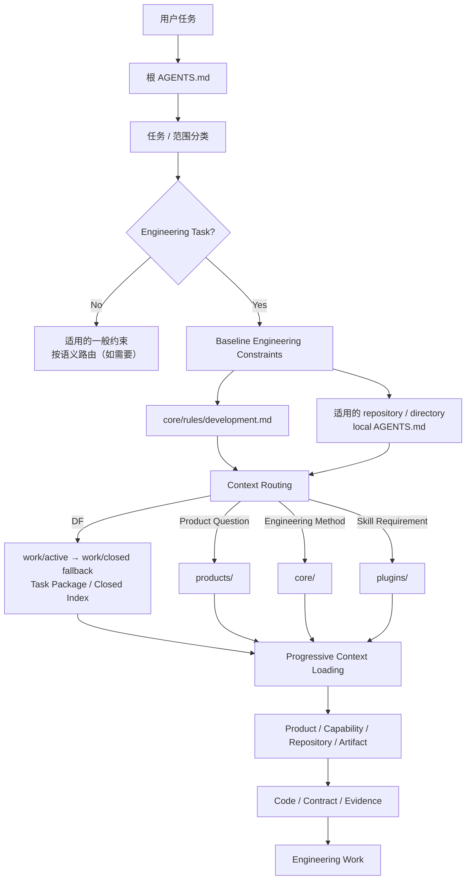
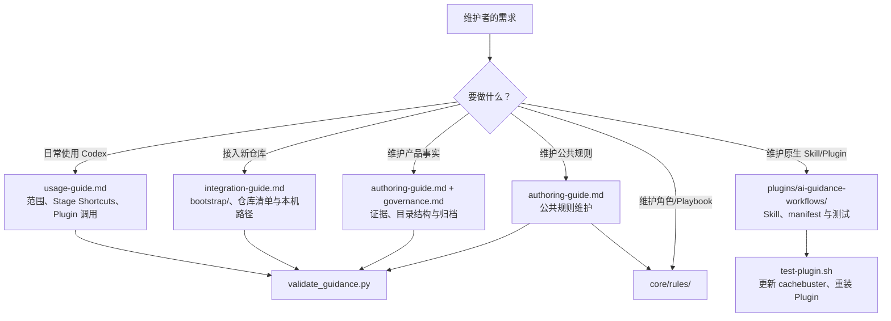

# 项目导航与维护地图

本页面面向使用或维护 `tu-engineering-workbench` 的工程师，用于理解项目骨架、两条协作链路和扩展入口。它不是 Codex 的默认上下文；AI 的运行时入口始终是根 [`AGENTS.md`](../../AGENTS.md)。

## 两条链路

### 1. AI 运行时加载链路



核心原则：根目录 `AGENTS.md` 是 Runtime 入口，先完成范围、语义与“是否工程任务”的分类。工程任务随后加载 `development.md` 与适用 local `AGENTS.md` 作为 **Baseline Constraints**，再进行 **Context Routing**；DF 是 Context Address，不会跳过工程基准。这里的 Constraint First 是逻辑 Authority 层级，不要求所有任务机械读取所有文档。Routing 只找到最小相关入口，之后才渐进加载 Product、Capability、Repository 或 Artifact，并以代码、契约、配置、测试和可复现证据核实现状。非工程任务不强制加载 `development.md`，仍遵循已适用的一般约束。该图仅供维护者理解，Codex 实际遵循平台、系统、开发者指令和各级 `AGENTS.md`；P0 不会因被设为 Primary 而自动成为目标代码的阅读或修改范围。

#### 第 3 节判定矩阵：什么情况下读取什么

判定顺序是固定的：先完成范围和“是否工程任务”的判断，再叠加下表中**所有命中的条件**。条件清晰时按表读取；仅出现项目标记、示例文字或模糊词语而无法判断服务关系时，不扩大读取范围，应先确认。

| 任务信号 | 除公共约束外，必须读取 | 不默认读取 | 示例 |
| --- | --- | --- | --- |
| 纯问答、纯文案、会议纪要等非工程任务 | 已适用的局部 `AGENTS.md`（如有） | `development.md`、产品目录、Core 工作流 | “解释这段错误信息的含义，不修改代码。” |
| 单项目工程任务，且没有明确服务边界 | `core/rules/development.md`、目标仓库/目录的局部 `AGENTS.md`、相关代码/调用方/契约/测试 | 其他仓库源码、产品目录、治理和使用文档 | “P1：给现有接口增加一个校验字段。” |
| 自然语言任务，或可选 `Explore` / `Plan` / `Execute` / `Verify` Stage Shortcut | 按任务语义、风险和阶段选择最小必要的 Core 角色、Playbook、Skill 与验证 | 无关角色、Playbook、Skill 与产品上下文 | “`P1 Explore：梳理状态缓存调用链，不修改代码。`”只加载所需探索上下文。 |
| 显式调用 `tu-` Skill，或任务语义命中其描述 | 该 Skill 的 `SKILL.md` 及其要求的最小上下文 | 其他 `tu-` Skill | “`$ai-guidance-workflows:tu-diagnosing-spring-backend-incidents`”只加载该诊断 Skill。 |
| 明确涉及 P1–P4、P3-1 的 API、消息、数据归属、协议、MQTT、OSD、视频流媒体链路或跨服务发布 | 产品 `index.md`，再沿链接读取当前已维护的最小 Flow 或仓库入口资料；未覆盖场景以受影响仓库的局部约束、代码、契约和配置核实 | 整个产品目录、未受影响服务的源码 | “P1 通过 P3-1 管理视频资源并获取播放地址。” |
| 仅写了多个项目标记，但未说明交互边界 | 已明确范围内项目各自的局部约束；服务关系不明时先确认 | 不自动加载 P1–P4、P3-1 全局上下文 | “P1、P2 帮我看看这个问题。” |
| 维护 P0 运行时入口、`core/` 规则、角色、工作流或契约 | `docs/governance/authoring-guide.md` 的“公共规则维护”及受影响文件 | 产品知识、治理规范、使用教程 | “调整 `development.md` 的验证规则。” |
| 维护 P0 产品知识、架构、流程、服务边界或 Delivery State | `docs/governance/authoring-guide.md`、`docs/governance/governance.md` 与受影响的权威页面 | 其他产品目录和所有使用教程 | “拆分 DJI OSD 上行与指令下行流程文档。” |
| 修改 P0 工具、脚本、校验或团队 Plugin | 工程基准、目标目录 README、实现和测试；Plugin 还读取 manifest、相关 `SKILL.md` 和 `tests/test-plugin.sh` | 产品知识、知识编写规范、无关 Plugin | “调整 guidance 校验脚本以检查一个新字段。” |

因此，“是否会读取某份信息”不是靠图本身决定，而是靠用户任务中可辨认的范围和语义条件决定。例如，单写“P1 修复接口”不会让 AI 读取 DJI 产品链路；补充“该接口向 P2 下发 DJI 指令”后，跨服务条件命中，才会读取对应产品入口、下行 Flow 及受影响服务的最小代码上下文。

### 2. 工程师使用与维护链路



核心原则：面向工程师的使用说明和维护规范放在 `README.md`、`docs/`；面向 AI 的最小运行时约束放在 `AGENTS.md` 与按需加载的 Core、产品知识、原生 Skill 中。不要把工程师使用说明反向塞进 AI 默认上下文。

## 项目骨架与职责

| 位置 | 职责 | 何时进入或修改 |
| --- | --- | --- |
| 根目录 `AGENTS.md` | P0 公共运行时入口：范围、可选 Stage Shortcuts、条件读取、优先级与事实边界 | 调整跨仓库且长期稳定的 AI 加载或协作规则时。 |
| `core/` | 跨产品复用的 Kernel、角色、规则、Playbook、契约 | 需要通用方法而非产品事实时；遵循渐进式加载。 |
| `products/` | 已有证据支撑的产品、服务边界、链路与决策 | 改变长期入口、服务/数据边界、公开契约或端到端流程时。 |
| `work/` | Delivery Change State：`active/` 的完整当前 Package、`closed/` 的薄索引与按需访问的 cold history | 推进、继续、关闭或回溯真实需求时；显式 Product Truth Sync 可同步独立成立的结论，Closing 对 Delivery 最终 reconciliation。 |
| `docs/` | 仅供工程师按需查阅的使用、接入、编写、治理和项目导航 | 调整工程师使用方式、维护入口或知识治理规则时。 |
| `bootstrap/` | 目标仓库接入 P0 的 `AGENTS.md` 与清单模板 | 接入新仓库或修订接入模板时。 |
| `scripts/`、`tests/` | 文档结构、链接、路径和契约的校验实现 | 调整校验能力或修复校验问题时。 |
| `core/registry/repositories.yaml` | 已登记项目标记、仓库身份与产品绑定的唯一来源 | 新增或调整工程注册时；同步校验本机路径模板。 |
| `core/registry/environments.yaml` | Logical Environment、产品绑定与 runtime model 的 committed registry | 新增逻辑环境或维护已验证的运行模型时；不记录物理主机或连接参数。 |
| `workspace.example.yaml` / `workspace.local.yaml` | 可提交的路径模板 / 不提交的本机绝对路径映射 | 接入或移动本机工作区时；不得把本机路径写入可提交模板。 |
| `runtime.example.yaml` / `runtime.local.yaml` | 可提交的 Runtime binding 模板 / 不提交的 Shortcut 到本机 SSH alias 绑定 | 新电脑配置或新增本机 Runtime Target 时；不记录 Host、User 或 key。 |
| `products/**/runtime/` | 已验证、长期且非敏感的 Runtime Knowledge | 维护 Repository ↔ Runtime、部署架构、中间件边界或 observability 事实时。 |
| `.runtime.local/` | 不提交的物理 Runtime Snapshot | 只读勘察后保存当时容器、端口、镜像、挂载和日志路径等易变事实。 |
| `.agents/plugins/marketplace.json` | 团队 Plugin 市场清单；仓库根目录是市场根目录 | 新增 Plugin、调整市场元数据或重新配置本地市场时。 |
| `plugins/ai-guidance-workflows/` | 团队原生 Codex Skill 与 Plugin 测试 | 新增、修改或重命名团队 Skill 时。 |

## 常见维护入口

| 目标 | 首先阅读 | 主要修改位置 | 必做核对 |
| --- | --- | --- | --- |
| 使用自然语言、Stage Shortcut 或团队 Skill | [工程师使用与维护指南](usage-guide.md) | 通常无需修改 | Stage Shortcut 是可选加速器；安装 Plugin 后新建 Codex 任务以重新发现 Skill。 |
| 接入新服务仓库 | [接入指南](integration-guide.md) | `bootstrap/`、仓库清单、目标仓库局部 `AGENTS.md`、本机映射 | 不猜测路径或产品绑定；运行 guidance 校验。 |
| 补充产品链路、边界或决策 | [编写指南](../governance/authoring-guide.md)、[治理规范](../governance/governance.md) | `products/` 中最小必要的权威页面 | 记录证据和可信度；不以文档替代代码核实。 |
| 修改跨仓库公共规则 | [编写指南](../governance/authoring-guide.md) 的“公共规则维护” | `AGENTS.md` 或 `core/` | 保持条件、动作、例外清晰；避免加入产品事实。 |
| 新增或更新团队 Skill | [工程师使用与维护指南](usage-guide.md) 的 Plugin 章节 | `plugins/ai-guidance-workflows/skills/` | 更新引用和测试；更新 cachebuster、重装 Plugin，并在新任务验证发现结果。 |
| 修改校验脚本或结构规则 | 受影响脚本与测试 | `scripts/`、`tests/` 或 Plugin 测试 | 运行对应校验；不把校验器当作产品事实来源。 |

## 扩展原则

1. 先判断新增内容属于运行时约束、通用方法（Playbook）、产品事实、Delivery State、维护者说明、接入模板还是原生 Skill；只放入一个权威位置，其他位置用链接导航。
2. 新增运行时读取规则时，明确触发条件、最小读取集和不默认读取的内容，避免扩大每个任务的上下文。
3. 新增产品事实时，先取得代码、契约、测试或批准记录等可复现证据；不确定内容标为 `pending_verification` 或 `unknown`。
4. 新增原生 Skill 时，保持触发描述具体、正文精炼，并同步 Plugin 测试、使用说明和更新安装后的发现流程。
5. 每次维护后，运行与改动相称的校验；文档结构变更至少执行：

   ```powershell
   python scripts/validate_guidance.py --repo-root .
   git diff --check
   ```

## 维护边界速查

- AI 默认阅读：根目录 `AGENTS.md`、当前任务触发的局部约束和最小必要上下文。
- 工程师按需阅读：`README.md`、`docs/`、接入与治理说明、项目导航页。
- 当前事实：代码、契约、配置、测试和可复现命令结果。
- 长期知识：经证据支撑的产品入口、链路、边界和设计决策。
- Delivery Change State：真实需求的完整当前上下文与薄历史索引；显式 Product Truth Sync 可将独立成立的验证结论进入 Current Product Truth，Delivery Closing 负责最终 reconciliation。
- 不应进入产品 Current Truth：密钥、敏感运行数据、全量环境配置、未经核实猜测和一次性排查细节。
