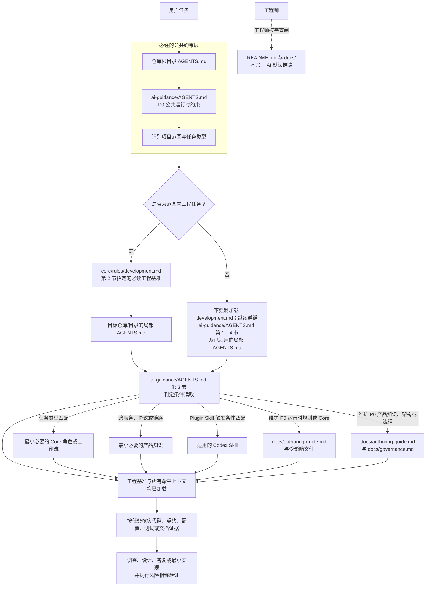
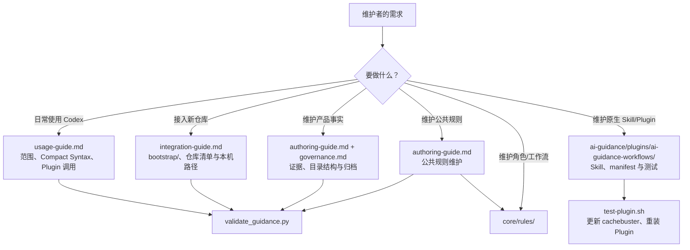

# 项目导航与维护地图

本页面面向使用或维护 `tu-devkit` 与 `ai-guidance` 的工程师，用于理解项目骨架、两条协作链路和扩展入口。它不是 Codex 的默认上下文；AI 的运行时入口始终是 [`../AGENTS.md`](../AGENTS.md)。

## 两条链路

### 1. AI 运行时加载链路



核心原则：仓库根目录 `AGENTS.md`、`ai-guidance/AGENTS.md` 与范围识别构成**必经的公共约束层**；它们不是条件加载项。范围内工程任务必须读取 `ai-guidance/AGENTS.md` 第 2 节指定的 `core/rules/development.md`；第 3 节只判定需要叠加读取哪些专项 Core、产品知识、维护规范或原生 Skill，命中多个条件时不是相互替代。`development.md` 只提供分析、实施、验证与交接的公共执行基准，不负责跨服务等条件分支。非工程任务并非没有约束：至少继续遵循 `ai-guidance/AGENTS.md` 第 1 节的范围规则和第 4 节的指令优先级、事实与安全边界，以及任何已经适用的局部 `AGENTS.md`；它只是不会因此被强制要求加载 `development.md`。该图仅供维护者理解，Codex 实际遵循的是平台、系统、开发者指令和各级 `AGENTS.md`，不会因这张位于 `docs/` 的图而执行额外操作。产品文档用于导航，当前代码、契约、配置和测试才用于核实现状。P0 提供公共约束，不会因被设为 Primary 而自动成为目标代码的阅读或修改范围。

#### 第 3 节判定矩阵：什么情况下读取什么

判定顺序是固定的：先完成范围和“是否工程任务”的判断，再叠加下表中**所有命中的条件**。条件清晰时按表读取；仅出现项目标记、示例文字或模糊词语而无法判断服务关系时，不扩大读取范围，应先确认。

| 任务信号 | 除公共约束外，必须读取 | 不默认读取 | 示例 |
| --- | --- | --- | --- |
| 纯问答、纯文案、会议纪要等非工程任务 | 已适用的局部 `AGENTS.md`（如有） | `development.md`、产品目录、Core 工作流 | “解释这段错误信息的含义，不修改代码。” |
| 单项目工程任务，且没有明确服务边界 | `core/rules/development.md`、目标仓库/目录的局部 `AGENTS.md`、相关代码/调用方/契约/测试 | 其他仓库源码、产品目录、治理和使用文档 | “P1：给现有接口增加一个校验字段。” |
| 使用 `F`、`B`、`R`、`A`、`X` 等 Compact Syntax 类型 | 该类型对应的最小 Core 角色或工作流 | 其他类型的角色和工作流 | “`R P1 g: ...`”只加载重构所需工作流，不加载缺陷排查工作流。 |
| 显式调用 `tu-` Skill，或任务语义命中其描述 | 该 Skill 的 `SKILL.md` 及其要求的最小上下文 | 其他 `tu-` Skill | “`$ai-guidance-workflows:tu-diagnosing-spring-backend-incidents`”只加载该诊断 Skill。 |
| 明确涉及 P1–P4、P3-1 的 API、消息、数据归属、协议、MQTT、OSD、视频流媒体链路或跨服务发布 | 产品 `index.md`，再沿链接读取当前已维护的最小 Flow 或仓库入口资料；未覆盖场景以受影响仓库的局部约束、代码、契约和配置核实 | 整个产品目录、未受影响服务的源码 | “P1 通过 P3-1 管理视频资源并获取播放地址。” |
| 仅写了多个项目标记，但未说明交互边界 | 已明确范围内项目各自的局部约束；服务关系不明时先确认 | 不自动加载 P1–P4、P3-1 全局上下文 | “P1、P2 帮我看看这个问题。” |
| 维护 P0 运行时入口、`core/` 规则、角色、工作流、契约或模板 | `docs/authoring-guide.md` 的“公共规则维护”及受影响文件 | 产品知识、治理规范、使用教程 | “调整 `development.md` 的验证规则。” |
| 维护 P0 产品知识、架构、流程、服务边界或任务记录 | `docs/authoring-guide.md`、`docs/governance.md` 与受影响的权威页面 | 其他产品目录和所有使用教程 | “拆分 DJI OSD 上行与指令下行流程文档。” |
| 修改 P0 工具、脚本、校验或团队 Plugin | 工程基准、目标目录 README、实现和测试；Plugin 还读取 manifest、相关 `SKILL.md` 和 `tests/test-plugin.sh` | 产品知识、知识编写规范、无关 Plugin | “调整 guidance 校验脚本以检查一个新字段。” |

因此，“是否会读取某份信息”不是靠图本身决定，而是靠用户任务中可辨认的范围和语义条件决定。例如，单写“P1 修复接口”不会让 AI 读取 DJI 产品链路；补充“该接口向 P2 下发 DJI 指令”后，跨服务条件命中，才会读取对应产品入口、下行 Flow 及受影响服务的最小代码上下文。

### 2. 工程师使用与维护链路



核心原则：面向工程师的使用说明和维护规范放在 `README.md`、`docs/`；面向 AI 的最小运行时约束放在 `AGENTS.md` 与按需加载的 Core、产品知识、原生 Skill 中。不要把工程师使用说明反向塞进 AI 默认上下文。

## 项目骨架与职责

| 位置 | 职责 | 何时进入或修改 |
| --- | --- | --- |
| 根目录 `AGENTS.md` | 将 Codex 引导到 `ai-guidance/AGENTS.md` | 调整 P0 的唯一 AI 协作入口时。 |
| `ai-guidance/AGENTS.md` | 公共运行时入口：范围、任务简写、条件读取、优先级与事实边界 | 调整跨仓库且长期稳定的 AI 加载或协作规则时。 |
| `ai-guidance/core/` | 跨产品复用的角色、规则、工作流、契约和模板 | 需要通用方法而非产品事实时；遵循渐进式加载。 |
| `ai-guidance/products/` | 已有证据支撑的产品、服务边界、链路、决策和任务历史 | 改变长期入口、服务/数据边界、公开契约或端到端流程时。 |
| `ai-guidance/docs/` | 仅供工程师按需查阅的使用、接入、编写、治理和项目导航 | 调整工程师使用方式、维护入口或知识治理规则时。 |
| `ai-guidance/bootstrap/` | 目标仓库接入 P0 的 `AGENTS.md` 与清单模板 | 接入新仓库或修订接入模板时。 |
| `ai-guidance/scripts/`、`tests/` | 文档结构、链接、路径和契约的校验实现 | 调整校验能力或修复校验问题时。 |
| `workspace.example.yaml` / `workspace.local.yaml` | 可提交的路径模板 / 不提交的本机绝对路径映射 | 接入或移动本机工作区时；不得把本机路径写入可提交模板。 |
| `ai-guidance/.agents/plugins/marketplace.json` | 团队 Plugin 市场清单；`ai-guidance/` 是市场根目录 | 新增 Plugin、调整市场元数据或重新配置本地市场时。 |
| `ai-guidance/plugins/ai-guidance-workflows/` | 团队原生 Codex Skill 与 Plugin 测试 | 新增、修改或重命名团队 Skill 时。 |

## 常见维护入口

| 目标 | 首先阅读 | 主要修改位置 | 必做核对 |
| --- | --- | --- | --- |
| 使用 Compact Syntax 或团队 Skill | [工程师使用与维护指南](usage-guide.md) | 通常无需修改 | 安装 Plugin 后新建 Codex 任务以重新发现 Skill。 |
| 接入新服务仓库 | [接入指南](integration-guide.md) | `bootstrap/`、仓库清单、目标仓库局部 `AGENTS.md`、本机映射 | 不猜测路径或产品绑定；运行 guidance 校验。 |
| 补充产品链路、边界或决策 | [编写指南](authoring-guide.md)、[治理规范](governance.md) | `products/` 中最小必要的权威页面 | 记录证据和可信度；不以文档替代代码核实。 |
| 修改跨仓库公共规则 | [编写指南](authoring-guide.md) 的“公共规则维护” | `AGENTS.md` 或 `core/` | 保持条件、动作、例外清晰；避免加入产品事实。 |
| 新增或更新团队 Skill | [工程师使用与维护指南](usage-guide.md) 的 Plugin 章节 | `ai-guidance/plugins/ai-guidance-workflows/skills/` | 更新引用和测试；更新 cachebuster、重装 Plugin，并在新任务验证发现结果。 |
| 修改校验脚本或结构规则 | 受影响脚本与测试 | `scripts/`、`tests/` 或 Plugin 测试 | 运行对应校验；不把校验器当作产品事实来源。 |

## 扩展原则

1. 先判断新增内容属于运行时约束、通用方法、产品事实、维护者说明、接入模板还是原生 Skill；只放入一个权威位置，其他位置用链接导航。
2. 新增运行时读取规则时，明确触发条件、最小读取集和不默认读取的内容，避免扩大每个任务的上下文。
3. 新增产品事实时，先取得代码、契约、测试或批准记录等可复现证据；不确定内容标为 `pending_verification` 或 `unknown`。
4. 新增原生 Skill 时，保持触发描述具体、正文精炼，并同步 Plugin 测试、使用说明和更新安装后的发现流程。
5. 每次维护后，运行与改动相称的校验；文档结构变更至少执行：

   ```powershell
   python ai-guidance/scripts/validate_guidance.py --repo-root .
   git diff --check
   ```

## 维护边界速查

- AI 默认阅读：根目录 `AGENTS.md`、`ai-guidance/AGENTS.md`、当前任务触发的局部约束和最小必要上下文。
- 工程师按需阅读：`README.md`、`docs/`、接入与治理说明、项目导航页。
- 当前事实：代码、契约、配置、测试和可复现命令结果。
- 长期知识：经证据支撑的产品入口、链路、边界和设计决策。
- 不应进入知识库：密钥、敏感运行数据、全量环境配置、未经核实猜测和一次性排查细节。
