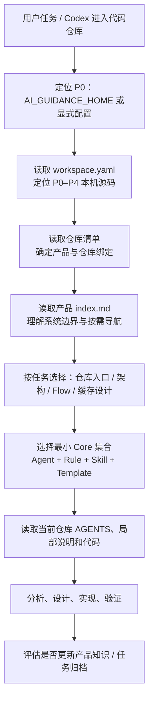

# 使用指南

## 1. P0–P4 指代

| 标识 | 仓库/职责 |
| --- | --- |
| P0 | `tu-devkit`：AI 上下文、工具和使用说明的统一维护仓库 |
| P1 | `c-drone-inspection`：巡检业务、设备、任务、媒体、视频和巡检 IoT 业务处理 |
| P2 | `c-iot-server`：IoT 业务、设备状态、Data Rule 和消息处理 |
| P3 | `c-iot-gateway`：协议接入、连接管理、消息上下行入口 |
| P4 | `ad-iot-codec-adapter-dji`：DJI 协议解析、物模型转换和命令编码 |

P0 是知识主库，不参与 P1–P4 的运行时调用。P1–P4 共同属于 `device-inspection-platform` 产品。

P0–P4 的本机源码位置统一登记在 [`workspace.yaml`](../workspace.yaml)。当任务需要阅读、核实或修改代码时，先读取该文件并按其中路径打开目标仓库；目录迁移只更新这一处，不在产品文档内散落绝对路径。

## 2. AI 读取链路

Codex 不会仅因目录存在就自动读取所有 Markdown。需要通过仓库 `AGENTS.md`、任务文本或明确指令告诉它从哪里开始；随后按需加载，而非把所有文档一次塞入上下文。

P0 根目录的 [`AGENTS.md`](../../AGENTS.md) 已负责识别任务类型并引导到本平台；进入本目录后，[`AGENTS.md`](../AGENTS.md) 会进一步规定产品与 Core 的读取顺序。这两份文件是实际生效的引导文件，`bootstrap/AGENTS.md.template` 仅用于其他仓库接入时复制。



读取顺序不等于冲突优先级。发生冲突时始终采用：**当前代码与仓库局部约束 > 产品上下文 > Core 规则**。

## 3. 两种工作区模式

### 模式 A：P0 + P1–P4 全量系统工作区

适用于跨服务需求、OSD/指令链路、协议改造、Data Rule、设备状态和端到端故障。

1. 在 P0 读取产品入口和任务相关流程，例如 [DJI OSD 与设备指令链路](../products/company/device-inspection-platform/flows/dji-osd-command-flow.md)。
2. 阅读涉及仓库的入口地图，例如 [P1 关键入口](../products/company/device-inspection-platform/repositories/c-drone-inspection/key-entry-points.md)。
3. 只打开受影响的 P1–P4 代码，不必扫描全部模块。
4. 使用 `cross-service-change.md` 或 `architecture-design.md` 记录契约、发布顺序和验证。

优点是可直接核对每一跳代码；代价是工作区和可读上下文更大。

### 模式 B：P0 + 部分代码仓库，例如 P0 + P1

适用于 P1 局部功能、业务编排、页面接口、缓存、任务或单服务缺陷。

1. 仍读取同一个产品 `index.md`，因为 P1 的输入输出依赖 P2–P4。
2. 只读取 P1 仓库入口、相关 Flow、缓存设计和 P1 代码。
3. P2–P4 使用 P0 中的已验证知识作为依赖说明；无法打开其代码时，必须把接口、Topic、Data Rule 和部署配置标为“需联调/待核实”。
4. 不因缺少 P2–P4 工作区而臆造其实现；跨服务改动应列出待核实项。

这两种模式的产品知识相同，区别只是“能否直接读取和验证依赖仓库代码”，不是两套架构事实。

## 4. 如何使用 Core

先从 [Core 入口](../core/index.md) 选择最小必要组合：

| 任务 | 建议读取 |
| --- | --- |
| P1 单服务功能 | `Java Engineer` + Java/架构规则 + `feature-development` + `feature.md` |
| P1 IoT 上行异常 | `Java Engineer` + `bug-analysis` + P1 入口地图/缓存设计 |
| P1–P4 指令或协议变更 | `System Designer` + 架构规则 + `cross-service-change.md` + 对应 Flow |
| 结构调整 | `Backend Architect` 或 `System Designer` + `refactor-analysis` + `refactor.md` |
| 代码审查 | `Code Reviewer` + `code-review.md` + 相关产品约束 |

可以在任务开头显式写出读取要求，例如：

```text
请先读取：
1. products/company/device-inspection-platform/index.md
2. repositories/c-drone-inspection/key-entry-points.md
3. repositories/c-drone-inspection/cache-design.md
4. core/skills/bug-analysis.md 和 core/templates/bugfix.md
然后只分析 P1 的设备 OSD 缓存异常。
```

## 5. Template 与变量替换

当前 `core/templates/*.md` 是 **Markdown 任务表单**，不是自动渲染的 Prompt 模板。Codex 不会自动发现某个 Template，也不会自动替换 `{{background}}`、`{{scope}}` 一类变量。

### 方式一：复制后人工填充

复制所需模板到任务说明，替换其中 HTML 注释的提示内容：

```markdown
## 背景

P1 的机场 OSD 分包上报；页面需要读取 `osd:{deviceSn}` 的完整快照。

## 影响范围

P1 `InspectionDeviceStatusBusinessServiceImpl`、监控状态读取与 Redis TTL。
```

这是当前最可靠的方式：填写后的内容会直接作为任务上下文传给 AI。

### 方式二：采用显式变量约定

也可以在任务消息中使用变量名，但必须在同一消息或任务文件中给出值：

```text
使用 core/templates/bugfix.md。
{{background}} = P1 的 OSD 分包导致页面字段闪空。
{{scope}} = 只修改 P1；不得改变 P2 Data Rule。
{{acceptance}} = 同一设备连续分包后，读取 osd:{deviceSn} 保留完整字段。
```

这里的 `{{...}}` 是**人为约定的占位标记**，由 Codex 在阅读任务时解释和填入；它不是 P0 已实现的模板引擎。若未来需要批量渲染，应单独实现 `ai-guidance init/render` 工具，并明确变量 schema、缺失变量报错和输出文件位置。

### 如何验证 AI 是否真的读取了模板

在任务验收中要求 AI 先输出：

1. 已读取的文档清单；
2. 从产品知识中采用的关键约束；
3. 已填充模板的完整任务摘要；
4. 未知或待验证的事实。

不要只通过 AI 是否“提到了模板文件名”判断；应检查输出是否实际包含模板章节和产品约束。

## 6. 最小可复制任务

```text
目标：排查 P1 机场 OSD 页面字段闪空。

读取范围：
- P0/ai-guidance/products/company/device-inspection-platform/index.md
- P0/ai-guidance/products/company/device-inspection-platform/repositories/c-drone-inspection/cache-design.md
- P0/ai-guidance/core/skills/bug-analysis.md
- P0/ai-guidance/core/templates/bugfix.md

工作区：P0 + P1；P2–P4 仅作为产品上下文依赖，不修改其代码。

请先列出读取到的约束，再按 bugfix 模板输出排查计划；不要假设 P2 Data Rule 已按预期配置。
```

## 7. 维护动作

- 新增跨服务链路：更新 `flows/`、`architecture/` 和受影响仓库入口地图。
- 新增关键入口或缓存：更新对应 `repositories/<repo>/` 下的说明，并在仓库清单登记入口。
- 完成跨服务任务：归档任务，并记录哪些知识已更新、哪些仍待验证。
- 代码与知识冲突：以代码为准，立即将知识标记为待验证或更新证据日期。
