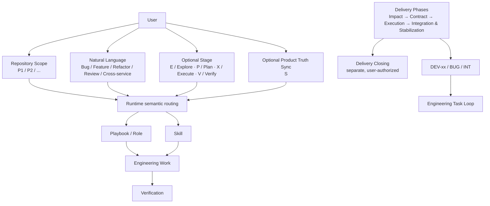
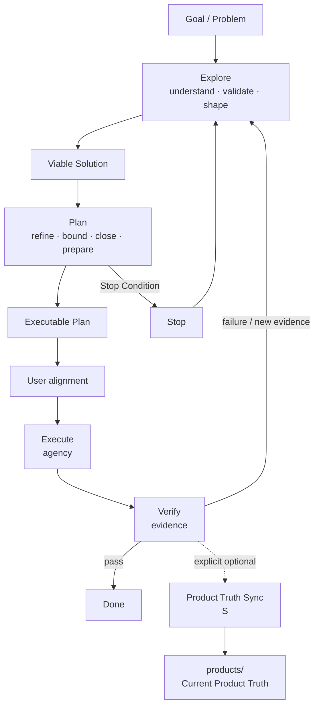
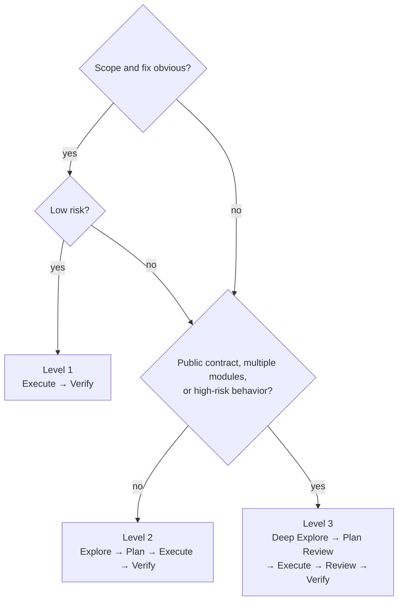
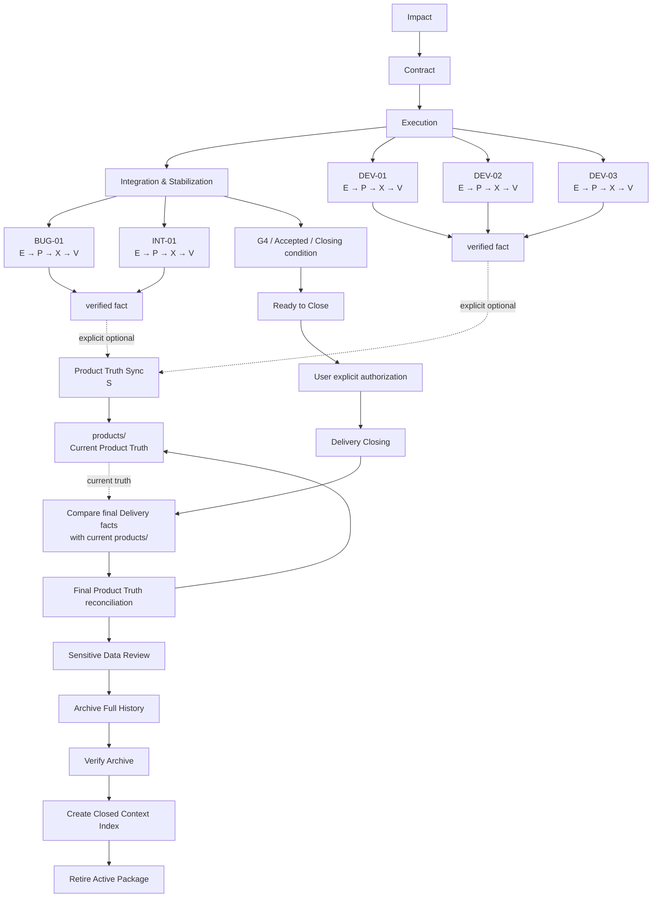
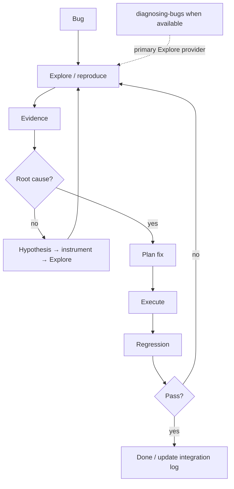
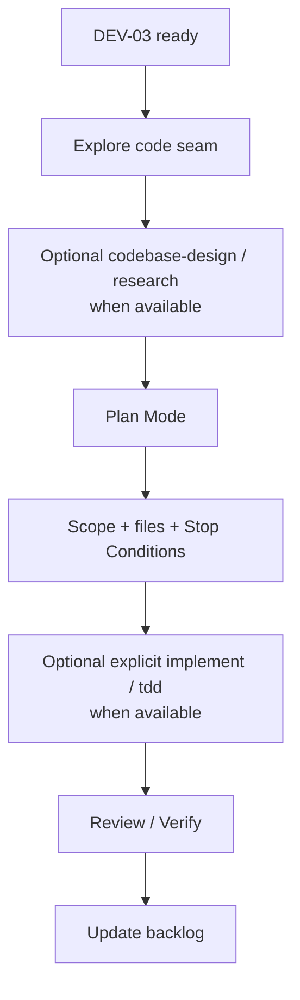
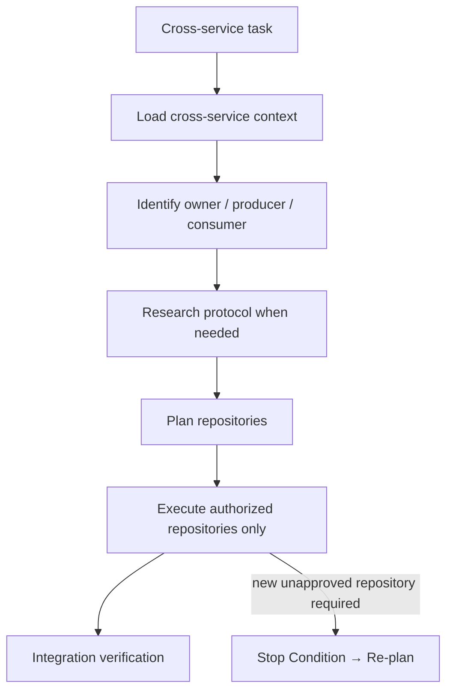
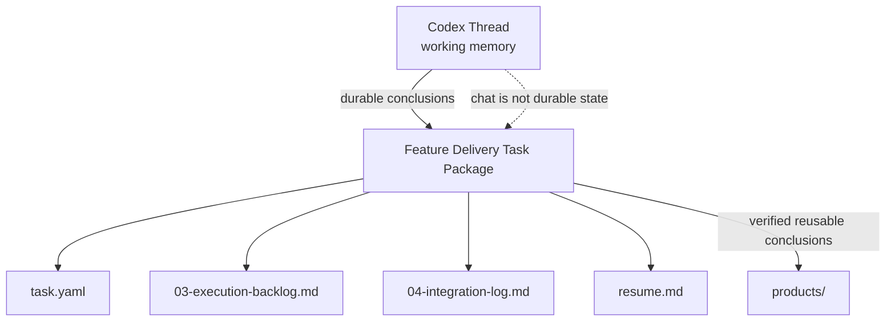

# Engineering Task Loop

Engineering Task Loop 是一次具体 DEV、Bug、Refactor 或技术改造的细粒度安全执行方法：先核实现状、验证关键可行性并收敛推荐方向，再锁定边界，随后在授权范围内修改，并用证据决定是否完成。它不取代长期的 [Feature Delivery](../feature-delivery/README.md)。可复用方法见 [Core Playbook](../../../core/playbooks/engineering-task-loop.md)；本页是面向人的使用说明和可复制提示。

## Mental Model

```text
Repository Scope
+
Task Semantics
+
Optional Stage
+
Optional Product Truth Sync
=
Current Engineering Intent
```

`P1`、`P2` 等项目标记说明在哪里工作；自然语言说明要做什么；Stage 只表达本轮操作意图；`S` 是在已验证后可选的 Product Truth Sync Action，不属于 Stage；Playbook、Skill 与 Role 是按语义选择的专业能力 Provider。长期 Feature 则由 Feature Delivery 保存生命周期与证据。



Feature Delivery 管长期生命周期；Engineering Task Loop 管一次具体修改；Stage Shortcut 不是 Provider，也不替代 Delivery ID、Task Package、Contract、Artifact 或证据。Task Loop 的 Verify 只回填当前 DEV 的 `03-execution-backlog.md`，或 BUG / INT 的 `04-integration-log.md`；它不触发 Delivery Closing。`S` 可在无 DF 或 Delivery 内独立同步已经成立的 Current Product Truth，但不触发 Archive 或修改 Delivery metadata。G4 / acceptance 只允许 Agent 建议 Ready to Close；用户显式授权后，Delivery Closing 才对整个 Delivery 的 Product Truth 做最终 reconciliation、执行 Sensitive Data Review、Archive 并验证 finalized snapshot、创建 Closed Context Index 并 retire active Package；这不是新的 Stage Shortcut，也不改变 E/P/X/V。

## Daily Stage Shortcuts

日常不需要复制后面的完整 Prompt。自然语言始终有效；需要强调本轮默认行为时，只写 Stage 加本次特殊上下文。新用户推荐全名，熟练用户可用短写：

| Stage | Full | Short |
| --- | --- | --- |
| Explore | `Explore` | `E` |
| Plan | `Plan` | `P` |
| Execute | `Execute` | `X` |
| Verify | `Verify` | `V` |

长写、短写和大小写均等价：`e`、`E`、`explore`、`Explore`、`EXPLORE` 都是 Explore。Stage Shortcut 应位于消息的任务头部区域，可出现在可选 Repository Scope 之后、主要自然语言任务正文之前，并作为独立 token / 独立标签出现，例如 `e` 或 `e:`；正文中的普通字母不触发 Stage。独立 `P` 是 Plan，`P1`、`P2`、`P3-1` 始终是项目标记。

```text
E
<问题和特殊上下文>
```

```text
P
<本轮额外边界>
```

```text
X
<可选补充>
```

```text
V
<可选额外验证>
```

Stage Shortcut 提供默认行为，用户补充内容提供本次问题与额外约束；补充可收窄或覆盖默认行为，但仍受指令优先级限制。Explore 默认不修改 tracked files；Plan 默认只形成候选 Executable Plan；Execute 只在有效边界内修改；Verify 只取得证据，不在失败后自动修复。

## Product Truth Sync Shortcut

`Sync` / `S` 是可选的独立 Action，不加入上表四个 Stage。它只在当前 Thread 已有可靠工程事实和 Verification Evidence 时，检查是否存在同时满足 **Verified、Current、Durable、Independently Valid** 的 Current Product Truth Delta。四项缺一不可：未产生长期事实为 `not-needed`，结论依赖尚未完成能力为 `not-ready`，缺少证据为 `insufficient-evidence`；三者均不修改文档。满足 Gate 时结果为 `synced`，最小更新已有 canonical `products/` 页面并报告 Delta、页面与证据。

`S` 不要求 DF 或 Active Delivery，不是 Closing、Archive 或 `knowledge_update_assessment` 的别名。它只写 P0 `products/` 及确有必要的 canonical navigation links，不写 `work/`、源代码仓库、Archive 或 Delivery metadata，也不 commit、push、release 或 deploy。`S1` 仍是 Repository Scope；独立 token 的 `S` 才是 Action。通常在工程修改验证后另起一轮：

```text
P0
S
```

或：

```text
P0 S
```

这表示在 Workbench 范围内，以当前 Thread 已有证据同步长期 Current Product Truth；它不自动扩大到 P1、P2 等业务仓库。若必须重新核实业务实现而该仓库不在 Scope，则报告 `insufficient-evidence` 并说明所需 Scope。

## Real Daily Usage

### Level 2: ordinary task

```text
P1

E

设备状态 WS 偶尔不刷新。
重点看 DeviceStateService → WsPublisher。
```

Explore 完成后切换 Codex Plan Mode：

```text
P

采用推荐的最小方案。
不要动 adapter repository。
```

Plan 输出候选 Executable Plan。若 UI 提供 `Execute Plan`、`Implement` 或等价原生 Action，直接使用它，无需再输入 `X`。若 Plan 后继续讨论，例如“不要新建 DTO，继续复用现有状态对象”，待最新方案重新收敛后输入 `X`，即确认并执行该唯一、有效的最新 Plan。

完成后可补充验证：

```text
V

额外覆盖 WS reconnect。
```

### Level 1 and Level 3

明确小改可以直接开始：

```text
X

修复这里已经确认的 NPE，补对应单测。
```

跨服务或高风险任务先扩大探索，再在 Plan 中锁定边界：

```text
P1 + P2

E

梳理设备状态跨服务链路，重点确认消息 ownership 和状态收敛语义。
```

Plan 中可明确“允许修改 P1、P2，不能改 DB Schema 和外部 API Contract”。优先使用原生执行 Action；没有时再使用 `X`，最后用 `V` 取得证据。

### Loop at a glance

直接要求 AI 改代码会把理解、决策、修改和验收混在一起。这个 Loop 将它们分开：Explore 用证据证明推荐方案可行，Plan 将方案补完整并形成可执行边界，Execute 严格受授权约束，Verify 以测试和证据而不是“看起来正确”决定结果。完整规则以 [Core Playbook](../../../core/playbooks/engineering-task-loop.md) 为准。



## Choose the path



| Level | 典型任务 | 路径 |
| --- | --- | --- |
| 1 — Fast Path | 明确 NPE、import、字段映射、补充已知测试、小范围 rename | Execute → Verify |
| 2 — Standard Path | Service 行为、cache/SQL/WS、权限条件、一般 Bug、小重构 | Explore → Plan → Execute → Verify |
| 3 — Controlled Path | 跨服务、公开 API、DB Schema/迁移、并发、认证授权、设备控制、多仓库、陌生遗留代码 | Deep Explore → Plan Review → Execute → Code Review → Verify |

## Full / Controlled Templates

以下完整模板适合 Level 3、新用户学习、高风险任务，或需要显式强化边界时使用；不是日常每次都必须复制的输入。

### Explore: understand, validate, and shape before planning

Explore 先核实 Goal / Problem、当前实现、调用链、约束、change / integration seam 与可复用能力，并区分 Facts、Assumptions 和 Unknowns；不要一开始直接输出方案。随后以读取、搜索、现有测试或非持久诊断等证据验证推荐方向成立所依赖的关键条件：当前架构和扩展点是否支持、是否触及公共 Contract 或兼容性边界、外部 SDK / API 是否具备所需能力，以及性能、数据量、并发或前置条件是否构成约束。最后收敛出推荐方案及其 Evidence / Reasoning，必要时给出替代方案和取舍。

Explore 的方案要足以让 Plan 拆分 Files / Components、Steps 和 Stop Conditions，但不应预先展开成逐步实施计划。普通小任务只输出紧凑 Explore Summary：Goal / Problem、Current state、Facts / Assumptions / Unknowns、Feasibility（及 Evidence）、Recommended solution、Affected scope、Explicit non-scope、Risks / constraints、Verification strategy 与 Open questions / Preconditions；按复杂度省略不适用字段，无需新建持久文件。复杂或高风险任务应明确可行性结论，例如 `Feasible`、`Feasible with constraints`、`Needs further validation` 或 `Not recommended`；关键未知项仍会阻塞 Plan 时，必须继续验证或明确列为前置条件，而非视作 Explore 完成。

```text
先不要修改代码。

目标：
<我要解决的问题>

本轮只做探索、可行性验证和方案收敛。

请：
1. 理解当前实现与调用链；
2. 找出真正修改 seam、integration seam 与可复用能力；
3. 区分事实、假设与未知；
4. 用现有证据或非持久验证确认关键可行性与约束；
5. 给出附 Evidence / Reasoning 的推荐方案及必要替代方案；
6. 明确影响范围、非范围、风险/约束和 Verification Strategy；
7. 确认关键未知项不会阻塞 Plan，或明确继续验证所需的前置条件。

完成后先停在方案评审，不执行修改。
```

Explore 的退出条件是：Goal / Problem、当前实现与约束、关键 Facts / Assumptions / Unknowns 已基本明确；核心可行性已有足够证据；推荐方案、change seam、影响范围和 Verification Strategy 已清楚；剩余未知项不阻塞 Plan，或已显式成为其前置条件。满足后停在方案评审。Explore 默认禁止 tracked-file 修改、commit、push、deploy、release、生产写入和外部副作用；可以读取、搜索调用链、运行现有测试或非持久诊断/验证。用户可显式放宽明确范围，例如允许新增临时测试，但不会因此授权生产代码修改。Goal Mode 或 Explore 类请求本身不天然等于只读模式。

### Plan: execution contract

Plan 建立在 Explore 已验证的 Viable Solution 上，继续追问“方案是否已经完整到可以安全执行”。它通过 Refine、Bound、Close the Loop 和 Prepare Execution，把方案推进为 Executable Plan；不重新无依据研究“是否可行、应该采用什么方案”，也不一开始就机械拆 todo。

Plan 按任务相关性补齐：Scope / Non-scope 和输入输出、模块、数据、生命周期、权限、外部系统、旧数据/旧行为边界；性能、并发、一致性、SDK/API、数据库、Contract、发布、安全、兼容和可观测性约束；关键失败与边缘路径；需修改、仅受影响和明确不改内容组成的 Change Map；Files / Components、依赖、顺序、migration、feature flag、rollout / rollback 等 Execution Design；以及能覆盖正常、关键失败和兼容路径的 Executable Verification Plan。简单任务可缩短为 change、impact、execution、verification；只有复杂度或风险需要时才完整展开，不机械套模板。

Plan 完成时，Explore 的推荐方向仍须成立；Goal、Scope / Non-scope、关键边界、主要约束和失败路径已经明确；依赖、Change Map、数据/API/Contract/config/迁移/部署影响与兼容性已经处理；Files / Components、执行顺序和任务拆分已经明确；Verification Plan 可以实际执行；且不存在阻塞 Execute 的关键 Unknown。此时 Plan 应当唯一、明确、可排序、可验证并带有 Stop Conditions。

若 Plan 中出现足以推翻 Explore 的新事实，例如 SDK 不支持、实际数据量突破假设、隐藏架构限制、公共 Contract 无法按原方向变化，或成本/风险已不合理，应携带新证据返回 Explore。Plan 精炼可行方案；当可行性重新变得不确定时，不在 Plan 中静默重选方向。

Codex Plan Mode 形成和收敛候选 Executable Plan，本身不修改代码，也不是业务 Contract 或 Workbench Artifact。若 UI 提供原生 Plan 执行 Action，优先使用；否则 `X` / `Execute` 可确认并执行当前唯一、明确、无未决且未失效的最新 Plan。属于 Feature Delivery 时，持久边界和结果必须回填对应 Artifact。

```text
基于刚才探索结果，进入计划模式。

请把执行范围收敛为：

- Goal
- Scope / Non-scope and relevant boundaries
- Constraints, failure paths, compatibility, and Change Map
- Files / Components, dependencies, and ordered steps
- Executable Verification Plan
- Stop Conditions

优先采用最小改动。

如果新事实使 Explore 的可行性结论不再成立，返回 Explore；如果计划需要扩大到新的 Repository、Contract、DB Schema 或权限模型，请明确指出，不要默认纳入。
```

### Execute: act inside the boundary

只有当前 Plan 唯一、明确、无未决关键决定且未被新证据推翻时，`X` / `Execute` 才可视为用户对该 Plan 的确认和实施授权；否则先回到 Plan。它不自动授权 commit、push、release、deploy、生产写入、外部系统变更、付费或破坏性操作。

```text
按已确认计划执行。

严格遵守 Scope 和 Stop Conditions。

如果发现计划假设不成立或必须扩大范围，停止修改并重新汇报。

完成后：
- 汇报实际修改
- 执行 Verification
- 说明与原 Plan 的偏差
- 说明剩余风险
```

### Verify: require evidence

根据任务选用 unit/integration test、build、lint、typecheck、SQL/API 验证、WS/MQTT 模拟、设备反馈、运行观测或 code review。默认只验证，不扩大实现 Scope 或在失败后自动 patch；验证失败时返回 Explore，以新证据更新 Plan。

## Stop Conditions

以下任一情况都停止执行，不自行扩大 Scope：需要 DB Schema、公开 API Contract、第二个未授权 Repository、权限/数据隔离模型变动；Explore 假设被证伪；原计划无法达到成功标准；或改动范围明显扩大。此时汇报新证据和方案，重新进入 Explore / Plan。

## Skill composition

以下是工作台当前已记录能力的组合原则，不把外部 Matt 类能力当作已安装事实。仅在当前 Session 真的暴露且调用策略允许时，才使用 `research`、`domain-modeling`、`codebase-design`、`diagnosing-bugs`、`implement`、`tdd`、`code-review`、`to-spec` 或 `to-tickets`。

```mermaid
flowchart LR
    subgraph E[Explore]
        I[tu-analyzing-feature-impact<br/>prototype / PRD]
        C[tu-loading-device-inspection-<br/>cross-service-context]
        DIAGNOSE[tu-diagnosing-spring-backend-incidents]
        O[External research / modeling / diagnosis<br/>only when available]
    end
    subgraph P[Plan]
        PM[Codex Plan Mode]
        TM[External to-spec / to-tickets methods<br/>only when available]
    end
    subgraph X[Execute]
        EX[Explicit implement / tdd<br/>only when available]
    end
    subgraph V[Verify]
        T[Tests / build / lint / typecheck]
        R[External code-review or diagnosing-bugs<br/>only when available]
    end
    E --> P --> X --> V
```



| Stage | 推荐 provider / 方法 | 使用边界 |
| --- | --- | --- |
| Explore | `tu-analyzing-feature-impact`（原型/PRD）、`tu-loading-device-inspection-cross-service-context`（跨服务）、`tu-diagnosing-spring-backend-incidents`（Spring 事故） | 产出事实、影响和诊断输入，不接管长期交付状态。 |
| Plan | Codex Plan Mode；可用时借鉴 `to-spec` / `to-tickets` | Plan Mode 形成候选计划；用户确认后的 Plan 定义本轮边界。Feature Delivery 的持久边界和结果回填 Workbench Artifact。 |
| Execute | 用户显式调用且可用时 `implement`；适合时 `tdd` | 只处理已授权、已准备好的改动。 |
| Verify | 测试、构建、lint、typecheck；可用时 `code-review` | review 是实现审查，不是 Lifecycle Authority。 |
| Verify failure | 可用时 `diagnosing-bugs` | 用诊断获取新证据，再回到 Explore。 |

## Feature Delivery × Task Loop

大 Workflow 管生命周期，小 Loop 管每次具体修改。Loop 不取代 Delivery ID、CAP、Gates、Artifacts 或 Task Package。



在 Delivery 中，非 trivial DEV 将关键 Plan、实际实施结果和 Verify 证据回填 `03-execution-backlog.md`；Bug/INT 的根因、修复、回归和 Verify 证据回填 `04-integration-log.md`；暂停或 Phase 变化刷新 `resume.md`。这不使单个 Task Loop 关闭 Delivery；独立成立的事实可通过 `S` 同步，但不改任何 Delivery 状态或 metadata。整个 Delivery 达到 G4 / acceptance 或明确 Closing condition 后，Agent 只能建议显式调用 `tu-close-delivery`；获授权后才依次对 Product Truth 做最终 reconciliation、Sensitive Data Review、Archive/verify finalized snapshot、创建 Closed Index 并 retire active Package。

### Bug scenario



```text
先不要修。

请先建立可复现和证据链：
1. 找到调用路径；
2. 尽可能复现；
3. 区分事实和假设；
4. 提出可证伪的 Root Cause 假设；
5. 用日志 / test / instrumentation 验证；
6. 根因明确后给最小修复方案。

根因未明确前不要进行猜测式 patch。
```

### Ready DEV scenario



### Cross-service scenario



### Context persistence



`work/` 是交付证据，不等于产品知识；显式 `S` 可将已独立成立的验证结论提炼进 `products/`，Delivery Closing 则对整个 Delivery 做最终 reconciliation。

## Recommended working habit

对非平凡任务：

```text
Explore freely
↓
Plan conservatively
↓
Execute narrowly
↓
Verify objectively
```
