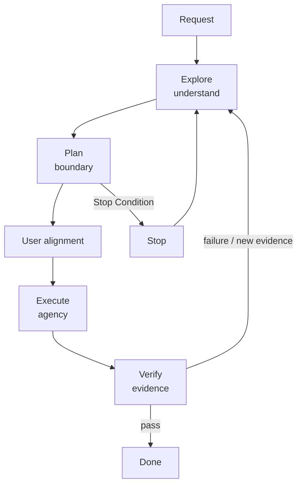
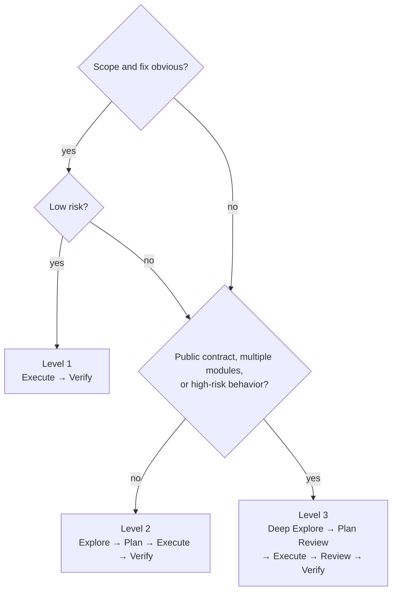
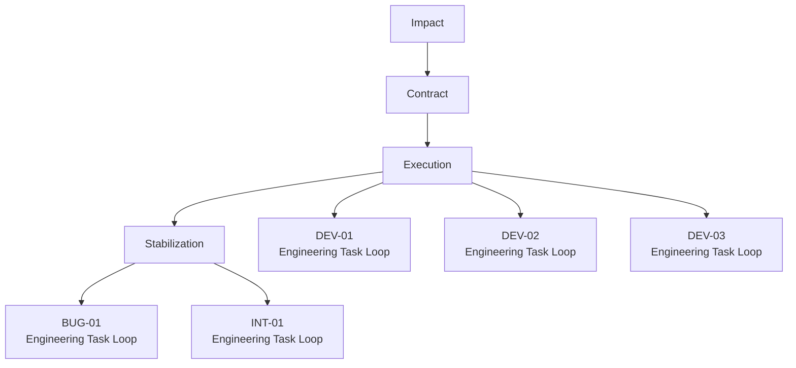
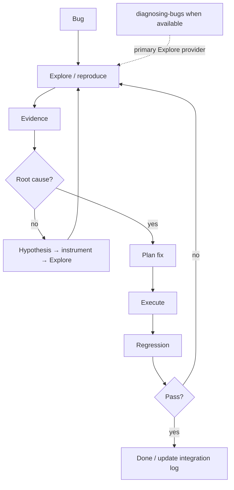
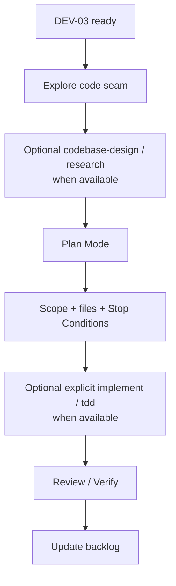
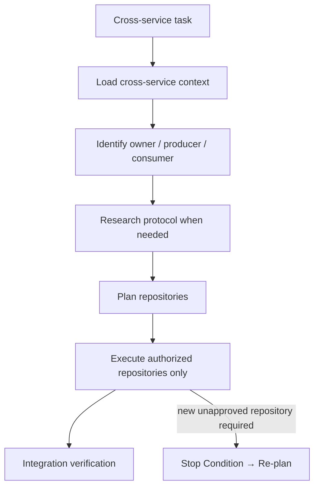
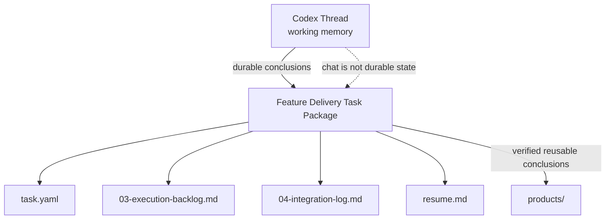

# Engineering Task Loop

Engineering Task Loop 是一次具体 DEV、Bug、Refactor 或技术改造的细粒度安全执行方法：先充分理解，再锁定边界，随后在授权范围内修改，并用证据决定是否完成。它不取代长期的 [Feature Delivery](../feature-delivery/README.md)。可复用方法见 [Core Playbook](../../../core/playbooks/engineering-task-loop.md)；本页是面向人的使用说明和可复制提示。

## Why

直接要求 AI 改代码会把理解、决策、修改和验收混在一起。这个 Loop 将它们分开：Explore 允许充分调查，Plan 与人对齐边界，Execute 严格受授权约束，Verify 以测试和证据而不是“看起来正确”决定结果。

## Quick Start

- **明确且低风险的小改动**：说明目标、已知修改位置与验证方式，直接走 Execute → Verify。
- **普通 DEV / Bug / Refactor**：先发送本页 Explore 模板；确认结论后进入 Codex Plan Mode，确认边界后再发送 Execute 模板。
- **高风险或跨服务改动**：先深度 Explore，评审 Plan，并在执行中严格遵守 Stop Conditions。
- **属于 Feature Delivery 的任务**：Loop 管一次工程动作；长期状态和关键结论仍写回 Task Package。

Goal/Explore 用于表达本轮目标和调查边界，不天然授予只读或修改权限；Plan Mode 用于确认下一轮的执行 Contract，不能替代业务 Contract 或持久 Artifact。



## Choose the path



| Level | 典型任务 | 路径 |
| --- | --- | --- |
| 1 — Fast Path | 明确 NPE、import、字段映射、补充已知测试、小范围 rename | Execute → Verify |
| 2 — Standard Path | Service 行为、cache/SQL/WS、权限条件、一般 Bug、小重构 | Explore → Plan → Execute → Verify |
| 3 — Controlled Path | 跨服务、公开 API、DB Schema/迁移、并发、认证授权、设备控制、多仓库、陌生遗留代码 | Deep Explore → Plan Review → Execute → Code Review → Verify |

## Explore → Plan → Execute → Verify

### Explore: understand before changing

回答发生了什么、为什么、真实 change seam 在哪里、已有何种可复用实现、受影响哪些仓库/模块、有什么替代方案、最小可行改动是什么、可能失败什么以及如何验证。默认只输出紧凑 Explore Summary：Finding、Root/likely cause、Relevant code path、Recommended approach、Alternatives、Affected scope、Explicit non-scope、Risk、Verification approach 与 Open questions；普通小任务无需新建持久文件。

```text
先不要修改代码。

目标：
<我要解决的问题>

本轮只做探索和可行性分析。

请：
1. 理解当前实现与调用链；
2. 找出真正修改 seam；
3. 区分事实、假设与未知；
4. 给出推荐方案及必要替代方案；
5. 明确影响范围与非范围；
6. 给出风险和验证方式。

完成后先停在方案评审，不执行修改。
```

“只探索不修改”来自此类明确执行边界。Goal Mode 或 Explore 类请求本身不天然等于只读模式。

### Plan: execution contract

Plan 是用户与 AI 对下一轮实际修改边界的最终确认，至少包含 Goal、Scope、Files / Components、Steps、Verification 与 Stop Conditions。它不是业务 Contract，也不取代 Workbench Artifact。

```text
基于刚才探索结果，进入计划模式。

请把执行范围收敛为：

- Goal
- Scope
- Files / Components
- Steps
- Verification
- Stop Conditions

优先采用最小改动。

如果计划中需要扩大到新的 Repository、Contract、DB Schema 或权限模型，请明确指出，不要默认纳入。
```

### Execute: act inside the boundary

```text
按已确认计划执行。

严格遵守 Scope 和 Stop Conditions。

如果发现计划假设不成立或必须扩大范围，停止修改并重新汇报。

完成后：
- 汇报实际修改
- 执行 Verification
- 说明与原 Plan 的偏差
- 说明剩余风险
```

### Verify: require evidence

根据任务选用 unit/integration test、build、lint、typecheck、SQL/API 验证、WS/MQTT 模拟、设备反馈、运行观测或 code review。验证失败时返回 Explore，以新证据更新 Plan；不要连续猜测式 patch。

## Stop Conditions

以下任一情况都停止执行，不自行扩大 Scope：需要 DB Schema、公开 API Contract、第二个未授权 Repository、权限/数据隔离模型变动；Explore 假设被证伪；原计划无法达到成功标准；或改动范围明显扩大。此时汇报新证据和方案，重新进入 Explore / Plan。

## Skill composition

以下是工作台当前已记录能力的组合原则，不把外部 Matt 类能力当作已安装事实。仅在当前 Session 真的暴露且调用策略允许时，才使用 `research`、`domain-modeling`、`codebase-design`、`diagnosing-bugs`、`implement`、`tdd`、`code-review`、`to-spec` 或 `to-tickets`。

```mermaid
flowchart LR
    subgraph E[Explore]
        I[tu-analyzing-feature-impact<br/>prototype / PRD]
        C[tu-loading-device-inspection-<br/>cross-service-context]
        DIAGNOSE[tu-diagnosing-spring-backend-incidents]
        O[External research / modeling / diagnosis<br/>only when available]
    end
    subgraph P[Plan]
        PM[Codex Plan Mode]
        TM[External to-spec / to-tickets methods<br/>only when available]
    end
    subgraph X[Execute]
        EX[Explicit implement / tdd<br/>only when available]
    end
    subgraph V[Verify]
        T[Tests / build / lint / typecheck]
        R[External code-review or diagnosing-bugs<br/>only when available]
    end
    E --> P --> X --> V
```



| Stage | 推荐 provider / 方法 | 使用边界 |
| --- | --- | --- |
| Explore | `tu-analyzing-feature-impact`（原型/PRD）、`tu-loading-device-inspection-cross-service-context`（跨服务）、`tu-diagnosing-spring-backend-incidents`（Spring 事故） | 产出事实、影响和诊断输入，不接管长期交付状态。 |
| Plan | Codex Plan Mode；可用时借鉴 `to-spec` / `to-tickets` | Plan Mode / Workbench Artifact 才是最终执行边界。 |
| Execute | 用户显式调用且可用时 `implement`；适合时 `tdd` | 只处理已授权、已准备好的改动。 |
| Verify | 测试、构建、lint、typecheck；可用时 `code-review` | review 是实现审查，不是 Lifecycle Authority。 |
| Verify failure | 可用时 `diagnosing-bugs` | 用诊断获取新证据，再回到 Explore。 |

## Feature Delivery × Task Loop

大 Workflow 管生命周期，小 Loop 管每次具体修改。Loop 不取代 Delivery ID、CAP、Gates、Artifacts 或 Task Package。



在 Delivery 中，非 trivial DEV 将关键 Plan 和实际实施结果回填 `03-execution-backlog.md`；Bug/INT 的根因、修复和回归回填 `04-integration-log.md`；暂停或 Phase 变化刷新 `resume.md`。

### Bug scenario



```text
先不要修。

请先建立可复现和证据链：
1. 找到调用路径；
2. 尽可能复现；
3. 区分事实和假设；
4. 提出可证伪的 Root Cause 假设；
5. 用日志 / test / instrumentation 验证；
6. 根因明确后给最小修复方案。

根因未明确前不要进行猜测式 patch。
```

### Ready DEV scenario



### Cross-service scenario



### Context persistence



`work/` 是交付证据，不等于产品知识；只将已验证且未来可复用的结论提炼进 `products/`。

## Recommended working habit

对非平凡任务：

```text
Explore freely
↓
Plan conservatively
↓
Execute narrowly
↓
Verify objectively
```
