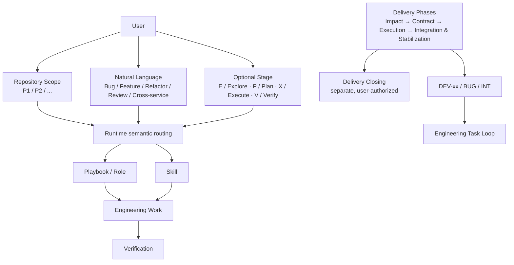
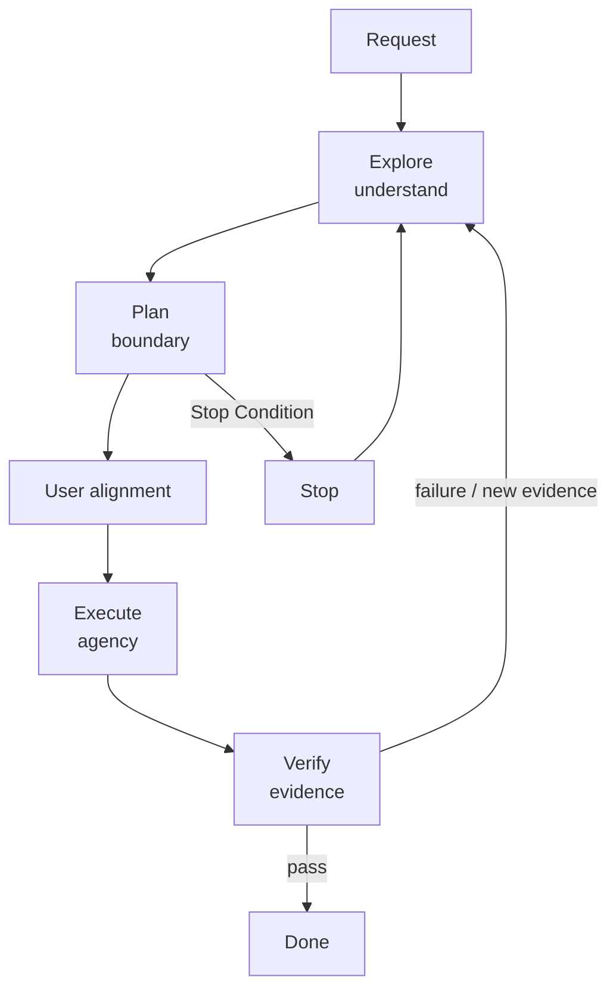
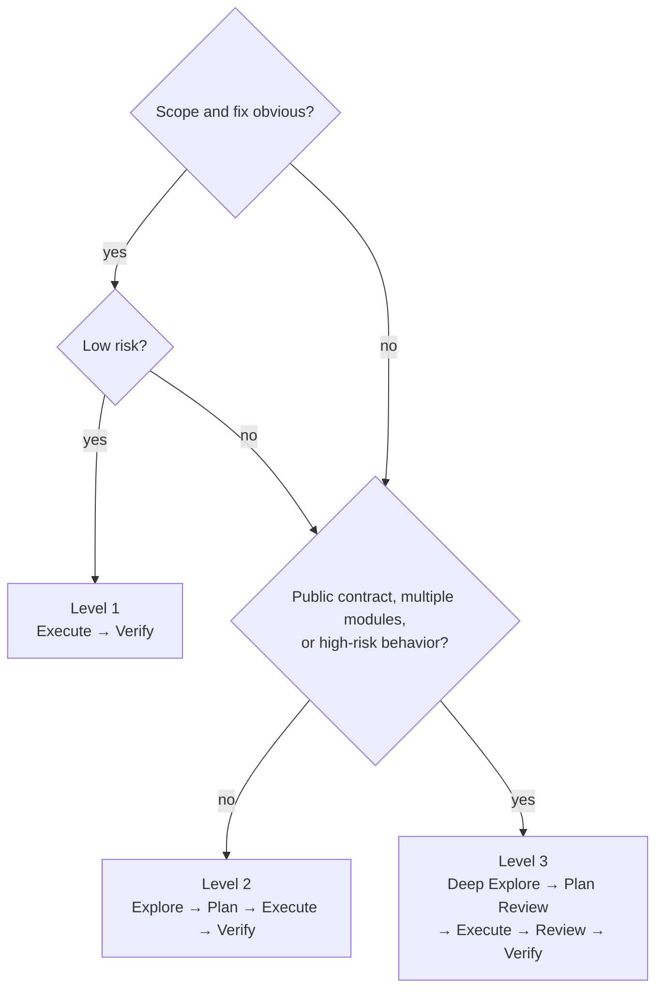
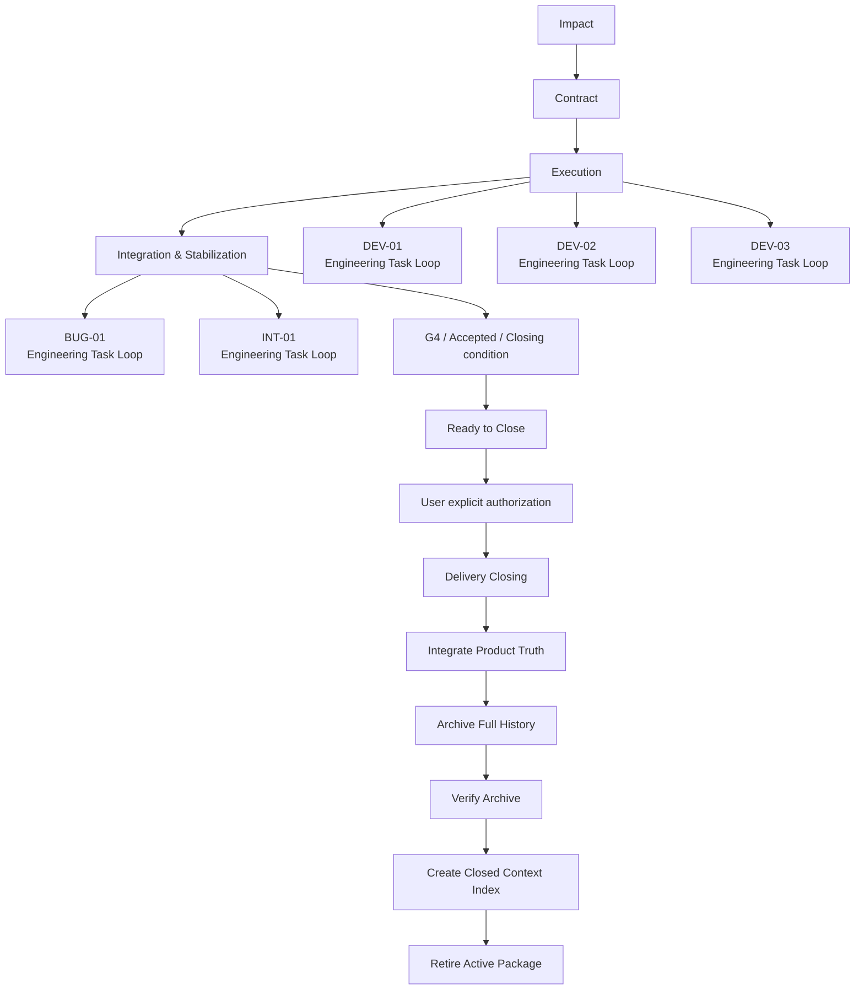
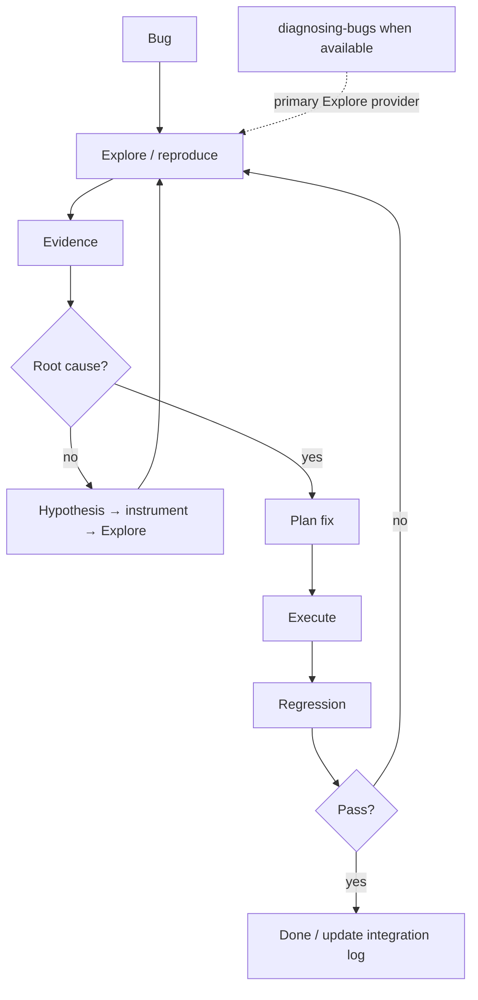
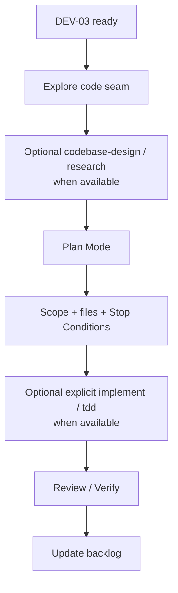
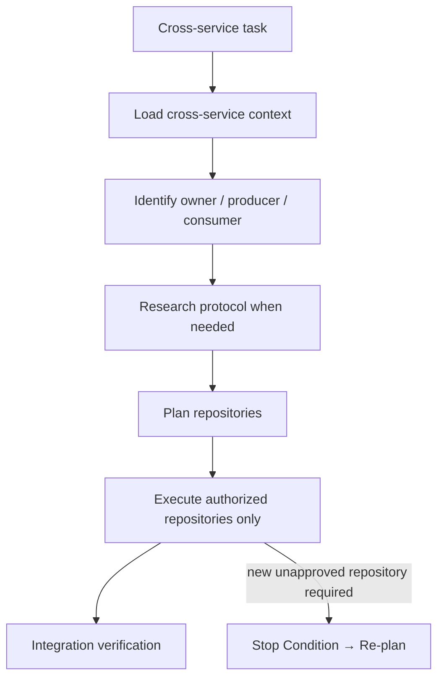
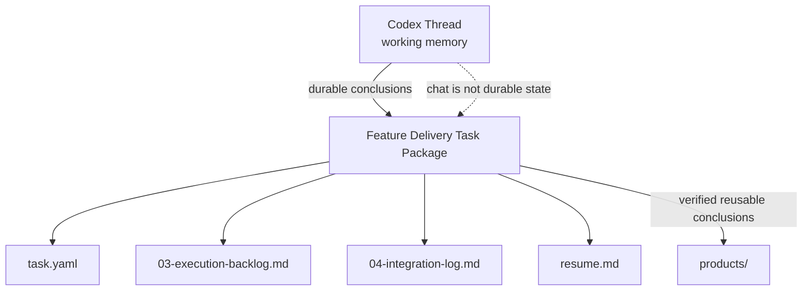

# Engineering Task Loop

Engineering Task Loop 是一次具体 DEV、Bug、Refactor 或技术改造的细粒度安全执行方法：先充分理解，再锁定边界，随后在授权范围内修改，并用证据决定是否完成。它不取代长期的 [Feature Delivery](../feature-delivery/README.md)。可复用方法见 [Core Playbook](../../../core/playbooks/engineering-task-loop.md)；本页是面向人的使用说明和可复制提示。

## Mental Model

```text
Repository Scope
+
Task Semantics
+
Optional Stage
=
Current Engineering Intent
```

`P1`、`P2` 等项目标记说明在哪里工作；自然语言说明要做什么；Stage 只表达本轮操作意图；Playbook、Skill 与 Role 是按语义选择的专业能力 Provider。长期 Feature 则由 Feature Delivery 保存生命周期与证据。



Feature Delivery 管长期生命周期；Engineering Task Loop 管一次具体修改；Stage Shortcut 不是 Provider，也不替代 Delivery ID、Task Package、Contract、Artifact 或证据。Task Loop 的 Verify 只回填当前 DEV 的 `03-execution-backlog.md`，或 BUG / INT 的 `04-integration-log.md`；它不触发 Integrate / Archive。G4 / acceptance 只允许 Agent 建议 Ready to Close；用户显式授权后，Delivery Closing 才依次更新 Current Product Truth、Archive、创建 Closed Context Index 并 retire active Package；这不是新的 Stage Shortcut，也不改变 E/P/X/V。

## Daily Stage Shortcuts

日常不需要复制后面的完整 Prompt。自然语言始终有效；需要强调本轮默认行为时，只写 Stage 加本次特殊上下文。新用户推荐全名，熟练用户可用短写：

| Stage | Full | Short |
| --- | --- | --- |
| Explore | `Explore` | `E` |
| Plan | `Plan` | `P` |
| Execute | `Execute` | `X` |
| Verify | `Verify` | `V` |

长写、短写和大小写均等价：`e`、`E`、`explore`、`Explore`、`EXPLORE` 都是 Explore。Stage Shortcut 应位于消息的任务头部区域，可出现在可选 Repository Scope 之后、主要自然语言任务正文之前，并作为独立 token / 独立标签出现，例如 `e` 或 `e:`；正文中的普通字母不触发 Stage。独立 `P` 是 Plan，`P1`、`P2`、`P3-1` 始终是项目标记。

```text
E
<问题和特殊上下文>
```

```text
P
<本轮额外边界>
```

```text
X
<可选补充>
```

```text
V
<可选额外验证>
```

Stage Shortcut 提供默认行为，用户补充内容提供本次问题与额外约束；补充可收窄或覆盖默认行为，但仍受指令优先级限制。Explore 默认不修改 tracked files；Plan 默认只形成候选计划；Execute 只在有效边界内修改；Verify 只取得证据，不在失败后自动修复。

## Real Daily Usage

### Level 2: ordinary task

```text
P1

E

设备状态 WS 偶尔不刷新。
重点看 DeviceStateService → WsPublisher。
```

Explore 完成后切换 Codex Plan Mode：

```text
P

采用推荐的最小方案。
不要动 adapter repository。
```

Plan 输出候选计划。若 UI 提供 `Execute Plan`、`Implement` 或等价原生 Action，直接使用它，无需再输入 `X`。若 Plan 后继续讨论，例如“不要新建 DTO，继续复用现有状态对象”，待最新方案重新收敛后输入 `X`，即确认并执行该唯一、有效的最新 Plan。

完成后可补充验证：

```text
V

额外覆盖 WS reconnect。
```

### Level 1 and Level 3

明确小改可以直接开始：

```text
X

修复这里已经确认的 NPE，补对应单测。
```

跨服务或高风险任务先扩大探索，再在 Plan 中锁定边界：

```text
P1 + P2

E

梳理设备状态跨服务链路，重点确认消息 ownership 和状态收敛语义。
```

Plan 中可明确“允许修改 P1、P2，不能改 DB Schema 和外部 API Contract”。优先使用原生执行 Action；没有时再使用 `X`，最后用 `V` 取得证据。

### Loop at a glance

直接要求 AI 改代码会把理解、决策、修改和验收混在一起。这个 Loop 将它们分开：Explore 允许充分调查，Plan 收敛候选边界，Execute 严格受授权约束，Verify 以测试和证据而不是“看起来正确”决定结果。



## Choose the path



| Level | 典型任务 | 路径 |
| --- | --- | --- |
| 1 — Fast Path | 明确 NPE、import、字段映射、补充已知测试、小范围 rename | Execute → Verify |
| 2 — Standard Path | Service 行为、cache/SQL/WS、权限条件、一般 Bug、小重构 | Explore → Plan → Execute → Verify |
| 3 — Controlled Path | 跨服务、公开 API、DB Schema/迁移、并发、认证授权、设备控制、多仓库、陌生遗留代码 | Deep Explore → Plan Review → Execute → Code Review → Verify |

## Full / Controlled Templates

以下完整模板适合 Level 3、新用户学习、高风险任务，或需要显式强化边界时使用；不是日常每次都必须复制的输入。

### Explore: understand before changing

回答发生了什么、为什么、真实 change seam 在哪里、已有何种可复用实现、受影响哪些仓库/模块、有什么替代方案、最小可行改动是什么、可能失败什么以及如何验证。默认不修改任何 tracked file；普通小任务只输出紧凑 Explore Summary：Finding、Root/likely cause、Relevant code path、Recommended approach、Alternatives、Affected scope、Explicit non-scope、Risk、Verification approach 与 Open questions，无需新建持久文件。

```text
先不要修改代码。

目标：
<我要解决的问题>

本轮只做探索和可行性分析。

请：
1. 理解当前实现与调用链；
2. 找出真正修改 seam；
3. 区分事实、假设与未知；
4. 给出推荐方案及必要替代方案；
5. 明确影响范围与非范围；
6. 给出风险和验证方式。

完成后先停在方案评审，不执行修改。
```

Explore 默认禁止 tracked-file 修改、commit、push、deploy、release、生产写入和外部副作用；可以读取、搜索调用链、运行现有测试或非持久诊断/验证。用户可显式放宽明确范围，例如允许新增临时测试，但不会因此授权生产代码修改。Goal Mode 或 Explore 类请求本身不天然等于只读模式。

### Plan: execution contract

Codex Plan Mode 用于形成和收敛候选执行计划，至少覆盖 Goal、Scope、Files / Components、Steps、Verification 与 Stop Conditions。它本身不修改代码，也不是业务 Contract 或 Workbench Artifact。若 UI 提供原生 Plan 执行 Action，优先使用；否则 `X` / `Execute` 可确认并执行当前唯一、明确、无未决且未失效的最新 Plan。属于 Feature Delivery 时，持久边界和结果必须回填对应 Artifact。

```text
基于刚才探索结果，进入计划模式。

请把执行范围收敛为：

- Goal
- Scope
- Files / Components
- Steps
- Verification
- Stop Conditions

优先采用最小改动。

如果计划中需要扩大到新的 Repository、Contract、DB Schema 或权限模型，请明确指出，不要默认纳入。
```

### Execute: act inside the boundary

只有当前 Plan 唯一、明确、无未决关键决定且未被新证据推翻时，`X` / `Execute` 才可视为用户对该 Plan 的确认和实施授权；否则先回到 Plan。它不自动授权 commit、push、release、deploy、生产写入、外部系统变更、付费或破坏性操作。

```text
按已确认计划执行。

严格遵守 Scope 和 Stop Conditions。

如果发现计划假设不成立或必须扩大范围，停止修改并重新汇报。

完成后：
- 汇报实际修改
- 执行 Verification
- 说明与原 Plan 的偏差
- 说明剩余风险
```

### Verify: require evidence

根据任务选用 unit/integration test、build、lint、typecheck、SQL/API 验证、WS/MQTT 模拟、设备反馈、运行观测或 code review。默认只验证，不扩大实现 Scope 或在失败后自动 patch；验证失败时返回 Explore，以新证据更新 Plan。

## Stop Conditions

以下任一情况都停止执行，不自行扩大 Scope：需要 DB Schema、公开 API Contract、第二个未授权 Repository、权限/数据隔离模型变动；Explore 假设被证伪；原计划无法达到成功标准；或改动范围明显扩大。此时汇报新证据和方案，重新进入 Explore / Plan。

## Skill composition

以下是工作台当前已记录能力的组合原则，不把外部 Matt 类能力当作已安装事实。仅在当前 Session 真的暴露且调用策略允许时，才使用 `research`、`domain-modeling`、`codebase-design`、`diagnosing-bugs`、`implement`、`tdd`、`code-review`、`to-spec` 或 `to-tickets`。

```mermaid
flowchart LR
    subgraph E[Explore]
        I[tu-analyzing-feature-impact<br/>prototype / PRD]
        C[tu-loading-device-inspection-<br/>cross-service-context]
        DIAGNOSE[tu-diagnosing-spring-backend-incidents]
        O[External research / modeling / diagnosis<br/>only when available]
    end
    subgraph P[Plan]
        PM[Codex Plan Mode]
        TM[External to-spec / to-tickets methods<br/>only when available]
    end
    subgraph X[Execute]
        EX[Explicit implement / tdd<br/>only when available]
    end
    subgraph V[Verify]
        T[Tests / build / lint / typecheck]
        R[External code-review or diagnosing-bugs<br/>only when available]
    end
    E --> P --> X --> V
```



| Stage | 推荐 provider / 方法 | 使用边界 |
| --- | --- | --- |
| Explore | `tu-analyzing-feature-impact`（原型/PRD）、`tu-loading-device-inspection-cross-service-context`（跨服务）、`tu-diagnosing-spring-backend-incidents`（Spring 事故） | 产出事实、影响和诊断输入，不接管长期交付状态。 |
| Plan | Codex Plan Mode；可用时借鉴 `to-spec` / `to-tickets` | Plan Mode 形成候选计划；用户确认后的 Plan 定义本轮边界。Feature Delivery 的持久边界和结果回填 Workbench Artifact。 |
| Execute | 用户显式调用且可用时 `implement`；适合时 `tdd` | 只处理已授权、已准备好的改动。 |
| Verify | 测试、构建、lint、typecheck；可用时 `code-review` | review 是实现审查，不是 Lifecycle Authority。 |
| Verify failure | 可用时 `diagnosing-bugs` | 用诊断获取新证据，再回到 Explore。 |

## Feature Delivery × Task Loop

大 Workflow 管生命周期，小 Loop 管每次具体修改。Loop 不取代 Delivery ID、CAP、Gates、Artifacts 或 Task Package。



在 Delivery 中，非 trivial DEV 将关键 Plan、实际实施结果和 Verify 证据回填 `03-execution-backlog.md`；Bug/INT 的根因、修复、回归和 Verify 证据回填 `04-integration-log.md`；暂停或 Phase 变化刷新 `resume.md`。这不使单个 Task Loop 关闭 Delivery。整个 Delivery 达到 G4 / acceptance 或明确 Closing condition 后，Agent 只能建议显式调用 `tu-close-delivery`；获授权后才依次 Integrate、Archive、验证 Archive、创建 Closed Index 并 retire active Package。

### Bug scenario



```text
先不要修。

请先建立可复现和证据链：
1. 找到调用路径；
2. 尽可能复现；
3. 区分事实和假设；
4. 提出可证伪的 Root Cause 假设；
5. 用日志 / test / instrumentation 验证；
6. 根因明确后给最小修复方案。

根因未明确前不要进行猜测式 patch。
```

### Ready DEV scenario



### Cross-service scenario



### Context persistence



`work/` 是交付证据，不等于产品知识；只将已验证且未来可复用的结论提炼进 `products/`。

## Recommended working habit

对非平凡任务：

```text
Explore freely
↓
Plan conservatively
↓
Execute narrowly
↓
Verify objectively
```
