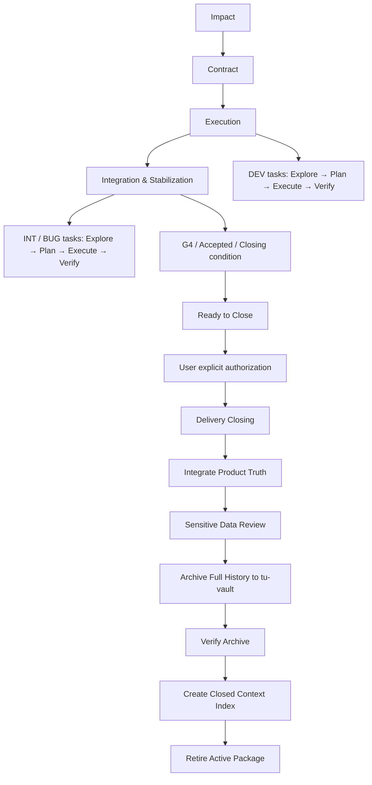

# Feature Delivery Workflow V1

## Background

功能需求很少从一份完整、稳定的后端规格开始。它可能来自产品原型、PRD、截图、PDF、聊天记录、已有接口讨论，或后续的测试反馈。实际交付还要兼顾前端尽早对齐、需求尚未确认时避免过早冻结接口、多服务与 IoT/WS/MQTT/设备链路，以及跨数天或数周的 AI Session、联调和 Bug 回归。

V1 将一次完整交付组织为一个可恢复的 Delivery，而不是把聊天历史、Apifox、Issue Tracker 或单次编码 Session 当成事实来源。

## Problems addressed

- 新 Session 重复理解需求，原型按钮又被直接映射为后端接口。
- 前后端契约太晚才形成，Markdown、OpenAPI、Controller 又各自漂移。
- 多仓库、实时链路和设备责任边界不清，导致任务拆分和联调语义不稳定。
- Bug 在数周后出现时，无法快速定位原需求、契约和已验证证据。
- 过程记录与长期 Product Truth 混在一起，既难恢复，也污染当前产品模型。

## When to use

用于一个需求会经历影响分析、Contract 确认、多个 DEV/INT 任务、跨 Session 协作，或在联调/测试后仍可能回归的真实交付。它尤其适合多仓库、实时链路、设备链路或前后端需要提前对齐的 Feature。

不要把所有工作都放入 Delivery：范围和复现路径已经明确的小 Bug、独立技术研究、单纯 code review、已具备完整 Scope/Contract/Verification 的单个 DEV Task，以及独立 architecture review，都优先采用对应的专用 capability。详见 [Skill Integration Best Practices](skill-integration.md)。

## Quick start

```text
$ai-guidance-workflows:tu-deliver-feature
<需求 / 原型>

继续 DF-20260905-01
DF-20260905-01 当前进展
DF-20260905-01 设备状态偶尔不刷新
```

新需求从 Impact 开始。继续、状态和 Bug 均使用 canonical Delivery ID，而非目录 slug。

## Model and authority

```text
Workflow owns lifecycle state and orchestration.
Phase owns stable input, output, and gate contracts.
Skill supplies replaceable execution capability.
Product knowledge supplies verified domain context.
```

`/tu-deliver-feature` 是生命周期入口，不是 Mega Prompt。它识别或创建 Delivery、恢复最小上下文、检查 Gate、路由到可用能力，并回填状态和导航。它不取代原型解析、通用调试、TDD 或代码评审方法。

代码、批准的 Contract、Task Artifact 与可复现测试/联调证据始终是 Authority。`resume.md`、Apifox、Issue Tracker 和聊天记录都不是 Authority。

## Delivery ID and package

每次软件交付使用一个稳定、可排序的 canonical Delivery ID：`DF-YYYYMMDD-NN`。它既是机器身份，也是 Context Address：可据此定位当前或已关闭的 Delivery、对应 Product、Capability、Repository、related deliveries 与阶段；不能包含或依赖需求标题。可读 slug 仅属于目录，例如 `DF-20260904-01-robotdog-fill-light`。同一 Delivery ID 贯穿需求、契约、实现、联调、Bug、回归与归档；不要因为后续 Bug 新建丢失原上下文的 Delivery。Delivery 内子任务使用 `CAP-01`、`EXT-01`、`DEV-01`、`INT-01`、`BUG-01` 等局部编号。

新建时扫描 `work/active/`、`work/closed/` 与兼容保留的 `work/**/tasks/archive/` 下当天的 ID，取最大 `NN + 1`；若目标目录已存在则重新扫描并取下一号。不使用 UUID、sequence file、registry、锁、服务或数据库。

```text
work/active/<domain>/<product>/<delivery-id>-<slug>/
├── task.yaml
├── 01-impact-review.md
├── 02-api-contract.md
├── 02-openapi.yaml          # 可选；仅在有 REST 且实际需要时创建
├── 03-execution-backlog.md
├── 04-integration-log.md
└── resume.md
```

不强制生成空文件。新建时只创建 `task.yaml`、`resume.md` 与当前 Phase Artifact，并仅在 `artifacts` 中声明已创建文件。达到 Closing condition 只表示 Ready to Close；必须由用户显式调用 `tu-close-delivery`，它才会先 Integrate 已验证的 Product Truth、完成 Sensitive Data Review、将完整 Package Archive 到由 shared external context registry 定义、并由本机 `tu-vault` 路径解析的唯一 `<delivery_archive_root>/<delivery-id>/`、finalize 并验证 archived snapshot、创建 `work/closed/<domain>/<product>/<delivery-id>.md` Thin Context Index，并最后 retire active Package。`tasks/archive/` 只保留 legacy/local cold compatibility，不是正式 Closing 目标。

上图是人类说明的简化结构。Runtime authoritative template 是 [Task Package reference](../../../plugins/ai-guidance-workflows/skills/tu-deliver-feature/references/task-package.md)；不要让本页示例成为第二份 Runtime Authority。教学演练见 [robot-dog fill-light example](examples/robotdog-fill-light/walkthrough.md)。

`task.yaml` 是生命周期状态和导航索引，至少包含 `delivery_id`、`title`、`status`、`phase`、`product`、`repositories`、`capabilities`、`related_deliveries`、`created_at`、`gates`、`artifacts`、`current_focus`、`last_verified`、`next_actions`、`evidence` 和 `knowledge_update_assessment`。它不复制需求或接口正文。`repositories` 是列表，记录已确认的实际范围；不因产品知识或示例推断加入仓库。

`resume.md` 是短小的 Resume Cache，包含 Delivery ID、Current Phase、Goal、Confirmed Decisions、Current Implementation、Open Items、Relevant Commits、Read Next 和 Next Action。Phase 切换、重要 DEV 批次完成、联调结束、重要 Bug 修复、用户暂停和归档前都刷新它。恢复时先读 `task.yaml`，再读 `resume.md` 与当前阶段 Artifact，最后读取完成当前动作所需的最小代码/契约/证据。

## Four phases

| Phase | Core question | Authority | Gate |
| --- | --- | --- | --- |
| 1. Impact | 到底要改什么？ | `01-impact-review.md` | `G1_scope_confirmed` |
| 2. Contract | 前端、后端、上下游如何约定？ | `02-api-contract.md`，可选 `02-openapi.yaml` | `G2_contract_confirmed` |
| 3. Execution | 怎么拆、怎么实现？ | `03-execution-backlog.md` | `G3_tasks_ready` |
| 4. Integration & Stabilization | 联调、测试、Bug、回归如何闭环？ | `04-integration-log.md` | `G4_test_ready` |

```text
Impact → G1 → Contract → G2 → Execution → G3 → Integration & Stabilization → G4 / Accepted → Ready to Close → User Authorization → Delivery Closing → Integrate → Sensitive Data Review → Vault Archive → Verify Archive → Closed Index → Retire Active
```

### Phase artifacts

| Artifact | Solves |
| --- | --- |
| `task.yaml` | Lifecycle state、Gate 与 Artifact navigation。 |
| `01-impact-review.md` | Scope、CAP、repository/cross-service impact 与未决项。 |
| `02-api-contract.md` | 人类评审的 REST/Event/Device Contract Authority。 |
| `02-openapi.yaml` | 可选的 machine-readable REST Contract。 |
| `03-execution-backlog.md` | EXT/DEV/INT 的执行条件、验证与证据。 |
| `04-integration-log.md` | 联调、Bug、回归和 reopen evidence。 |
| `resume.md` | 短小 Resume Cache，不替代上述 Authority。 |

### Phase 1 — Impact

`01-impact-review.md` 必须保留范围与非目标、原型/PRD Evidence、`CAP-xx`、页面或行为到 Backend disposition、仓库影响、跨服务责任、REST/WS/MQTT/状态链路、待确认事项、风险与分批建议。Disposition 为 `reuse`、`change`、`new`、`frontend_only`、`upstream_dependency`、`out_of_scope` 或 `unknown`。Evidence 不足时不能冻结最终 API。

这是 V1 的 OWN 能力，由 `tu-analyzing-feature-impact` 提供聚焦的原型/需求到影响评审方法。优先在可用且 model-invokable 时 ADOPT/ADAPT research、domain modeling、codebase design 来核实协议、领域边界和责任；无法组合的外部 Skill 只借鉴方法，不绕过调用策略。

### Phase 2 — Contract

`02-api-contract.md` 面向人类评审，覆盖 REST、WebSocket/Event、MQTT/设备、状态、权限、实时策略、上下游与 Open Decisions。REST 至少定义 method、path、权限/数据范围、request/response、分页/排序、校验、错误语义、幂等与兼容性。WS/Event 至少定义 channel、envelope、business identifier、全量/增量、初始读取、重连、fallback、项目隔离、顺序与去重。设备链路必须区分 HTTP success、platform acceptance、message published、adapter sent、device executed 与 state converged。

REST 较多时新增可导入 Apifox 的 `02-openapi.yaml`，但它不是 WS、MQTT 或设备契约的唯一表达。IDEA→Apifox 保持为实现后的 Runtime Contract Synchronization：Phase 2 用草案供前端早期对齐；Phase 3 Controller/DTO/Swagger 形成 Runtime OpenAPI；Phase 4 比对运行时输出和已批准 Contract，再决定是否同步 Apifox。不要为提前生成 Apifox 文档而创建未实现的空 Controller。

本阶段 ADAPT `to-spec` 的结论收敛、完整性与 seam 分析方法；不自动调用 user-invoked provider，且批准的 Workbench Contract 不随 provider 改变 Authority。V1 不新增庞大的 Contract Skill。

### Phase 3 — Execution

Backlog 中只使用 `EXT`（外部确认/环境/设备）、`DEV`（可直接编码）和 `INT`（联调与验收）。每项至少有 Task ID、CAP-xx、Type、Goal、Repository、Preconditions、Blocking dependencies、Relevant contract、Expected changes、Verification、Status 与 Evidence。`DEV` 仅在其前置均已满足时 ready；它必须是 fresh-context-sized、可独立验证的垂直切片。

本阶段 ADAPT `to-tickets` 的 tracer bullet、vertical slice 与 blocker edge；外部 Tracker 不能成为 Authority。成熟 `implement` 是 user-invoked 时，总入口只在 DEV Ready 后给出建议入口；不要绕过平台机制或另建巨大实现 Skill。优先使用可 model-invokable 的 `tdd`、`code-review` capabilities。

### Engineering Task Loop inside Delivery

Phase 3 的非 trivial DEV，以及 Phase 4 的 BUG / INT，推荐按 [Engineering Task Loop](../engineering-task-loop/README.md) 执行 Explore → Plan → Execute → Verify。它约束一次具体修改的理解、授权边界和验证；Delivery 仍保留 Delivery ID、CAP、Gate、Task Package 与 Artifact Authority。关键 Plan/实施结果回填 `03-execution-backlog.md`，Bug/INT 的根因、修复和回归回填 `04-integration-log.md`，暂停或 Phase 变化刷新 `resume.md`。

### Phase 4 — Integration & Stabilization

联调日志覆盖前后端、WS、MQTT、Device、测试环境、部署依赖、真实设备、Bug 与回归。每条场景记录参与系统、输入/环境、期望、实际、证据与结论；`G4_test_ready` 只在验证与必要联调证据足够、未完成项被明确为 blocked/deferred/out-of-scope 时关闭。

Bug 先定位 Delivery 和 CAP，再分类路由：

- 实现 Bug：留在 Phase 4，保持 G1–G3，使用 `diagnosing-bugs` 或等价诊断，修复并回归，更新 integration log。
- Contract Bug：进入 Phase 2，将 G2 重置为 `pending`，更新受影响 DEV/INT Task 后重新确认。
- Requirement Gap：进入 Phase 1，将 G1 重置为 `pending`，更新 CAP、影响、后续 Contract 与 Backlog。
- Environment/Integration Issue：留在 Phase 4，建立/更新 INT Task。

Phase 4 ADOPT 已可用的 `diagnosing-bugs`；总入口只负责 Delivery、CAP、Phase 和 Artifact 路由，不重写通用 Debug 方法。

## Closing: Integrate and Archive

单个 DEV / BUG / INT 的 Engineering Task Loop Verify 只回填 `03-execution-backlog.md` 或 `04-integration-log.md`，不触发 Delivery Closing。G4 / acceptance 达成时，`tu-deliver-feature` 最多报告 Ready to Close 并建议 `tu-close-delivery DF-YYYYMMDD-NN`；只有用户显式 Closing Authorization 才开始收尾。`completed` 需 acceptance satisfied，通常也满足 G4；`blocked` 或 `superseded` 也可明确关闭。Integrate 与 Archive 是 Delivery Closing 的动作，不新增 Engineering Task Loop Stage，也不改变四阶段或 E/P/X/V。



Integrate 将已验证、仍有效且可复用的能力、链路、契约、约束或 ADR 更新至 `products/` 的唯一权威页；没有可提炼事实时记录 `knowledge_update_assessment: not-needed`。Requirement Authority 来自 Current Product Spec/PRD、approved Product Decision、approved Contract 或明确 acceptance criteria；Implementation Reality 来自代码、测试、配置与可复现运行证据。两者不一致时记录 Requirement / Implementation Gap，不能让代码反向否定已批准需求。对于 `superseded`，不得把被替代的旧设计写成 Current Product Truth，并应记录 related delivery / superseded-by reference。

Archive 仅在 Sensitive Data Review 通过后写入本机 `workspace.local.yaml` 的 `external_contexts.tu_vault.path`；shared `delivery_archive_root` 由 `core/registry/external-contexts.yaml` 定义。一个 DF 对应唯一 `<delivery_archive_root>/<DF-ID>/` Archive Unit，且 Closed Index、manifest 与 archived task metadata 都使用 `tu-vault:<delivery_archive_root>/<DF-ID>`，不写本机绝对路径。Workbench active task 保持 `status: active`；只有 copied `delivery/task.yaml` 写入 final status、`archived_at`、`archive_reference` 和 `closed_index`。Archive Verification 必须核对 manifest、archived task metadata 和全部 artifacts；通过后才创建 `work/closed/<domain>/<product>/<delivery-id>.md` Thin Context Index，随后 retire active Package。它表示 Delivery Lifecycle Closed / Cold Context，不等于成功。配置缺失或 archive 不可验证时保留 active Package 并停止；不得降级为本地 archive 后假装成功。reopen 只将 immutable `<Archive Unit>/delivery/` restore/copy 为 Active Package，不移动、删除或修改 Vault Unit，也不把 `summary.md` 或 `manifest.yaml` 带入 active。已有 pre-V1 `tasks/archive/` 不删除、不伪造也不迁移。

## Entry and recovery

用户只需记住以下入口：

```text
/tu-deliver-feature <需求或原型>
/tu-deliver-feature 继续 DF-20260904-01
/tu-deliver-feature DF-20260904-01 当前进展
/tu-deliver-feature DF-20260904-01 <Bug 描述>
/tu-close-delivery DF-20260904-01
```

新需求：创建 ID 与包，创建必要的 `task.yaml`/`resume.md`，进入 Impact。继续或查询：先在 `work/active/` 按 DF ID 定位包；未命中时读 `work/closed/` Thin Index，再按其 archive reference 访问 cold history。读取最小恢复集并报告/执行当前阶段的下一动作。Closing：仅在用户明确授权后调用 `tu-close-delivery`，它按 Core Delivery Closing Playbook 处理。若 Bug 属于已关闭 Delivery，先解析配置的 external archive；不可访问时才检查 local legacy cold history。若两者都不可访问，报告证据缺口而不伪造 prior state。然后按既有 reopen 机制恢复 Package、记录分类并刷新 resume。Bug：创建或定位 `BUG-xx`，先分类；只有 Contract 或 Requirement 变化才回退 Gate。任何代码修改、外部发布、Apifox 写入或跨仓库读取仍遵循当前用户授权和本地约束。

## Common mistakes

- 从 UI button 直接推导 API，或把显示字段直接变为请求字段和数据库列。
- 提前创建所有 Artifact 空文件，或在 `artifacts` 中指向不存在的文件。
- 把 Chat History、Apifox 或 Issue Tracker 当成 Authority。
- 因普通实现 Bug 重开 G1/G2，或为后续 Bug 创建失去原上下文的新 Delivery。
- 用 `handoff` 替代持久的 Task Package / `resume.md`。
- 强制所有小任务走完整 Feature Delivery。

## Knowledge promotion and non-goals

`work/` 保存 Delivery Change State，不自动进入 `products/`。仅在 Integrate 时将经验证且未来可复用的架构事实、仓库责任、跨服务 flow、协议语义或 ADR 提炼为 Current Product Truth；Closing 时把 `knowledge_update_assessment` 更新为 `updated` 或 `not-needed`。

V1 不引入运行时框架、工作流引擎、数据库、复杂 DSL、额外 Schema Framework、大量 phase Skill，也不把 Apifox/Issue Tracker 设为 Authority。Prototype parsing、通用 debugging、TDD、review、ticketing 和 implementation 保留给成熟可用能力；本 Workbench 只拥有生命周期状态与领域交付语义。
