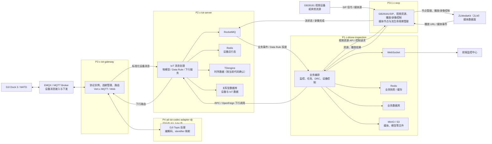

# P1-P4、P3-1 技术栈、中间件与系统架构

## 文档定位

本文是无人机巡检平台 P1-P4、P3-1 的架构边界和问题定位入口，服务于两类场景：

- 人员快速理解五个仓库分别负责什么、依赖哪些基础设施。
- AI 分析问题时先定位到协议接入、IoT 消息、业务编排或流媒体边界，再读取对应仓库文档和代码。

本文依据当前五个仓库的 `pom.xml`、已有设计文档和 P0 链路文档整理。已核实的代码/依赖事实与尚未确认的部署事实分开记录；运行环境中的地址、集群规模、账号、Topic 配置和具体数据表仍以实际配置为准。

## 总体架构

### 两条主链路

**设备消息上行：** DJI 设备 -> EMQX/MQTT -> P3 网关 -> P4 DJI 编解码 -> P2 IoT 消息处理 -> RocketMQ/Data Rule -> P1 业务 Handler、缓存和 WebSocket -> 前端。

**设备指令下行：** P1 业务或 DRC -> P2 下行服务 -> P3 协议实例 -> P4 编码为 DJI Topic/Payload -> EMQX/MQTT -> DJI 设备。

**视频流媒体链路：** 业务系统通过 P3-1 `c-wvp` 管理视频资源、GB28181 设备/通道、播放会话与录像；`c-wvp` 控制 ZLMediaKit 节点并把可播放地址和媒体事件提供给业务侧。视频字节的接入、转协议、转码和分发属于 ZLM 媒体数据面。该链路与 OSD/HMS/Task 消息链路相互关联但不是同一条消息通道；排查黑屏、拉流失败、转码或推流问题时优先检查 P3-1、ZLM、媒体会话和网络，而不是先从 P2/P3 的 IoT 消息链路推断。

设备消息上行和设备指令下行两条链路仅描述**当前已核对的 DJI 接入实现**；视频流媒体链路描述的是 `c-wvp` 的通用视频控制面，不证明任一具体厂商设备已经接入。新增机器狗或其他设备厂商时，不得把 P4 DJI Codec、EMQX Topic 或 DJI 媒体链路视为通用前提；先按[多厂商设备接入边界](../context/domain/vendor-device-integration.md)核对厂商/型号资料和 P3 接入分流。

## 五个项目的职责与技术栈

| 项目 | 已核实职责 | 主要技术与中间件 |
| --- | --- | --- |
| P1 `c-drone-inspection` | 面向巡检业务的设备数据消费、监控中心、任务、DRC 和设备控制；向前端提供 REST/WebSocket。 | Java 8、Spring Boot 2.7.18、MyBatis、Redis、RocketMQ Spring、WebSocket、Nacos、RPC/OpenFeign、MinIO/S3；公共模块还声明 Spring Integration MQTT、文件、监控等 Starter。 |
| P2 `c-iot-server` | IoT 消息处理、物模型/TSL、Data Rule、设备运行态和下行服务调用；将平台消息投递给业务侧。 | Java 8、Spring Boot 2.7.18、MyBatis、Redis、RocketMQ 客户端 5.3.1、Nacos、OpenFeign/RPC、Redisson/Lock4j、Quartz、Flyway、TDengine JDBC。 |
| P3 `c-iot-gateway` | 设备协议接入、连接管理、协议实例选择、上行标准化和下行转发；承载适配器。 | Java 8、Spring Boot 2.7.18、Vert.x MQTT/Web、Nacos、RocketMQ Spring、负载均衡、RPC、文件服务和 Codec Adapter SPI。 |
| P3-1 `c-wvp` | 视频控制面：GB28181/SIP 视频设备和通道、媒体节点、拉流/推流资源、播放会话、协议播放地址和录像生命周期；发布受管资源的流状态与录像完成事件。ZLM 仍负责实际媒体数据面。 | Java 21、Spring Boot 3.4.4、SIP、Redis、RocketMQ Spring、WebSocket、MyBatis、Flyway、`c-video-api`。 |
| P4 `ad-iot-codec-adapter-dji` | DJI Topic/字段/identifier 的编解码与协议映射，以依赖库形式装载到 P3，不承担业务编排、业务数据库或独立消息消费。 | Java 8、Spring Context/Boot Autoconfigure、`s-iot-codec-adapter`、Jackson、Fastjson、Hutool。 |

## 中间件边界

| 中间件 | 所在边界 | 用途与排查入口 |
| --- | --- | --- |
| EMQX / MQTT | 设备 <-> P3 | DJI OSD、HMS、状态和指令 Topic 的接入与下发；先查连接、Topic、订阅和 Payload。 |
| RocketMQ | P2 <-> P1，及平台内部消息 | Data Rule、标准化设备事件和业务消费；先查消息是否生成、Topic/Tag、消费者组和重试。 |
| Redis | P1、P2 各自维护 | P2 侧保存设备实时运行态；P1 侧保存业务快照、拓扑和监控展示缓存。不要把两个服务的 Key/数据所有权混为一谈。 |
| 关系型数据库 | P1、P2 | 业务主数据、设备/IoT 持久化和低频投影；具体库名、表结构、版本以目标服务配置和代码为准。 |
| TDengine | P2 | 当前 P2 依赖 `taos-jdbcdriver`，用于时序数据的可能性已由代码确认；具体写入链路需结合运行配置核实。 |
| Nacos | P1、P2、P3 | 服务发现和配置中心；调用失败时检查注册状态、配置版本和命名空间。 |
| WebSocket | P1 <-> 前端 | 监控中心局部字段更新和全局刷新；字段与 `monitor_device_v2_list` 的关系见 P1 专门文档。 |
| ZLMediaKit（ZLM） | P3-1 视频媒体数据面 | `c-wvp` 管理媒体节点并控制播放/录像；ZLM 负责推流、拉流、转协议/转码和流会话能力。具体节点、端口与集群配置以实际部署为准；不负责 OSD/HMS 业务事件投递。 |
| MinIO / S3 | P1 文件边界 | 媒体、模型和其他对象文件的存储/访问；文件上传成功不等于设备消息链路成功。 |
| RPC / OpenFeign | 服务间调用 | P1/P2/P3 的同步查询、控制和下行服务调用；先确认调用方、接口、超时和目标服务。 |
| Redisson/Lock4j、Quartz | P2 内部 | 分布式锁、定时任务和补偿；问题定位时与实时消息消费区分开。 |

P1 的 POM 还声明了 Spring Integration MQTT；当前 P0 主链路以 P2/P3 的设备消息桥接和已有 DJI 文档为准，该依赖的实际运行入口需通过 P1 配置/代码进一步确认。历史设计资料中出现过 Kafka，但当前 P1-P3 核心 POM 和现行链路证据指向 RocketMQ，不能据此把 Kafka 作为当前必需中间件。

## 问题定位边界

| 现象 | 首要定位层 | 其次核对 |
| --- | --- | --- |
| MQTT 无消息、Topic 不匹配、字段解析错误 | P3/P4 | EMQX 连接/订阅、P4 identifier 和 Payload 映射 |
| 消息已到网关但 P1 无业务事件 | P2 | Data Rule、RocketMQ Topic/Tag、消费者组和重试 |
| P1 列表数据不更新或字段滞后 | P1 | RocketMQ Handler、Redis 快照、WebSocket bizcode 和全局刷新触发 |
| 指令已生成但设备无动作 | P1 -> P2 -> P3/P4 | 下行接口、协议编码、MQTT 发布和设备 ACK |
| 视频黑屏、拉流失败、流状态异常 | P3-1、ZLM/媒体网络 | 视频资源/播放会话、ZLM 节点与流源网络；再核对业务侧视频 API 或媒体事件消费 |
| 设备在线状态与页面展示不一致 | P2/P1 | P2 Redis 实时态、P1 投影/缓存和刷新事件的时间顺序 |

## 当前不纳入的事实

本文不固化主机地址、账号密码、生产 Topic、集群节点数、部署编排、具体数据库表全量清单、ZLM 的生产参数或未在代码/配置中确认的转码能力。这些内容变化频繁或涉及环境信息，应在对应仓库和运行环境中核实后再补充。

## 证据与关联文档

- 四个项目的依赖证据：`c-drone-inspection/pom.xml`、`c-iot-server/pom.xml`、`c-iot-gateway/pom.xml`、`ad-iot-codec-adapter-dji/pom.xml`。
- P3-1 视频控制面证据：`c-wvp/README.md`、`c-wvp/pom.xml`、`c-wvp/src/main/java/com/genersoft/iot/vmp/xmkj/controller/VideoResourceRpcController.java`、`c-wvp/src/main/java/com/genersoft/iot/vmp/xmkj/mq/MediaEventMqProducer.java`。
- [DJI OSD 上行数据链路](../flows/dji-osd-upstream-flow.md)
- [DJI 设备指令下行链路](../flows/dji-osd-command-flow.md)
- [P2 消息桥接与 Data Rule](../repositories/c-iot-server/message-bridge-and-data-rule.md)
- [P3 网关上/下行桥接](../repositories/c-iot-gateway/gateway-upstream-downstream-bridge.md)
- [P4 DJI 协议映射](../repositories/ad-iot-codec-adapter-dji/dji-adapter-mapping.md)
- [P3-1 视频流管理平台网关关键入口地图](../repositories/c-wvp/key-entry-points.md)
- [P1 监控中心设备核心列表与刷新模型](../repositories/c-drone-inspection/monitor-device-v2-list-refresh-model.md)
- [P1-P4、P3-1 产品入口](../index.md)
