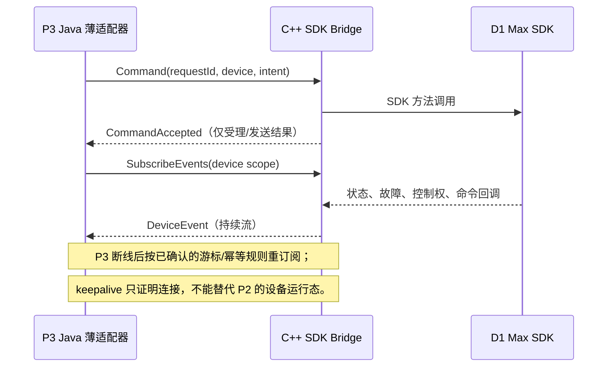

# P3 与原生 SDK Bridge：gRPC、HTTP 与 MQTT 的选型

> **证据等级：当前 P3 代码与官方 gRPC/Protocol Buffers 文档核对（2026-08-31）。** 本页解决“P3 如何对接独立的 C++ SDK Bridge”，不替代智元设备的产品、TSL 或安全决策。推荐方案是后续 PoC 的起点，不是已经上线的架构。

## 何时读取

- 设计智元或其他 C++/原生 SDK Bridge 与 P3 的通信边界。
- 需要在 gRPC、HTTP/JSON 和 MQTT 之间选择，或为该选择设计 PoC。
- Java 团队需要理解 gRPC、Protobuf 与 Hessian 类方案的区别。

## 先建立正确认知

**gRPC 不是 HTTP 的替代品，而是一种通常运行在 HTTP/2 上的 RPC 框架。** 开发者先以 `.proto` 定义 `service`、`rpc` 和 `message`，再由 `protoc` 与 gRPC 插件生成 Java/C++ 两端的类型和调用 Stub。默认消息格式是 Protobuf：跨语言、强类型的二进制序列化格式。

常被提及的 Hessian/Hessian2 是另一类二进制序列化/RPC 组合，在 Java/Dubbo 历史场景中较常见；它不等同于 Protobuf 或 gRPC。它们的共同点是都避免把所有内部调用表达为 JSON，区别在于契约、生成代码、跨语言生态和传输模型。

| 对比对象 | 调用模型 | 主要优势 | 主要代价 |
| --- | --- | --- | --- |
| REST/HTTP + JSON | URL、HTTP 方法、JSON 请求/响应。 | 可读、可用 curl/Postman 排障，团队学习和跨网关接入门槛低。 | 实时上行还要另行设计 Webhook、SSE、WebSocket 或轮询；字段契约约束较弱。 |
| gRPC + Protobuf | Service/Method、生成 Stub，普通 RPC 或单/双向流。 | C++/Java 共用一份强类型契约；服务端流适合持续状态与事件；支持 deadline、流控、健康检查。 | 需要维护 proto、代码生成、HTTP/2/TLS 和流重连；直接抓包不可读，团队须掌握调试工具。 |
| MQTT | Topic、消息、QoS 和订阅关系。 | 适合设备侧脱网缓冲、异步广播和跨站点中转。 | 必须额外治理 Topic、QoS、顺序、重复、命令回执和 ACL；不是对 SDK 方法调用的天然映射。 |

## 当前边界与推荐取舍

P3 的 `IoTCustomGatewayServer` 适配“第三方 SDK 自行维护设备连接”的模式：它调用 Java `CustomProtocolAdapter#downstream`，并接收该 Adapter 上行回调。若智元 Bridge 是独立 C++ 进程，P3 仍需要一个**薄 Java Adapter/Ingress**，把 Bridge 事件转成 `UpstreamDecodedData`，并把 P3 下行委托给 Bridge；独立 C++ 进程不能被 Maven classpath 直接加载。

| 方案 | 适用条件 | 对智元 Bridge 的判断 |
| --- | --- | --- |
| HTTP/JSON + 事件回调 | 首次验证厂商 SDK，状态频率低，团队希望用现成 HTTP 工具排障。下行可为 HTTP 请求，上行必须配套 webhook/SSE/WebSocket，不能只靠轮询。 | **推荐为最小 PoC 选项。** 先证明一台设备的连接、状态、故障、命令受理与回调语义。 |
| gRPC Unary `Command` + 服务端流 `SubscribeEvents` | Bridge 长期在线，P3 要持续接收状态/故障/控制权/命令结果，且 C++ 与 Java 均可管理 proto 生成与 TLS。 | **推荐为生产候选方案。** 比完整双向流更容易首期落地，并保留后续扩展空间。 |
| gRPC 双向流 | 双方都需持续发送消息、需要一个逻辑会话承载下行命令和上行事件，团队已经掌握流控和重连。 | 不作为首期必选项；先完成 Unary + 服务端流的 PoC，再决定是否合并为双向流。 |
| MQTT Bridge 直连平台 Broker | 设备边缘经常断网、需要本地缓存/多消费者，且已有可治理的 Broker、ACL、主题和幂等规范。 | 不应仅因平台已有 MQTT 就默认选择；当前 P3/P2 标准消息入口、Topic 与命令回执契约须先设计确认。 |

**推荐决策：** 对智元 D1 Max，先完成 HTTP/JSON 或 gRPC Unary + 服务端流的同机 PoC；若目标是长期运行的多设备 Bridge，优先演进到 gRPC。不要在未验证厂商 SDK 生命周期和回调线程模型前，直接实施复杂双向流或 MQTT 生产主题。

## 建议的 gRPC 最小契约

以下仅示意交互类别，不定义最终字段名、TSL identifier 或安全策略：

```proto
service RobotBridge {
  rpc Command(CommandRequest) returns (CommandAccepted);
  rpc SubscribeEvents(SubscribeRequest) returns (stream DeviceEvent);
}
```

- `Command` 只表达“Bridge 已受理/拒绝命令”，并携带可关联的请求标识。
- `SubscribeEvents` 传递设备状态、故障、控制权、SDK 连接生命周期和后续命令结果。
- 动作完成必须由独立 `DeviceEvent` 或状态变化证明；不得把 `CommandAccepted` 当作动作完成。
- 每个事件都需具备设备身份、事件时间、递增/幂等标识和契约版本；具体字段由 P1/P2/P3/P4-1 联合确认。



## PoC 与发布门槛

1. 先编译并运行 C++ gRPC 官方 Quick Start，再以同一 `.proto` 运行 Java Client；验证开发机的 `protoc`、CMake、gRPC C++ 和 Java 代码生成链路。
2. 把厂商 SDK 接入到 C++ Bridge，仅实现一台测试机的 `Command` 与 `SubscribeEvents`。回调线程只复制/入队，不在 SDK 回调中执行网络阻塞或业务逻辑。
3. P3 Java 薄适配器使用生成 Stub 调用 Bridge，将事件转换为当前 `CustomProtocolAdapter` 上行回调；P3 仍负责向 P2 查询设备并补齐平台上下文。
4. 验证 SDK 连接断开、Bridge 重启、P3 重连、重复事件、超时与 deadline、慢消费者和 soft emergency stop。Bridge 健康检查、P3 到 Bridge 的连接 keepalive 与 P2 设备 ONLINE/OFFLINE 是三套不同语义。
5. 只有完成上述闭环，才决定是否采用 gRPC 双向流、是否部署 mTLS、以及是否需要 MQTT 作为边缘离线消息面。

## 学习路径与官方平台

按“先契约、再 Java、再 C++、最后流式与运维”的顺序学习，避免先堆框架：

1. [gRPC Introduction](https://grpc.io/docs/what-is-grpc/introduction/)：理解 RPC、Stub、HTTP/2 与 `.proto` 的关系。
2. [Protocol Buffers Overview](https://protobuf.dev/overview/) 与 [官方教程](https://protobuf.dev/getting-started/)：学习消息类型、字段编号和向后兼容。
3. [gRPC Java Basics](https://grpc.io/docs/languages/java/basics/)：完成 Unary、服务端流、客户端流和双向流的 Java 示例；对 P3 薄适配器最直接。
4. [gRPC C++ Quick Start](https://grpc.io/docs/languages/cpp/quickstart/)：建立 CMake、Protobuf 与 C++ gRPC 的最小工程；对 Bridge 本体最直接。
5. [gRPC Java 官方示例库](https://github.com/grpc/grpc-java/tree/master/examples)：随后练习 deadline、retry、health、keepalive 与 in-process test。
6. [gRPC Guides](https://grpc.io/docs/guides/)：上线前重点阅读 health checking、keepalive、deadline、错误处理、流控和 graceful shutdown。

这些官方站点与官方 GitHub 示例是推荐学习平台；中文课程或视频可用于辅助理解，但不得替代上述版本、兼容性与运维语义的一手资料。

## 当前证据与待确认项

- P3 `c-iot-gateway/c-iot-gateway-core/.../protocol/CustomProtocolAdapter.java` 与 `.../protocol/custom/IoTCustomGatewayServer.java`：证明 P3 已支持第三方 SDK 自管连接的 Java Adapter 边界；没有证明已存在 gRPC transport。
- P3 `.../core/manager/ProtocolCodecAdapterManager.java`：证明报文 Codec 选择机制；它不能证明 C++ SDK 可直接作为 Codec 加载。
- gRPC 官方文档：证明 `.proto` 生成跨语言 Client/Server、四种 RPC 模式，以及 C++/Java Quick Start 的依赖和示例；不证明本平台或智元 SDK 已具备 gRPC 条件。
- `pending_verification`：Bridge 部署网络、设备数量、SDK 许可证/运行环境、TLS 证书托管、断线后的事件补偿策略，以及 P3 使用 gRPC Java 依赖对现有 Java 8/Spring Boot 2.7 打包与发布的影响。
