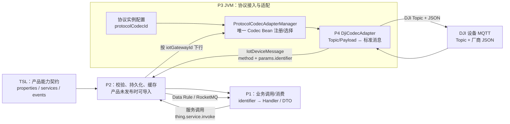
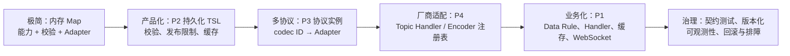

# 物联网物模型（TSL）：从极简内核到巡检平台

> **证据等级：项目链路已由代码核对（2026-08-26）；物模型通用定义引用阿里云官方文档。** 本文用于建立 TSL、协议适配与业务消费的共同认知，不作为任一产品的完整 TSL 文件、运行配置或设备厂商协议手册。

## 先建立一个正确的心智模型

物模型不是设备协议，也不是数据库表，更不是页面 DTO。它是一份**产品能力契约**：用稳定的 `identifier` 和数据类型说明设备可上报什么状态（属性）、可被调用什么动作（服务）、会发生什么需要业务感知的事情（事件）。阿里云将这份 JSON 格式的契约称为 TSL，属性、服务、事件可按产品需要选择定义。[阿里云：物模型与 TSL](https://help.aliyun.com/zh/iot/product-overview/terms)、[TSL 字段说明](https://help.aliyun.com/zh/iot/user-guide/tsl-parameters)

| 概念 | 回答的问题 | 巡检示例 | 不应混淆为 |
| --- | --- | --- | --- |
| 属性（property） | “设备当前是什么状态？” | 电量、位置、机场模式、在线活跃度相关遥测 | 一次性控制命令、业务任务状态。 |
| 服务（service） | “平台要设备执行什么动作？” | 起飞、返航、开关舱盖、进入 DRC 模式 | 任意 MQTT 原始 method。 |
| 事件（event） | “设备发生了什么，业务需要处理？” | 告警、任务进度、媒体上报 | 可轮询读取的当前属性。 |
| `identifier` | “跨边界如何唯一指向上述能力？” | `inspection_device_status_report`、某个控制服务名 | 展示文案、DJI 原始 Topic 或 command。 |
| TSL | 产品能力的声明与校验依据 | 某型号机场产品的 properties/services/events 集合 | P4 的 DJI Topic 映射或 P1 的 WebSocket DTO。 |

阿里云官方说明也解释了这一分层的价值：结构化数据、状态缓存/设备影子、可视化与在线调试。当前项目借鉴的是“以模型作为统一契约”的思想，但 P2 的 Redis 运行态、P1 的业务缓存和前端展示并不等同于阿里云设备影子。[阿里云：设备连接与物模型能力](https://help.aliyun.com/zh/iot/developer-reference/link-sdks)

## 官方文档入口（通用参考）

以下页面说明的是阿里云物联网平台的通用模型与产品能力，用于理解术语、JSON 结构和导入思路；它们不能替代本项目 P2/P3/P4 的代码、运行配置或设备厂商协议。

| 需要解决的问题 | 官方入口 | 使用边界 |
| --- | --- | --- |
| 属性、服务、事件分别是什么 | [物联网平台术语与物模型](https://help.aliyun.com/zh/iot/product-overview/terms) | 统一概念与能力类型，避免将属性、服务、事件混用。 |
| TSL JSON 有哪些字段与数据类型 | [物模型 TSL 字段说明](https://help.aliyun.com/zh/iot/user-guide/tsl-parameters) | 参考 identifier、`dataType`、struct、array 等格式；先经 P2 校验确认兼容性。 |
| 怎样定义、查看或导出产品模型 | [物模型（TSL）模型说明](https://help.aliyun.com/zh/iot/user-guide/what-is-a-tsl-model/) | 理解产品/模块/功能的组织方式，不假设项目存在同样的控制台能力。 |
| 怎样通过 API 导入 TSL | [ImportThingModelTsl API](https://help.aliyun.com/zh/iot/developer-reference/api-nu0i7a) | 作为“导入是产品契约变更”的参考；不能直接替代 P2 导入接口。 |
| 为什么选择模型通信，而非只用自定义 Topic | [设备连接与物模型能力](https://help.aliyun.com/zh/iot/developer-reference/link-sdks) | 理解结构化、状态缓存和调试收益；设备接入协议仍由 P3/P4 决定。 |

## 当前项目的真实链路



### 上行：把厂商报文翻译为平台能力

1. 设备按厂商协议向 MQTT Topic 发布 JSON；对 DJI 来说，Topic 与 payload 的含义属于 P4 的协议边界。
2. P3 为协议实例选择 `protocolCodecId` 指定的 Adapter。P4 不是独立服务，而是随 P3 Bootstrap 依赖装入同一 JVM 的 Spring Bean。
3. P4 先以 Topic 选择 `DjiTopicHandler`，再把厂商字段转换为标准上行结构。`params.identifier` 声明物模型能力；属性上报可使用扁平字段，事件使用 identifier 对应的 payload。
4. P3 补齐设备、网关、租户等上下文后转交 P2。P2 的设备消息处理、属性/时序处理与 Data Rule 为并行路径，不能假设其中一条必然先完成。
5. P2 的 Data Rule 需要按 method/identifier 匹配，随后才会投递 RocketMQ 给 P1。P1 Converter/Router 再按 identifier 选择业务 Handler；缺少模型契约、字段不匹配或 Handler 缺失都可能导致业务展示不更新。

### 下行：先以 TSL 约束动作，再编码为厂商报文

1. P1 只表达业务意图，例如“调用某机场控制服务”及其参数；它不应自行拼 DJI Topic 或 JSON。
2. P2 的 `IoTDeviceRpcApi#invokeDeviceService` 校验目标设备及产品下的**服务**物模型，构造 `thing.service.invoke`，并按设备关联的 `iotGatewayId` 路由。
3. P3 以当前协议实例的 codec ID 找到 P4。P4 仅接受 `thing.service.invoke`；外层 `identifier` 选 `DjiDownstreamEncoder`，内层 `params` 是命令参数。
4. P4 将已验证的统一服务转换为一条 DJI 原子 Topic/Payload，并依回复模式等待或不等待设备回复。开机、控制权、重试、DRC 心跳等多步骤业务编排仍属于 P1/P2，而不是 P4。

## TSL 的导入、发布与适配器加载：职责不能倒置

| 事项 | 当前项目责任 | 关键约束 |
| --- | --- | --- |
| 定义/导入 TSL | P2 `IotThingModelServiceImpl` | 校验 properties/services/events 的 identifier、名称与属性数据类型；产品已发布时拒绝导入。 |
| 导入写入 | P2 | 验证通过后替换该产品已有物模型记录并清理模型列表缓存；导入是产品契约变更，应先评估 P1/P4 兼容性。 |
| 协议适配加载 | P3 + P4 | P4 的自动配置扫描并注册 `DjiCodecAdapter`；P3 收集所有 `ProtocolCodecAdapter`，空或重复 codec ID 会使启动失败。 |
| 厂商协议映射 | P4 | Topic/原始 method/字段 ↔ 平台 method、identifier、参数；P4 不存储、导入或发布 TSL。 |
| 业务消费与展示 | P1 | identifier → Handler/DTO/缓存/推送；P1 不应绕过 P2 的产品模型校验。 |

阿里云也将 TSL 作为产品级 JSON 文件，支持查看/导出和导入，并将属性、服务、事件纳入同一模型；这有助于理解为什么“模型是契约而非代码生成物”。但**项目的 P2 导入 DTO 是否可直接接受阿里云完整 JSON schema 尚未核实**：不能直接把阿里云导出的文件投进 P2，必须先通过 P2 的验证/导入接口和测试样本确认字段兼容性。[阿里云：导入物模型 API](https://help.aliyun.com/zh/iot/developer-reference/api-nu0i7a)、[阿里云：TSL 模型说明](https://help.aliyun.com/zh/iot/user-guide/what-is-a-tsl-model/)

## 极简内核：一个可读的物模型模拟

下面的 Java 代码仅用于学习，省略网络、持久化和框架；它抽出三项必要机制：能力声明、按 identifier 校验、协议适配。不是仓库可直接复制的生产代码。

```java
enum Kind { PROPERTY, SERVICE, EVENT }

final class Capability {
    final String identifier;
    final Kind kind;
    final Class<?> payloadType;
    Capability(String identifier, Kind kind, Class<?> payloadType) {
        this.identifier = identifier;
        this.kind = kind;
        this.payloadType = payloadType;
    }
}

final class Message {
    final String identifier;
    final Object payload;
    Message(String identifier, Object payload) {
        this.identifier = identifier;
        this.payload = payload;
    }
}

final class ThingModel {
    private final Map<String, Capability> capabilities = new HashMap<>();

    ThingModel() {
        capabilities.put("battery", new Capability("battery", Kind.PROPERTY, Integer.class));
        capabilities.put("return_home", new Capability("return_home", Kind.SERVICE, Map.class));
        capabilities.put("alarm", new Capability("alarm", Kind.EVENT, Map.class));
    }

    Capability require(String identifier, Kind expected) {
        Capability c = Optional.ofNullable(capabilities.get(identifier))
            .orElseThrow(() -> new IllegalArgumentException("unknown identifier"));
        if (c.kind != expected) throw new IllegalArgumentException("wrong kind");
        return c;
    }
}

final class VendorAdapter {
    Message decode(String topic, Map<String, Object> json) {
        if (topic.endsWith("/osd")) return new Message("battery", json.get("battery_percent"));
        throw new IllegalArgumentException("unsupported vendor topic");
    }

    Map<String, Object> encode(Message service) {
        Map<String, Object> result = new HashMap<>();
        result.put("method", "return_home");
        result.put("params", service.payload);
        return result;
    }
}

// 上行：先翻译，再按模型校验；下行：先校验服务，再交给协议适配器。
ThingModel model = new ThingModel();
Message report = new VendorAdapter().decode("thing/product/sn/osd",
        Collections.<String, Object>singletonMap("battery_percent", 72));
model.require(report.identifier, Kind.PROPERTY);
model.require("return_home", Kind.SERVICE);
```

### 这个极简模型带来的好处

| 内核元素 | 解决的问题 | 缺失时的常见后果 |
| --- | --- | --- |
| `Capability(identifier, kind, payloadType)` | 让能力命名、方向和数据形状有唯一依据。 | P1/P4 各自猜字段；同名动作被当属性或事件。 |
| `require(identifier, expectedKind)` | 在跨服务边界尽早失败，避免错误协议发到设备。 | 运行到设备侧才发现 Topic/命令不支持。 |
| `VendorAdapter` | 将厂商 Topic/JSON 与业务语义隔离。 | P1/P2 到处出现 DJI 专属字段，换协议成本高。 |
| 上行/下行对称 | 上报和控制都以同一能力词典沟通。 | 写了下行编码器却未定义 service，或上行 identifier 无消费者。 |

## 从微模型演进到当前工程



| 演进层 | 为什么需要 | 当前工程对应 |
| --- | --- | --- |
| 内存能力表 | 证明物模型的最小本质是“可验证的能力字典”。 | 本文极简模拟。 |
| 产品级 TSL | 多设备共享模型，支持 CRUD、导入、缓存与发布约束。 | P2 `IotThingModelServiceImpl`。 |
| 多协议选择 | 同一平台可接入 DJI 及其他协议，而业务代码不感知 Topic。 | P3 `ProtocolCodecAdapterManager` + `protocolCodecId`。 |
| 专用适配器 | 将厂商 Topic、字段和命令格式封装在独立模块。 | P4 `DjiCodecAdapter`、Topic Router、Encoder Registry。 |
| 业务消费 | 将设备能力投影为任务、监控、告警和 UI；业务错误可独立处理。 | P1 Data Rule 消费、Converter/Router/Handler。 |
| 治理与可观测性 | 避免模型改了而适配器/消费者没改，避免消息静默跳过。 | TSL 校验、P4/P1 运行日志、契约测试；仍需补齐产品级发布流程与版本矩阵。 |

## 修改或排查时的最小检查表

1. 先确定能力种类：当前状态用 property，外部触发动作用 service，需通知的事实用 event；不要因“都能传 JSON”而混用。
2. 在 P2 先验证 product、identifier、类型和发布状态；新增下行服务必须先有同名 service。
3. 在 P4 核对上行 Topic Handler 或下行 Encoder 的唯一 identifier，并用脱敏契约样本验证原始 JSON ↔ 统一消息。
4. 在 P3 核对运行实例的 `protocolCodecId` 与 P4 `DjiConstants.DJI_CODEC_ID`，以及 Bootstrap 是否实际包含该 Adapter 版本。
5. 在 P1 核对 Data Rule、RocketMQ Topic/Tag、Converter 的字段恢复、Router Handler 和强类型 DTO；无 Handler 的 identifier 会被确认消费，不能当作“下游自然兼容”。
6. 发布前至少覆盖：旧设备上行、目标新能力上行、服务下行与回复、P1 展示/缓存；准备 TSL、P4、P1 三方版本回滚方案。

## 当前代码证据

- P2：`c-iot-server/c-iot-core/.../service/thingmodel/IotThingModelServiceImpl.java`、`.../api/device/IoTDeviceRpcApi.java`、`.../util/IotTslDataTypeConverter.java`。
- P3：`c-iot-gateway/c-iot-gateway-core/.../core/manager/ProtocolCodecAdapterManager.java`、`.../core/handler/MessageProcessingEngine.java`、`.../autoconfigure/IotGatewayProperties.java`。
- P4：`ad-iot-codec-adapter-dji/ad-iot-codec-adapter-inspection-dji/.../DjiCodecAutoConfiguration.java`、`DjiCodecAdapter.java`、`router/DjiTopicRouterFactory.java`、`encoder/DjiDownstreamEncoderRegistry.java`。
- P1：`c-drone-inspection/b-inspection-platform-iot/.../InspectionIotUpstreamConsumer.java`、`InspectionIotMessageConverter.java`、`InspectionIotMessageRouter.java`。
