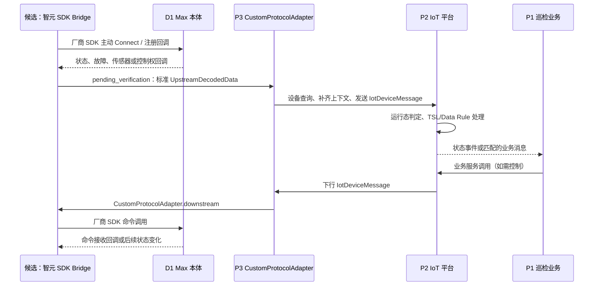

# 智元酷拓 D1 Max 型号能力与接入约束

> **证据等级：厂商公开 SDK 仓库与厂商交付包核对（阅读日期 2026-08-31）。** 本页用于评估智元酷拓四足机器人 D1 Max 接入巡检 IoT 平台时的事实、边界和待确认项。它不是已实现的产品接入设计、物模型或协议契约；目标架构均明确标为 `pending_verification`。厂商资料、版本追溯与使用边界统一见[智元酷拓（Agibot）厂商资料入口](agibot/index.md)。

## 何时读取

- 评估 D1 Max 或同系列设备接入，或确定 P3 是否需要新的协议实例、Adapter 或原生 Bridge。
- 定义 D1 Max 的状态、故障、控制权、运动、传感器或视频能力的产品契约。
- 排查 SDK 连接、回调、控制权、急停或 ROS2 传感器数据问题。

## SDK 已确认事实

| 主题 | 厂商文档确认的事实 | 接入含义 |
| --- | --- | --- |
| 设备与运行位置 | D1 Max 为轮足式四足机器人；本体有 RK3588 主控与可用于开发部署的 Orin NX 算力板。 | 适配器运行位置、资源配额和 OTA 后恢复方式须纳入部署方案；不要在本体运动控制板部署平台业务。 |
| 主 SDK | `SDKClient` 是 C++ 核心通信类，使用 IP/端口建立连接，支持阻塞或非阻塞调用、内部错误回调、连接/断开和 `IsConnected()`。SDK 与本体使用特定协议，SDK 与设备版本需匹配。 | 现有 P4 的“MQTT Topic + JSON 编解码”模型不能直接假定可复用。 |
| 状态与故障 | `IDataCallback` 提供 `OnRobotStateData`（文档标为 1 Hz 主动上报）、`OnFaultData`（发生故障时主动上报）、IMU、光照、运动数据以及控制权丢失/可用回调。 | 状态、故障、连接与控制权必须建模为不同语义，不能都折叠成 ONLINE/OFFLINE。 |
| 控制 | 提供软急停、站立/卧倒/匍匐、模式/速度、移动、姿态、灯光和控制权获取/释放等接口。遥控器和 SDK 同时只能有一方控制；遥控器可抢占控制权或触发急停。 | 控制权和急停是 P1/P2 的业务编排与安全策略，不应由协议适配器静默处理。 |
| 传感器/媒体 | 厂商文档提供前后 RTSP 视频、ROS2 的激光雷达/超声波/RTK/IMU/相机 Topic，以及 SDK 的 IMU、光照、运动数据回调。 | 视频、ROS2 与 SDK 回调是三种独立数据面；当前 P3/P4 上行链路不能默认覆盖它们。 |

厂商文档对运动数据频率存在不一致描述：`IDataCallback` 表标为配置后 100 Hz，而 `SetMcConfig` 段落标为 50 Hz。故 P0 不固化该频率；应以实际 SDK 头文件、示例和设备版本联调结果为准。

## 状态与安全语义

| 信号 | 可信含义 | 不应误用为 |
| --- | --- | --- |
| `IsConnected()` | SDK 客户端与机器人本体的当前连接状态。 | P2 的设备 ONLINE/OFFLINE。平台运行态还需要约定连接生命周期、心跳/回调超时和 P3 上报规则。 |
| `OnRobotStateData` | 厂商 SDK 的机器人状态回调，文档标示 1 Hz。具体 `RobotState` 字段未在本指南中完整列出。 | 已确定的 P2 TSL 字段集合。 |
| `OnFaultData` | 发生故障时的故障集合回调。 | 可轮询的状态属性；应先确认故障码、清除语义、等级和幂等键。 |
| `OnControlLost` / `OnControlAvailable` | SDK 控制权丢失或可用的回调。 | 网络断开或设备离线。 |
| `IControlCallback` | 非阻塞调用中机器人确认“已收到”控制命令的回调。 | 动作已执行完成；业务完成需要独立的状态/任务结果证据。 |
| 软急停 | 急停后机器人不再响应其他运动命令且速度为 0。 | 普通模式切换；它应拥有独立、可审计的安全命令与恢复流程。 |

## 对平台接入的型号影响

通用分流、资料归档和联调边界见[多厂商设备接入边界](vendor-device-integration.md)。厂商资料只确认 D1 Max C++ SDK 主动连接与回调，并未提供可由 Java 直接重实现的原始通信协议；因此不能仅凭资料决定采用 `ProtocolCodecAdapter`。以当前证据，D1 Max 更接近 P3 的 `CustomProtocolAdapter` 路径；Java 调用厂商 C++ SDK 的方式仍为 `pending_verification`，可能是受支持的 Java/JNI 封装，也可能是独立 C++ Bridge 加一份明确的本地/网络契约。通信方式取舍见[原生 SDK Bridge 的通信选型](grpc-edge-bridge-selection.md)。

上图是**目标候选**，不是当前部署事实。若厂商适配器是独立 C++ 进程，P3 无法通过 Maven classpath 直接加载它；必须另外定义 Bridge 生命周期、认证、反压、断线重连、上/下行消息格式和版本兼容策略。若它是可加载的 Java Adapter，仍须先验证厂商提供受支持的 Java 调用方式及其部署依赖。

## D1 Max 接入前必须确认的契约

| 契约 | 需要确认的问题 | 拥有者 |
| --- | --- | --- |
| 产品与 TSL | 哪些 D1 状态映射为 property、故障映射为 event、控制映射为 service；每项 identifier、数据类型、单位和版本策略是什么。 | 产品 + P2 + P1 |
| 设备身份 | SDK 连接目标与 P2 `productKey`/`deviceName` 如何稳定关联；替换设备后身份如何迁移。 | P2 + 厂商适配器 |
| 运行态 | 上行状态回调、SDK 断连、网络不可达与设备实际不可用分别如何影响 P2 ONLINE/OFFLINE；超时阈值和通道 tags 是什么。 | P2 + P3 + 厂商适配器 |
| 命令完成语义 | 发送成功、机器人确认收到、动作开始、动作完成、动作失败分别由何种回调/状态证明。 | P1 + P2 + 厂商适配器 |
| 安全与控制权 | 角色授权、控制权抢占、软急停、恢复、遥控器人工接管和审计如何定义。 | 产品 + P1 + P2 |
| 数据面 | SDK 回调、ROS2 传感器和 RTSP 视频哪些进入业务消息，哪些走专用媒体/数据管道；高频流的限流、采样和存储策略是什么。 | P1 + P2 + P3 + 厂商适配器 |

当前 `IoTCustomGatewayServer#processDownstream` 在 Adapter 未抛错时以 `NONE` 回复模式返回成功；它本身不等待厂商动作完成。因此，D1 Max 厂商适配器不能把“SDK 方法已调用”包装为“巡检动作完成”。在未补充完成事件/状态契约前，P1/P2 应将该结果限定为命令受理或发送结果。

## 最小验证顺序

1. 取得与目标固件匹配的 SDK 压缩包、头文件、示例与许可证，确认可运行环境和依赖；不要仅以 PDF 推断 ABI 或通信协议。
2. 在隔离网络对一台测试机验证连接、断开重连、状态 1 Hz 回调、故障触发/恢复和控制权抢占；记录脱敏样本。
3. 确定厂商适配器的 Java 加载或 C++ Bridge 方案，并用 P3 `customs` 协议实例验证上行回调可被 P3 按设备身份查询和投递。
4. 先以最小 TSL 覆盖运行态、基础状态、故障事件和软急停；为每个 identifier 配置 P2 Data Rule 与 P1 Handler 后再扩展运动/传感器能力。
5. 分别验收“设备在线”“状态可见”“故障可见”“命令受理”“动作完成”；特别验证遥控器接管与软急停不会被平台自动重试抵消。
6. 准备 TSL、P1 Handler/Data Rule、P3 协议实例或 Adapter 与厂商组件版本的联合回滚，确保新消息不会在 P1 因未知 identifier 被确认消费。

## 证据与未知项

### 厂商资料

SDK 下载、兼容表、版本演进、回调、API、数据结构、状态流转和原始协议的资料入口及使用约束统一见[智元酷拓（Agibot）厂商资料入口](agibot/index.md)。实施时记录固定 commit/tag、SDK 包版本和目标设备固件版本。

### 当前代码证据

- P3 `c-iot-gateway/c-iot-gateway-core/.../protocol/CustomProtocolAdapter.java`：第三方 SDK 上行注册与下行调用接口。
- P3 `.../protocol/custom/IoTCustomGatewayServer.java`：自管连接 SDK 的上行转发与下行消费；当前下行回复模式为 `NONE`。
- P3 `.../core/manager/ProtocolCodecAdapterManager.java`：基于唯一 codec ID 的报文编解码扩展机制。
- P0 [P3 协议实例与 Codec 选择](../../repositories/c-iot-gateway/protocol-instance-and-codec-selection.md) 与 [P3 网关上/下行桥接](../../repositories/c-iot-gateway/gateway-upstream-downstream-bridge.md)：当前已确认的平台边界。

### `pending_verification`

- 厂商是否提供 Java SDK、稳定的 C ABI、允许容器化的 SDK runtime，或可直接接入的原始报文规范。
- `RobotState`、`FaultDatas`、`MotionData`、控制权回调的完整字段与版本兼容性。
- 实际连接保活/重连行为、命令 ACK/执行完成的可用事件、设备唯一标识获取方式。
- ROS2 与 RTSP 数据的生产网络隔离、认证、带宽和与现有流媒体体系的集成方式。
