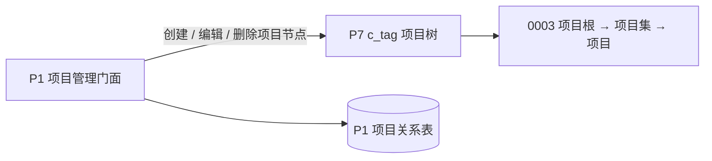
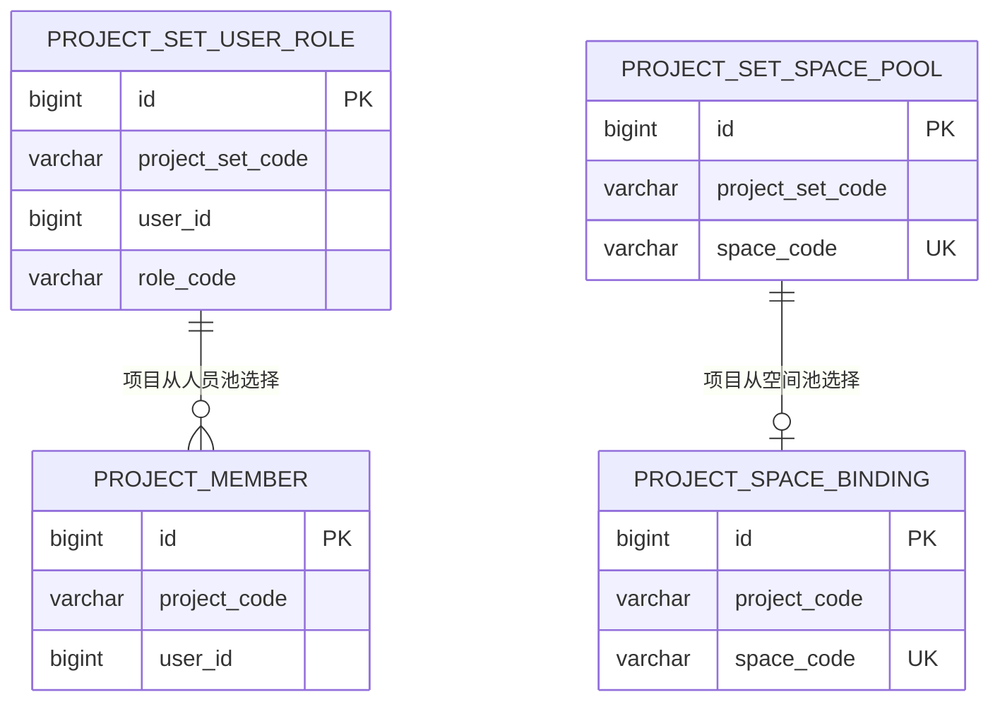

# 项目集与项目管理设计（P1 + P7）

## 决策与边界

P7 仅保存项目树；P1 是人员池、空间池、项目成员和项目空间绑定的唯一业务真相。项目树只能通过 P1 项目门面维护，前端不直调 P7 通用标签接口。



| 范围 | 归属 | 约束 |
| --- | --- | --- |
| 项目树节点 | P7 `c_tag` | `0003` 项目根 → 直属项目集 → 直属项目；根节点只初始化，不允许业务编辑或删除，节点类型不写入 `config`。 |
| 项目集人员池与角色 | P1 `project_set_user_role` | 仅允许 `INS_PM_ADMIN`、`INS_PM_STAFF`；同一用户可拥有两个角色。 |
| 项目集空间池 | P1 `project_set_space_pool` | 活动记录的 `space_code` 全局唯一，空间仅能进入一个项目集池。 |
| 项目成员 | P1 `project_member` | 只保存项目和用户；角色继承所属项目集，不重复保存角色。 |
| 项目空间 | P1 `project_space_binding` | 活动记录的 `space_code` 全局唯一，一个项目可选多个池内空间。 |

`c_tag_relation` 不承载项目空间池、项目空间、项目成员或项目角色，避免通用标签关系与项目业务关系形成双重真相。

项目节点只按结构识别：`parent_code = 0003` 是项目集；其直属子节点是项目。`config` 仅存储 JSON 扩展字段：项目集当前维护 `description`，项目还维护 `longitude`、`latitude`；更新时保留未知扩展字段。P7 不再使用 `config.type` 初始化项目根或识别项目节点。

## 面向前端的门面契约

项目管理页面只调用 P1 `ProjectManagementController` 的统一保存与详情接口；不公开成员、项目集角色、项目集空间或项目空间的原子页面操作。项目集和项目的创建、编辑各通过一次请求提交基本信息及关系编码集合。

| 页面能力 | P1 输出边界 | 前端组合责任 |
| --- | --- | --- |
| 项目集列表/详情 | 项目集卡片、基本信息、`members(userId, roleCode, projectCodes)` 与空间编码 | 按 `userId` 调用 P6 补齐姓名、账号和部门。 |
| 项目列表 | 项目卡片及中心点 `longitude`、`latitude` | 使用坐标渲染项目地图标记。 |
| 项目编辑详情 | 所属项目集编码和名称、成员选择状态、可用/已选/禁用空间编码 | 复用 P1 空间树接口，按 `availableSpaceCodes` 过滤并用 `spaceCodes`、`disabledSpaceCodes` 标记选择和禁用状态。 |

`disabledSpaceCodes` 仅包含同项目集其他项目已绑定的空间；当前项目已选空间不会被标记为禁用，以便页面取消选择。列表和详情响应不得透传 P7 `TagDTO` 或 P1 持久化实体。

## 表设计与关键关系



项目授权由 `project_member`、项目集有效角色和角色可执行权限共同决定；项目成员表不保存 `role_code`。

四张关系表均继承 P1 `BaseEntity`，必须完整包含 `create_user`、`create_time`、`update_user`、`update_time` 和 `is_deleted`。前两个用户审计字段保存系统操作人名称；项目集角色池和项目成员另使用 `user_id` 保存项目业务用户 ID。所有唯一键将 `is_deleted` 纳入约束，逻辑删除后允许按业务规则重新建立同一关系。

## 保存与删除约束

统一保存将请求中的成员、项目授权和空间编码作为目标集合同步到 P1 关系表；项目创建和更新还同步项目中心点配置。创建项目以请求中的 `projectSetCode` 确定所属项目集；更新项目时以路径中的既有项目确定所属项目集，请求中的 `projectSetCode` 不参与变更。

项目删除采用“移除”语义，不物理删除 P7 项目节点及历史任务数据。删除入口执行前必须通过项目任务状态校验；存在 `task_biz_status in (2, 6)`（执行中或暂停）任务时拒绝移除。校验通过后，P1 逻辑删除项目成员和项目空间绑定，P7 节点保留原名称、坐标、描述及未知扩展字段，并在 `config.status` 写入 `REMOVED`。

项目集移除先收集直属有效项目并完成全量任务状态校验，任何子项目存在执行中或暂停任务时整体失败，不产生部分移除。校验通过后，逐项释放项目成员和空间绑定，删除项目集角色池、空间池关系，并将所有子项目及项目集节点标记为 `REMOVED`。不提供恢复或重新开启接口。

P1 本地关系删除与 P7 生命周期更新不具备分布式事务。实施顺序为：完成全部本地校验 → 更新 P7 `config.status` → 删除 P1 关系；若后续本地操作失败，使用保存的原始 `config` 回写 P7 作为补偿，并记录失败上下文。P7 `deleteTag` 不用于项目移除。

P1 不再把空间关系投影到 P7，故不需要 outbox。项目树的创建、编辑和移除是同步 P7 标签操作；移除不构成跨服务双写事务。

项目权限失效通知复用 P1 现有 `/ws/drone` 全局通道和 `sendBatchByDeviceType`，业务码为 `project_permission_changed`。通知只在项目关系变更造成 `beforeAccess - afterAccess` 非空时发送，数据数组由 `userId` 与失效项目编码增量组成；事务提交后由 `@TransactionalEventListener(AFTER_COMMIT)` 广播，发送失败不回滚已提交关系。具体快照判定、触发入口和代码证据见 [P1 项目权限失效 WebSocket 广播](../repositories/c-drone-inspection/project-permission-websocket.md)。

## 删除前置校验接口

删除页面在调用移除接口前，可通过 P1 项目管理门面查询阻断原因。两个接口均为只读操作，不修改项目、关系、任务或 Redis 缓存；项目不存在、已移除或当前用户无项目访问权限时沿用项目管理域错误语义。

### 空间任务校验

```text
POST /drone/projects/{projectCode}/delete-check/spaces
Body: { "spaceCodes": ["SPACE-001", "SPACE-002"] }
Response: { "blockedSpaceNames": ["园区 A", "园区 B"] }
```

P1 先确认空间编码属于该项目的 `project_space_binding`，再通过 P7 资源关联查询按 `CASCADE` 获取空间及子空间下的设备 ID。以 `project_id = projectCode`、`dock_id in (deviceIds)`、`task_biz_status in (2, 6)` 查询 `wayline_task`，将命中设备反向映射到输入空间并批量读取空间名称，按输入顺序去重返回。父空间下子空间设备的任务必须计入父空间阻断结果。

### 人员驾驶舱控制校验

```text
POST /drone/projects/{projectCode}/delete-check/users
Body: { "userIds": [10001, 10002] }
Response: { "blockedUserNames": ["张三", "李四"] }
```

P1 先收集项目全部有效空间绑定，再解析其下设备 ID。对每个设备读取现有 `RedisService#getAuthorityUser(deviceId)` 对应的 `flight_authority:{deviceId}` 缓存；按缓存 `LoginUser.id` 与请求 `userIds` 过滤，从 `LoginUser.info.nickname` 返回去重后的人员名称。同一人员控制多个项目设备时只返回一次，不扫描 Redis 未知 Key。

接口响应建议同时保留 `spaceCode`/`userId` 与名称，名称集合用于原型提示，编码和 ID 用于前端精确定位；若当前前端只消费名称，可暂时只暴露名称字段。

## 删除校验的责任边界与风险

- `project_id` 与项目管理 `project_code` 是同一业务标识，P1 不做转换映射。
- 任务阻断状态以 P1 `EnumTaskBizStatus.IN_PROGRESS(2)` 和 `SUSPEND(6)` 为准。
- 项目空间设备归属通过 P7 空间资源关联解析；P1 不复制设备与空间的第二份关系真相。
- `RedisService#setAuthority` 当前使用无 TTL 的键值写入，异常断连可能留下陈旧控制权。前置接口的准确语义是“缓存仍显示该人员占有驾驶舱控制权”，不等价于实时在线证明。若后续需要严格在线判定，应独立增加显式删除、TTL 或心跳续约设计。
- 空间或 Redis 查询异常不得降级为空结果，否则可能误放行项目移除；应沿既有异常链路失败并保留可排查上下文。

## 当前实现与待验证

**已实现（本地代码变更，尚未发布）**：P1 四张业务关系表、项目管理门面及页面 Req/Resp；项目集和项目统一保存，项目列表包含中心点，项目详情包含项目集名称及空间选择状态；项目和项目集移除、`REMOVED` 读取隔离、任务状态拦截及失败补偿已在 P1 本地实现。P7 保留项目根迁移与 `PROJECT_ROOT_CODE`。

**本次设计待实施**：删除前置空间任务校验和人员驾驶舱控制权校验接口尚未写入 P1；本页接口与查询链路是实施基线。实现后应补充 P1 服务单元测试和接口契约验证。

**待发布 / 待确认**：

- P1 已发布依赖尚未包含 P7 的 `TagCodes.PROJECT_ROOT_CODE`，当前使用兼容性常量 `"0003"`；发布 P7 API 并升级 P1 依赖后移除该硬编码。
- 平台级接口访问权限编码尚未确认；项目域角色继承不替代系统级接口访问控制。
- 在集成环境验证 P7 项目根迁移、项目树接口权限和 P1 空间池行锁并发行为。

## 证据

- P1：`b-inspection-platform-core/.../service/project/impl/ProjectManagementServiceImpl.java`、`controller/admin/project/ProjectManagementController.java`。
- P1：`b-inspection-platform-common/.../project/`（实体、页面 Req/Resp）与 `docs/sql/v2.1.0_add_project_management.sql`。
- P7：`c-tag-api/.../constants/TagCodes.java`、`c-tag-bootstrap/.../V1.2.0__project_root.sql` 与 `V1.2.1__clear_project_type_config.sql`。
