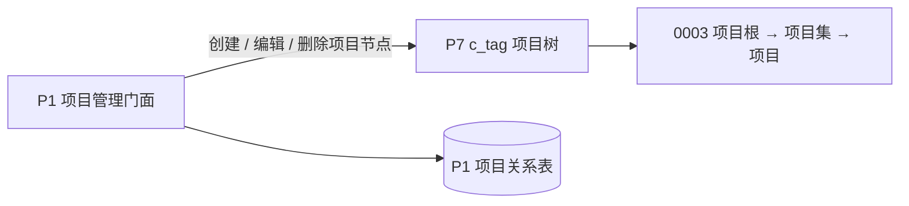
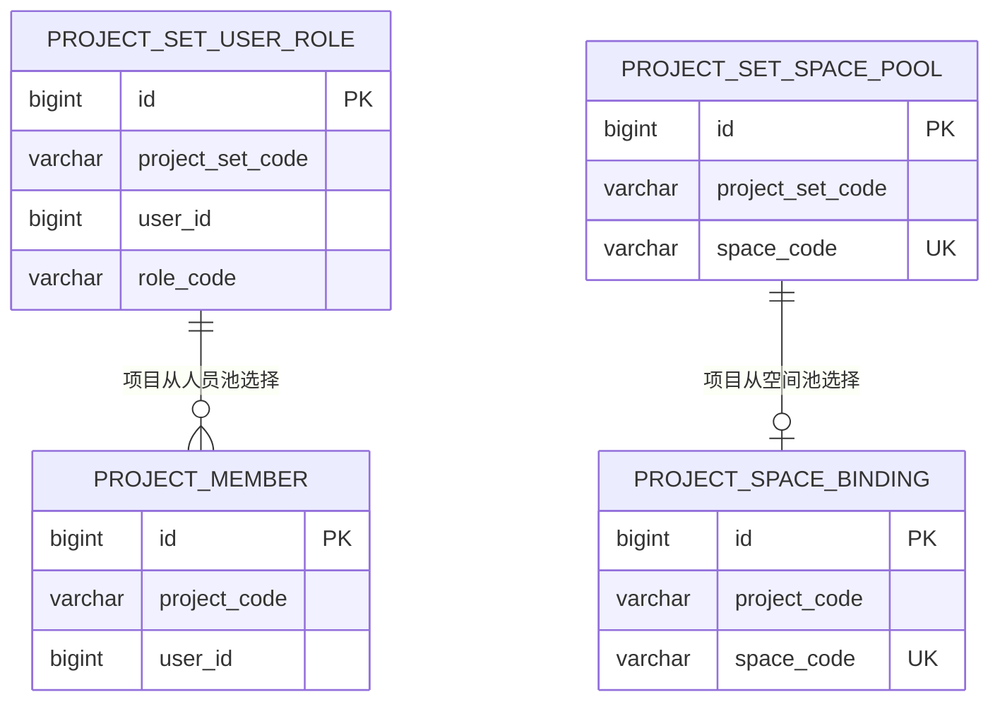
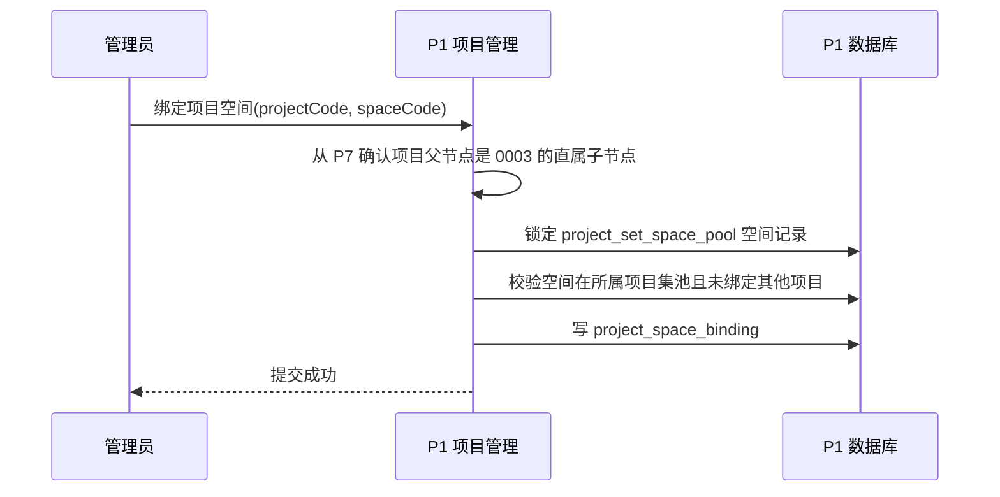

# 项目集与项目管理设计（P1 + P7）

## 决策与边界

P7 仅保存项目树；P1 是人员池、空间池、项目成员和项目空间绑定的唯一业务真相。项目树只能通过 P1 项目门面维护，前端不直调 P7 通用标签接口。

| 范围 | 归属 | 约束 |
| --- | --- | --- |
| 项目树节点 | P7 `c_tag` | `0003` 项目根 → 直属项目集 → 直属项目；根节点只初始化，不允许业务编辑或删除，节点类型不写入 `config`。 |
| 项目集人员池与角色 | P1 `project_set_user_role` | 仅允许 `INS_PM_ADMIN`、`INS_PM_STAFF`；同一用户可拥有两个角色。 |
| 项目集空间池 | P1 `project_set_space_pool` | 活动记录的 `space_code` 全局唯一，空间仅能进入一个项目集池。 |
| 项目成员 | P1 `project_member` | 只保存项目和用户；角色继承所属项目集，不重复保存角色。 |
| 项目空间 | P1 `project_space_binding` | 活动记录的 `space_code` 全局唯一，一个项目可选多个池内空间。 |

`c_tag_relation` 不承载项目空间池、项目空间、项目成员或项目角色，避免通用标签关系与项目业务关系形成双重真相。

项目节点只按结构识别：`parent_code = 0003` 是项目集；其直属子节点是项目。`config` 仅存储 JSON 扩展字段，P1 当前只维护 `description`，更新时保留未知扩展字段；P7 不再使用 `config.type` 初始化项目根或识别项目节点。

## 表设计与关键关系

项目授权由 `project_member`、项目集有效角色和角色可执行权限共同决定；项目成员表不保存 `role_code`。

四张关系表均继承 P1 `BaseEntity`，必须完整包含 `create_user`、`create_time`、`update_user`、`update_time` 和 `is_deleted`。前两个用户审计字段保存系统操作人名称；项目集角色池和项目成员另使用 `user_id` 保存项目业务用户 ID。所有唯一键将 `is_deleted` 纳入约束，逻辑删除后允许按业务规则重新建立同一关系。

## 关键时序

空间池移除也锁定同一池记录，再检查项目空间绑定，因此不会产生“池已移除但项目同时绑定”的并发结果。唯一索引是最终并发兜底。

## 生命周期约束

- 移除项目集角色前，如用户仍在任一子项目中，拒绝；先移除项目成员。
- 移除项目集空间前，如空间仍被项目绑定，拒绝；先解除项目空间。
- 删除项目须无成员和空间绑定；删除项目集须无项目、角色和空间池关系。
- P1 不再把空间关系投影到 P7，故不需要 outbox。项目树的创建、编辑、删除是同步 P7 标签操作；删除前 P1 关系已清空，不构成跨服务双写。

## 当前实现与待验证

**已实现（本地代码变更，尚未发布）**：P1 四张业务关系表、项目管理门面及 Controller；空间池和项目空间均在 P1 本地事务内处理。P7 保留项目根迁移与 `PROJECT_ROOT_CODE`。

**待发布 / 待确认**：

- P1 已发布依赖尚未包含 P7 的 `TagCodes.PROJECT_ROOT_CODE`，当前使用兼容性常量 `"0003"`；发布 P7 API 并升级 P1 依赖后移除该硬编码。
- 平台级接口访问权限编码尚未确认；项目域角色继承不替代系统级接口访问控制。
- 在集成环境验证 P7 项目根迁移、项目树接口权限和 P1 空间池行锁并发行为。

## 证据

- P1：`b-inspection-platform-core/.../service/project/impl/ProjectManagementServiceImpl.java`、`controller/admin/project/ProjectManagementController.java`。
- P1：`b-inspection-platform-common/.../project/` 与 `docs/sql/v2.1.0_add_project_management.sql`。
- P7：`c-tag-api/.../constants/TagCodes.java`、`c-tag-bootstrap/.../V1.2.0__project_root.sql` 与 `V1.2.1__clear_project_type_config.sql`。
