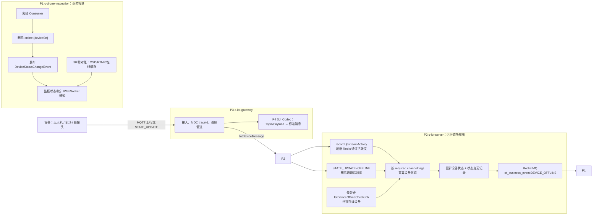
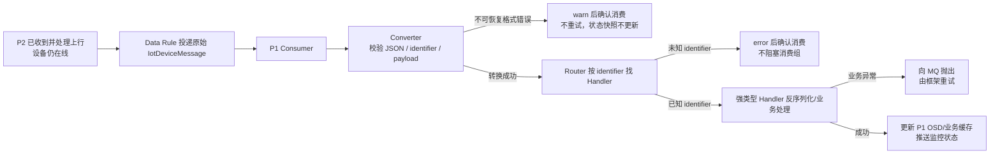

# 设备离线状态链路与排查 SOP

> **证据等级：代码核对已确认（2026-08-26）。** 本文限定“设备为何被平台判定为离线、以及离线通知如何到达巡检监控”。它不定义 EMQX 的在线事件、生产 Broker ACL、某产品实际 keepalive、或前端页面最终展示时序；这些均须按运行配置与日志核实。

## 范围与非目标

适用于 DJI 无人机/机场，以及接入 P2 的其他设备（例如摄像头）。这里的“离线”是 P2 的设备运行态从在线切换至离线、再由 P1 投影到业务缓存和监控通知；它不同于 OSD 中的业务异常、视频流不可用或单一设备通道离线。

P4 仅在 P3 进程内解析 DJI 上行 Topic/Payload，P3 负责把标准化上行消息送入 P2；两者**不直接产生 P2 的 `DEVICE_OFFLINE` 业务事件**。P2 的离线可由显式状态上报触发，或由上行活跃度超过 keepalive 后被定时扫描发现。



## 服务职责与数据所有权

| 服务 | 离线课题中的职责 | 不负责的事 |
| --- | --- | --- |
| P4 `ad-iot-codec-adapter-dji` | 从 DJI Topic/Payload 提取设备身份、`tid` 等请求标识，映射为统一上行结构。 | 不保存连接状态，不计算超时，不投递 RocketMQ 业务离线事件。 |
| P3 `c-iot-gateway` | 接收 MQTT，创建当前进程内 MDC `traceId`，执行上行管道并转发标准化 `IotDeviceMessage`；首次可识别上行还会异步发送在线 `STATE_UPDATE`。 | 不持久化设备离线状态；当前已核实代码没有 P3→P2 的“设备断连即离线”事件。 |
| P2 `c-iot-server` | **设备运行态的权威所有者**：按设备/通道活动 Redis 数据、产品 required channel tags 和 keepalive 计算状态；持久化状态变更记录，并生产 `DEVICE_OFFLINE`。 | 不维护 P1 的 `online:{SN}`、监控 DTO 或 WebSocket。 |
| P1 `c-drone-inspection` | 消费 `DEVICE_OFFLINE`，将 P2 `deviceId` 查询投影成业务 SN，删除本地在线缓存，触发监控状态刷新；30 秒对账补偿“缓存 TTL 静默过期”。 | 不反写 P2 设备主状态；不能以 OSD/视频缓存替代 P2 的运行态判定。 |

P2 对没有通道标签的产品按设备活动判断；配置 required channel tags 的产品只有所需通道满足在线条件才被视为在线。显式 `STATE_UPDATE=OFFLINE` 带 tags 时只移除相应通道，带空 tags 时代表整个设备离线并会移除已配置通道；随后重算或直接切换状态。

## 离线判定的两条路径

1. **显式离线：** 上游 `STATE_UPDATE` 的 identifier 为数字离线状态。P2 清理对应运行态，再写状态变更记录并发送 `DEVICE_OFFLINE`。
2. **静默超时：** 每分钟 `IotDeviceOfflineCheckJob` 在分布式锁下扫描 P2 当前在线设备，按网关 keepalive（若未配置则使用全局 keepalive × factor）重新判断。状态由在线变离线才会发事件；因此“最后一条 OSD”不是一条离线消息，且离线事件没有可一一对应的原始上行 messageId。

P1 的 `online:{deviceSn}` TTL 为 120 秒。它既可由 P2 的上线事件续期，也可在 P1 消费离线事件时显式删除；监控对账任务每 30 秒以 P1 的在线/OSD/RTMP 快照补偿状态通知。P1 缓存和 P2 运行态是不同所有权的数据，短时不一致需要依时间顺序分析。

## 排查闭环 SOP

先固定一个调查窗口（建议离线前后各 10 分钟）和身份集合：P2 `deviceId`、业务 `deviceSn`、产品标识、`iotGatewayId`、通道 tags。不要只用 SN 搜索，也不要把无人机 SN 与父机场 SN 混为同一设备；DJI 身份路由可能使 P4/P3 的接入身份与 P1 最终业务子设备不同。

```mermaid
flowchart TD
    A["告警：设备显示离线"] --> B["确认 P1 online:{SN}、OSD/RTMP 快照与展示时间"]
    B --> C["在 P2 查设备当前状态和最近状态变更记录"]
    C --> D{P2 有 ONLINE→OFFLINE 记录？}
    D -- 否 --> E["查 P2 离线 Job、分布式锁、keepalive/通道配置、运行态 Redis"]
    E --> F{最后上行活动存在？}
    F -- 否 --> G["逆向查 P3 MQTT 接入/解码/转发；再查设备连接、Topic、Payload"]
    F -- 是 --> H["核对 reportTime 乱序、required tags、状态重算/持久化失败"]
    D -- 是 --> I["记录 source、reportTime、gatewayId、P2 业务事件 msgId"]
    I --> J{P1 收到 DEVICE_OFFLINE？}
    J -- 否 --> K["查 RocketMQ topic/tag、消费组、堆积、重试/DLQ、P1 Consumer 日志"]
    J -- 是 --> L{P1 删除 online:{SN} 并发出本地状态事件？}
    L -- 否 --> M["查 deviceId→SN 查询、Redis、监听器异常"]
    L -- 是 --> N["查 Monitor 对账、WebSocket 订阅/通知与前端刷新"]
```

### 证据如何串联

| 字段/证据 | 可串联的边界 | 使用方式与限制 |
| --- | --- | --- |
| `deviceId` + `deviceName` + `productKey` | P2 运行态、状态记录、业务事件、P1 的设备查询 | 离线主闭环的首选稳定身份；P1 以 `deviceId` 查询得到业务 `deviceSn`。 |
| `iotGatewayId` + tags | P3→P2 上行、P2 活跃度与通道重算 | 用于确认进入了哪个网关/通道；必须和该产品的 required channel tags 一起看。 |
| `reportTime` | 原始上行、P2 运行态及状态记录 | 排除迟到消息；设备离线后早于 `offlineTime` 的消息会被忽略。 |
| 原始 `messageId` + `requestId` | P3→P2 的一条上行处理、P2 原始日志/消息记录 | `requestId` 为空时 P2 会以 messageId 回填。它可证明“某条上行是否刷新过活动”，但不必然存在于超时离线事件。 |
| P2 `DEVICE_OFFLINE` 的 RocketMQ messageId | P2 生产 → P1 消费 | 在 P2 `device_state_change` 发送成功日志中取得，随后在 RocketMQ 与 P1 消费日志定位；它是离线业务事件的 MQ 关联键，不是原始 MQTT/OSD messageId。 |
| `traceId` | 单服务、单次处理日志 | P3 在 MQTT 接收线程创建 MDC traceId；现有代码未证明它跨 P3→P2→RocketMQ→P1 持续透传。因此不能把 traceId 当端到端主键；跨服务以业务身份、时间窗口、requestId/messageId 和 RocketMQ messageId 交叉验证。 |

### 按现象执行

| 现象 | 最小检查集 | 缺失意味着什么 |
| --- | --- | --- |
| P2 从未出现离线记录 | P2 离线 Job 的启动/锁/执行日志、设备 state、运行态 Redis、keepalive 和通道配置 | 通常是定时任务未运行、活跃度尚未超时，或通道判定仍满足在线；先不要归因于 P1。 |
| P2 已离线，P1 仍在线 | P2 `DEVICE_OFFLINE` 发送结果与 MQ messageId；MQ topic/tag/消费组、积压和 P1 离线 Consumer | P2→P1 事件投递或消费链路缺失；还要检查 P1 的 `deviceId→SN` 查询与 Redis 删除。 |
| P1 缓存已离线，页面仍在线 | P1 `DeviceStatusChangeEvent`、监控监听器/对账、WebSocket 通知及前端订阅 | 后半段展示刷新缺失；P2 状态链路已不是首要嫌疑。 |
| 突发批量离线 | P2 离线 Job、Redis/Lock4j、P3 与 MQTT 接入可用性、共同 gatewayId/产品 keepalive 配置 | 优先按共同依赖分组，不要逐台设备独立排查。 |

## 经验分支：物模型或序列化异常造成“状态显示异常”

**先分流，不能直接按离线处理。** 若 P2 仍为在线、P1 的 `online:{SN}` 仍有效、且 P2 持续有该设备上行活动，页面状态/OSD 异常更可能是 P2→P1 的物模型契约或 P1 反序列化/Handler 问题，而不是设备真的离线。该判断是排查假设，须由下列证据同时确认。



P1 的 `InspectionIotMessageConverter` 只接受 `params.identifier` 声明的物模型；属性上报会将平铺属性恢复为 Handler 所需的 payload。它校验原始 JSON、`id`、`method`、`deviceId`、`reportTime`、`params`、identifier 及特定数组/对象的 JSON 类型。`InspectionIotUpstreamConsumer` 将 JSON 无效、必填字段缺失、字段类型错误、payload 无效视为不可恢复错误：记录前 2000 字符的摘要并确认消费，不进入重试。`InspectionIotMessageRouter` 对未注册 identifier 同样记录 `messageId`/`deviceId` 后确认消费；而已注册 Handler 抛出的业务异常会向 MQ 框架抛出，以便重试。

### 该分支的 SOP

1. 在 P2 以 `deviceId`、时间窗口和 `messageId/requestId` 确认原始上行已被接受，并确认设备状态仍在线；同时记录 Data Rule 投递的 Topic/Tag。
2. 在 P1 消费日志先搜 `messageId` 与 `deviceId`，再搜 identifier。出现“不可恢复”“`IOT_MESSAGE_*`”或“未注册 IoT identifier”时，保存**脱敏后的**消息结构、实际 identifier 与错误码；不要只截取异常堆栈。
3. 核对 P4 输出/P2 Data Rule 投递的 `params.identifier` 与 P1 已注册 Handler；再核对属性上报使用的平铺字段、数组文本 JSON 与 P1 `rebuildDeviceStatusPayload` 的恢复规则。新适配器字段或物模型先于 P1 Handler 发布时，会被未知 identifier 分支确认消费。
4. 若已进入已知 Handler，则区分 Jackson/DTO 绑定失败和业务处理异常：前者常表现为 payload 无效且不重试，后者应看到 RocketMQ 重试。核对重试、最终失败/DLQ 和该时段 P1 OSD/Redis 快照是否未更新。
5. 修复后使用同一类脱敏样本回放或集成测试，验证 P2 在线状态不被误改、P1 Consumer 成功路由、缓存快照更新和 WebSocket 展示恢复；不要通过手工写 `online:{SN}` 掩盖契约问题。

| 现象 | 结论边界 | 优先修复位置 |
| --- | --- | --- |
| P2 上行/在线正常，P1 有不可恢复 payload 日志 | 物模型消息被 P1 主动跳过；不是 MQ 重试问题。 | P4 映射、P2 Data Rule/TSL 传输格式，或 P1 Converter 的已确认契约。 |
| P1 报未知 identifier | P1 没有该物模型 Handler，消息已确认以保护消费组。 | 同步发布 P1 identifier、消息类型与 Handler；不要在 P1 以“默认状态”兜底。 |
| P1 有 Handler 异常与重试 | 消息已进入业务处理，问题在 DTO 绑定或业务处理。 | 该 Handler 及其 DTO/测试，并检查重试/DLQ。 |
| P1 消费成功但页面仍异常 | 物模型转换已通过，问题在缓存映射、状态计算或 WebSocket/前端。 | P1 状态服务、监控通知和页面订阅。 |

## 当前代码证据

- P3 MQTT 入口与 trace：`c-iot-gateway/c-iot-gateway-core/.../protocol/emqx/router/IotEmqxUpstreamHandler.java`；在线状态消息：`.../core/handler/upstream/AsyncOnlineMsgHandler.java`。
- P4 DJI 统一上行构造：`ad-iot-codec-adapter-dji/ad-iot-codec-adapter-inspection-dji/.../utils/DjiMessageSupport.java`。
- P2 上行消费、活跃度、超时与事件生产：`c-iot-server/c-iot-core/.../mq/consumer/device/IotDeviceMessageProcesser.java`、`.../service/device/state/IotDeviceOnlineStateServiceImpl.java`、`.../job/device/IotDeviceOfflineCheckJob.java`、`.../mq/producer/IotBusinessEventProducer.java`。
- P1 离线消费及业务投影：`c-drone-inspection/b-inspection-platform-iot/.../InspectionIotBusinessEventOfflineConsumer.java`、`c-drone-inspection/b-inspection-platform-core/.../IotDeviceOnlineStatusServiceImpl.java`、`.../MonitorBusinessStatusReconciliationTask.java`。
- P1 物模型转换、路由与消费失败语义：`c-drone-inspection/b-inspection-platform-iot/.../InspectionIotMessageConverter.java`、`.../InspectionIotMessageRouter.java`、`.../InspectionIotUpstreamConsumer.java`。

联调前仍需在目标环境核实：P2 实际的网关 keepalive/产品通道配置、P1 业务事件订阅配置、RocketMQ ACL/重试/DLQ 与 P3/P4 运行 Jar 版本。不要把这些易变运行事实写入本页。
