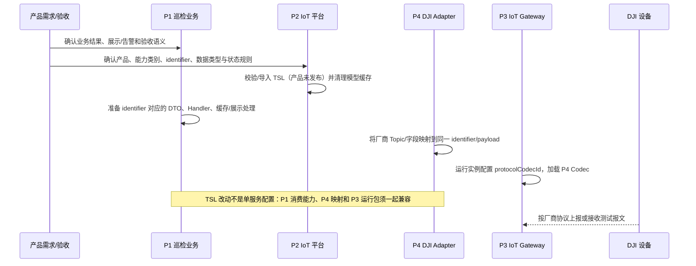
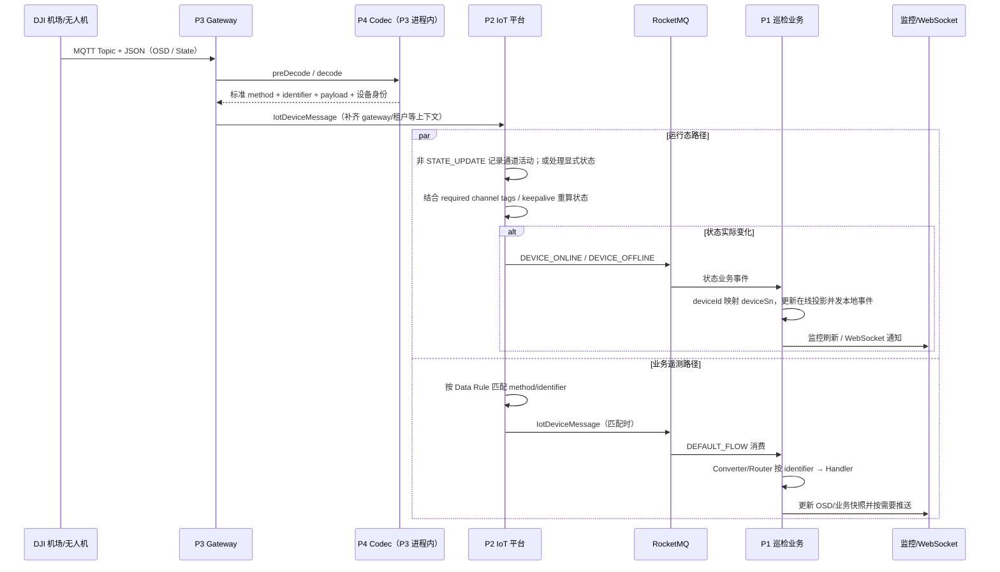

# 设备状态与物模型端到端链路

> **证据等级：代码核对已确认（2026-08-31）。** 本文说明当前 P1–P4 如何把 DJI 设备上报转换为平台物模型消息、判定设备运行态，并投影给巡检业务。它不定义厂商完整协议、实际 Broker/ACL、生产 keepalive 配置、Data Rule 配置或前端最终展示；这些易变事实应按运行环境核实。

## 范围、非目标与当前需求缺口

本文的“设备状态”分为两个不能互相替代的概念：

| 概念 | 含义与权威来源 | 不能替代的内容 |
| --- | --- | --- |
| 平台运行态 | P2 基于 `STATE_UPDATE`、上行活跃度、网关 keepalive 与产品要求通道计算的 ONLINE/OFFLINE。 | P1 的 OSD、视频或展示缓存。 |
| 业务遥测/展示状态 | P4 映射的属性，如位置、电量、机场模式；P1 消费后形成 OSD 快照、业务状态和 WebSocket 展示。 | P2 的设备在线判定。 |

当前已维护的 v2.1.0 项目管理 PRD 明确将设备在线状态排除在范围外。因此，下面“产品需求 → 物模型”的第一跳是**目标治理流程**，而不是现有 PRD 已确认的设备状态需求。补齐或变更设备状态能力前，产品方须先确认：目标设备/产品、状态含义、允许的延迟与失联阈值、展示与告警要求、以及属性/事件/服务的能力分类。

非目标：本文不定义完整 TSL JSON、数据库表、前端页面、下行命令细节或任何环境地址。下行边界见[物联网物模型专题](../context/domain/iot-thing-model-tsl.md)和[DJI 设备指令下行链路](dji-osd-command-flow.md)。

## 服务边界与数据所有权

| 服务 | 本领域负责的事 | 明确不负责 |
| --- | --- | --- |
| P1 `c-drone-inspection` | 消费 P2 Data Rule/业务事件；按 `identifier` 路由业务 Handler；维护巡检 OSD、在线投影、监控刷新和 WebSocket。 | 不计算或反写 P2 的平台运行态；不理解 DJI Topic。 |
| P2 `c-iot-server` | 产品/设备/TSL 的校验与持久化；处理标准上行；以运行态数据和产品通道约束计算 ONLINE/OFFLINE；发出状态业务事件与按 Data Rule 投递。 | 不保存 P1 的监控快照或决定其 WebSocket 展示。 |
| P3 `c-iot-gateway` | 协议接入、连接和上行处理管道；按 `protocolCodecId` 选择 Codec，补齐平台上下文并转发标准 `IotDeviceMessage`。 | 不持久化设备最终在线状态；不承担巡检业务编排。 |
| P4 `ad-iot-codec-adapter-dji` | 在 P3 进程内把 DJI MQTT Topic/Payload 映射为平台 method、`params.identifier` 与 payload；封装 DJI 身份路由。 | 不独立部署、不管理 TSL、不计算超时离线、不直接向 P1/P2 业务 Topic 投递。 |

P2 的运行态 Redis/设备状态记录与 P1 的 `online:{deviceSn}`、OSD/监控缓存是两份不同所有权的数据。短时间不同步应沿消息/事件时序排查，不能用一方的缓存覆盖另一方的语义。

## 从产品需求到可发布能力的责任链

P2 `IotThingModelServiceImpl#importTsl` 会验证产品存在及未发布状态，逐项校验 properties/services/events；验证成功后替换该产品的现有模型记录并清理模型列表缓存。Data Rule 保存时也会确认其引用的 `identifier` 在对应产品模型中存在。故 TSL 是产品能力契约，但**不是** P4 自动生成的 Topic 映射，也不会让 P1 自动拥有 Handler。

对当前 DJI 普通 OSD，P4 使用 `inspection_device_status_report`；DRC 高频 OSD 使用 `inspection_drc_osd_report`。它们是业务上行标识，不能把某个 DJI 原始 Topic 或页面字段名当作物模型 `identifier`。

## 上报、状态判定与业务投影

### 运行态路径（P2 权威）

1. P3 的 `MessageProcessingEngine` 为协议实例取得 P4 Codec；P4 的 `DjiOsdTopicHandler` 等处理器从 Topic/Payload 得到设备身份与统一上行数据。普通 OSD 被展平为属性上报：`params.identifier` 表示能力，其他字段为属性值。
2. P3 上行处理完成后，经 `IotDeviceMessageForwardAdapter` 将标准消息交给 P2。首次可识别上行的网关处理还会异步产生在线 `STATE_UPDATE`；这不是 P3 对最终状态的持久化判定。
3. P2 对非 `STATE_UPDATE` 调用 `recordUpstreamActivity`，按 tags 写入通道活跃度；对显式状态调用 `handleStateUpdate`。对于配置了 required channel tags 的产品，所有必需通道满足才为在线；无通道约束时按设备活动判定。
4. P2 的超时任务扫描当前在线设备并重算状态。只有状态变化才写设备状态、状态记录并发送 `DEVICE_ONLINE` 或 `DEVICE_OFFLINE`；因此一条 OSD 与一条离线事件不必一一对应。
5. P1 消费状态业务事件，将 P2 `deviceId` 映射到业务 `deviceSn`，维护本地在线缓存并发布本地状态事件；监控监听器和对账任务再面向页面刷新。P1 的投影失败不改变 P2 已判定的运行态。

### 遥测/物模型路径（P1 业务投影）

P2 的平台消息处理、属性/时序处理与 Data Rule 消费是独立路径；不能假设“属性已落库”先于“P1 已收到消息”。Data Rule 未匹配时，设备运行态仍可能被刷新而 P1 业务遥测不更新。

当 P1 收到 Data Rule 转发的消息时，`InspectionIotMessageConverter` 校验消息结构并恢复属性 payload，`InspectionIotMessageRouter` 以 `params.identifier` 找到已注册 Handler。格式错误或未知 identifier 的消息会被确认以保护消费组，不能视作新模型已被 P1 自动兼容；已进入 Handler 的业务异常则遵循其消息重试语义。

## 联调、发布与回滚的最小闭环

| 检查点 | 所有者 | 必须证明的事实 |
| --- | --- | --- |
| 产品/TSL | P2 + 产品 | identifier、能力类别、字段类型与产品发布状态匹配；Data Rule 可引用该模型。 |
| 厂商映射 | P4 | 脱敏样本可从指定 Topic/Payload 解码为预期的 method、身份、identifier 与字段形状。 |
| 接入装载 | P3 | 运行实例 `protocolCodecId` 与 P4 Codec ID 匹配，且实际运行包包含 Adapter。 |
| 运行态 | P2 | 上行活动/显式状态能按 required channel tags、keepalive 使设备正确变更；状态事件可见。 |
| 业务消费 | P1 | RocketMQ Topic/Tag、Data Rule、Converter、Router 和目标 Handler 全部匹配，快照/通知更新。 |
| 失败与回滚 | P1–P4 | 新 identifier 发布顺序保证 P1/P4/P3 兼容；回滚时同时恢复 TSL、Adapter 版本、P1 Handler/Data Rule，避免未知 identifier 被确认消费。 |

排查时优先使用 `deviceId`、`deviceName`、`productKey`、`iotGatewayId`、tags、`requestId/messageId` 和时间窗口串联；`traceId` 当前只被 P3 代码确认在单次处理日志内可用，不能作为端到端关联主键。设备“离线”专题排查见[设备离线状态链路与排查 SOP](device-offline-status-flow.md)，DJI OSD 字段与 P1 展示细节见[DJI OSD 上行数据链路](dji-osd-upstream-flow.md)。

## 当前证据与待核实项

| 结论 | 代码证据 |
| --- | --- |
| TSL 导入、产品发布限制、Data Rule 对模型引用校验 | `c-iot-server/c-iot-core/.../service/thingmodel/IotThingModelServiceImpl.java`；`.../service/rule/data/IotDataRuleServiceImpl.java` |
| 运行态、通道活跃度、超时扫描和状态事件 | `c-iot-server/c-iot-core/.../service/device/state/IotDeviceOnlineStateServiceImpl.java`；`.../mq/consumer/device/IotDeviceMessageProcesser.java`；`.../job/device/IotDeviceOfflineCheckJob.java` |
| 上行管道、在线状态消息与转发 | `c-iot-gateway/c-iot-gateway-core/.../core/handler/MessageProcessingEngine.java`；`.../core/handler/upstream/AsyncOnlineMsgHandler.java`；`.../core/handler/upstream/AsyncForwardHandler.java` |
| DJI 状态映射 | `ad-iot-codec-adapter-dji/ad-iot-codec-adapter-inspection-dji/.../DjiCodecAdapter.java`；`.../handler/DjiOsdTopicHandler.java`；`.../utils/DjiMessageSupport.java` |
| P1 状态事件与遥测消费/投影 | `c-drone-inspection/b-inspection-platform-iot/.../InspectionIotBusinessEventOfflineConsumer.java`；`InspectionIotUpstreamConsumer.java`；`InspectionIotMessageConverter.java`；`c-drone-inspection/b-inspection-platform-core/.../IotDeviceOnlineStatusServiceImpl.java` |

仍待运行环境核实：当前产品的完整 TSL 与 Data Rule、网关实例/Codec 配置、keepalive 与 required channel tags、RocketMQ ACL/重试/DLQ、以及 P1 前端订阅版本。上述内容不应由本页或代码静态检查推断。
