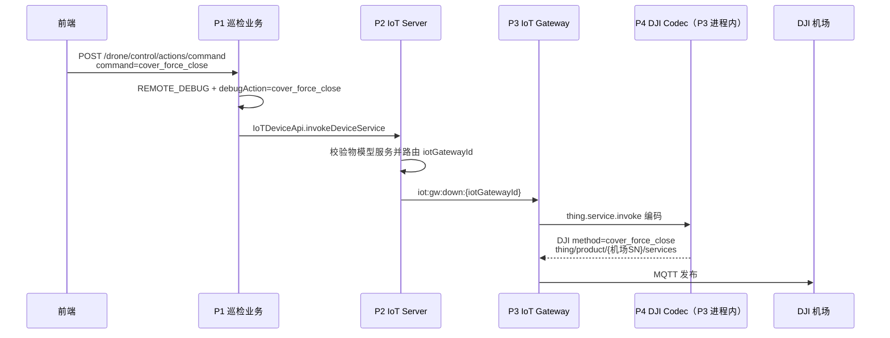
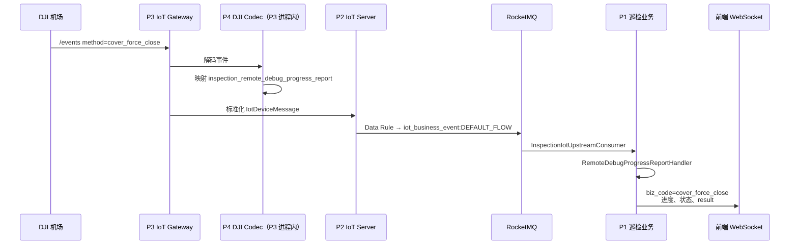

# DJI 机场强制关舱盖：端到端案例

> **证据等级：代码核对已确认（2026-08-03）。** 本页以 `cover_force_close` 为例说明一条机场远程调试指令的下行与进度上行闭环；它是两条通用 Flow 的参考案例，不替代其职责与联调约束。

## 何时读取

- 需要理解机场远程调试指令如何从 P1 下发至 DJI 设备，或如何将执行进度回显到前端。
- 排查 `cover_force_close` 未到设备、没有进度上报，或 WebSocket 未收到 `biz_code=cover_force_close`。
- 新增同类 DJI 远程调试指令时，用于核对跨服务边界；具体实现仍以当前代码、物模型和运行配置为准。

## 触发与安全边界

P1 的入口是 `POST /drone/control/actions/command`，请求中的 `command` 为 `cover_force_close`。此操作是高风险舱盖动作：当前 P1 接口注释要求仅在确认机体不在舱内、`drone_in_dock=0` 时使用。HTTP 或下行投递成功不代表机场已经完成关舱，必须以后续进度上报为准。

## 指令下行

关键映射：P1 将业务命令构造成 `REMOTE_DEBUG` 和 `debugAction=cover_force_close`；P2 的统一服务调用使用 `thing.service.invoke`，P4 选择 `inspection_device_control` 命令族编码器，并生成 DJI `/services` 消息。P4 是 P3 的进程内依赖，不是独立部署或消息总线的一跳。

## 进度数据上行与前端回显

P4 从 `data.output`（或兼容的 `data`）提取状态和进度，并同时兼容 `current_step/currentStep`、`total_steps/totalSteps`、`step_key/stepKey`、`step_result/stepResult`。P1 的远程调试业务服务将其转换为既有 WebSocket 回显结构，并在该命令场景固定使用 `biz_code=cover_force_close`。

P2 到 P1 依赖实际命中的 Data Rule；P2 的设备消息处理与 Data Rule 是并行消费者，不能假定状态落库早于 P1 收到进度事件。

## 联调必验项

- 机场设备、`targetDeviceSn` 与 `iotGatewayId` 的实际关联正确。
- P2 当前产品已定义并启用 `inspection_device_control` 服务物模型。
- P3 运行时选择的 codec ID 与 P4 DJI Adapter 版本匹配。
- P2 Data Rule 会将 `inspection_remote_debug_progress_report` 投递至 P1 实际消费的 Topic/Tag。
- P3 到机场的 MQTT 连接、ACL、订阅与实际 `/services`、`/events` Topic 在目标环境有效。

## 证据

- 通用下行职责与同步结果语义：[DJI 设备指令下行链路](dji-osd-command-flow.md)。
- 通用上行、Data Rule 与 P1 消费语义：[DJI OSD 上行数据链路](dji-osd-upstream-flow.md)。
- P1：`DockController#createControlJob`、`InspectionIotCommandGatewayImpl#controlDockDebug`、`RemoteDebugProgressReportHandler`、`InspectionRemoteDebugBusinessServiceImpl`。
- P2：`IoTDeviceRpcApi#invokeDeviceService`、Data Rule RocketMQ action。
- P3：`IotEmqxDownstreamHandler`、`AsyncForwardHandler`。
- P4：`DeviceControlCommandFamilyEncoder`、`DjiEventsTopicHandler`、`RemoteDebugProgressEventConverter`。
