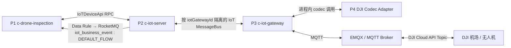

# DJI 机场 OSD 与设备指令上下行链路

> **证据等级：代码核对已确认（2026-07-24）**。本文依据 P1–P4 当前工作区源码梳理；Topic 配置、Data Rule、运行 Jar 版本、Broker ACL 与线上行为仍须按文末清单验证。

## 运行时边界

`ad-iot-codec-adapter-dji`（P4）不是独立部署或消息总线的一跳。它由 `c-iot-gateway`（P3）以 Maven 依赖、SPI/Bean 方式加载，真实路径为：P3 的协议处理器调用 P4 编解码，再由 P3 与 MQTT Broker 通信。

## 关键契约

| 契约 | 已确认含义 |
| --- | --- |
| 网关上下行 Topic | P2 按 `iotGatewayId` 创建上下行 Topic；P3 消费所属网关的下行消息。 |
| P1 业务 Topic | P1 默认消费 `iot_business_event` / `DEFAULT_FLOW`；P2 是否实际投递由 Data Rule 决定。 |
| 普通 OSD identifier | `inspection_device_status_report`，用于机场、无人机 OSD 与 State。 |
| DRC OSD identifier | `inspection_drc_osd_report`，用于含位置的高频 DRC OSD。 |
| 下行 identifier | `inspection_device_control`、`inspection_task_command`、`inspection_drc_command` 等驱动 P4 命令族编码。 |

P4 为机场和无人机建立身份路由：机场 SN 映射自身设备名；无人机 SN 映射到父机场设备名。因此子机 OSD 先按父机场路由，再由 P1 的 `parentDeviceSn` 与 `deviceSn` 恢复子机业务实体。

## OSD 上行

1. DJI 机场或无人机向 `thing/product/{sn}/osd`、`state` 或 `drc/up` 发布消息。
2. P3 的 EMQX 上行协议进入 `MessageProcessingEngine`；P4 的 `DjiCodecAdapter` 依次完成 Topic 预判、路由与解码。
3. P4 将 DJI `data` 规范化为 `identifier` 与同名 payload；普通 OSD/State 为 `inspection_device_status_report`，DRC 高频 OSD 为 `inspection_drc_osd_report`。
4. P3 补齐设备、租户、网关等上下文，发送至 P2 对应网关的上行 Topic。
5. P2 平台消息处理与 Data Rule 是并行消费者；不得假设属性落库先于 Data Rule 投递。
6. 匹配的 P2 Data Rule 将完整 `IotDeviceMessage` 投递给 P1 的 `iot_business_event:DEFAULT_FLOW`。
7. P1 以 `params.identifier` 和同名动态字段解析并路由：普通 OSD 由 `DeviceStatusPropertyHandler`，DRC OSD 由 `DrcOsdPropertyHandler`。

普通 OSD 与 DRC OSD 的 Redis/前端推送语义不同：前者驱动机场或子机状态、任务与业务联动；后者承载低延迟位置、姿态与视锥。不得将两者当成可相互覆盖的同一缓存。

## 指令下行

1. P1 的控制、任务或 DRC API 统一收敛至 `InspectionIotCommandGateway`，再通过 `IoTDeviceApi.invokeDeviceService` 调用 P2。
2. P2 校验设备和物模型服务，构造 `thing.service.invoke`；按设备和通道解析 `iotGatewayId`，投递到对应 P3 下行 Topic。
3. P3 消费下行消息，按 codecId 调用 P4 的 `DjiCodecAdapter#encode`。
4. P4 由 `params.identifier` 选择 Device、Task、Payload、DRC 等命令族编码器，生成 `/services` 或 `/drc/down` Topic 与 DJI JSON。
5. P3 通过 EMQX 发布给 DJI 机场或无人机；`WAIT_REPLY`、`NONE` 与 `UNSUPPORTED` 决定 P2 对同步 RPC 的完成语义。

DRC 先建立飞行控制权与 DRC 模式会话，`drc_mode_enter` 走 `/services`；摇杆、心跳、急停等高频命令走 `/drc/down`。会话心跳、Redis 会话键及停止逻辑应作为同一变更范围评估。

## 代码阅读入口

| 项目 | 首选入口 |
| --- | --- |
| P1 | `InspectionIotCommandGatewayImpl`、`InspectionIotUpstreamConsumer`、`InspectionDeviceStatusBusinessServiceImpl` |
| P2 | `IoTDeviceRpcApi#invokeDeviceService`、`IotDeviceMessageServiceImpl`、Data Rule 与 RocketMQ action |
| P3 | `IotEmqxUpstreamProtocol`、`MessageProcessingEngine`、上/下行 handler、`ProtocolCodecAdapterManager` |
| P4 | `DjiCodecAdapter`、`DjiOsdTopicHandler`、`DjiDrcTopicHandler`、`DjiDownstreamEncoderRegistry` |

## 联调前必验项

- P3 配置的 codecId 与 P4 `DjiConstants.DJI_CODEC_ID` 必须一致；运行 Jar 版本需与当前源码核对。
- P2 的 Data Rule 必须分别覆盖普通 OSD 与 DRC OSD，并投递到 P1 实际消费的 Topic/Tag。
- P4 的机场—无人机身份注册依赖 `update_topo`；重启后先验证其重新建立。
- 核对 `targetDeviceSn` 是机场还是机体，以及最终 `/services`、`/drc/down` Topic。
- 平台状态处理和 Data Rule 消费并行；P1 不得依赖“P2 已先落库”的时序。
- EMQX 入口的认证、ACL、订阅 Topic 与 QoS 属运行配置事实，必须单独核实。

相关资料：原始核对文档《机场OSD与设备指令上下行链路梳理》（用户提供，2026-07-24）。
