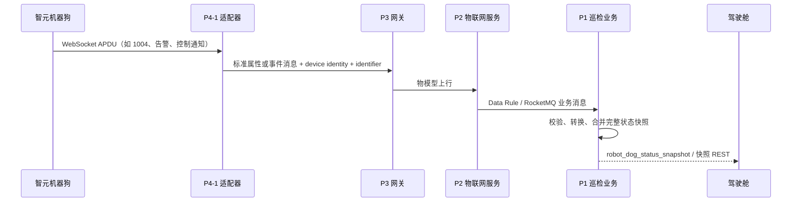
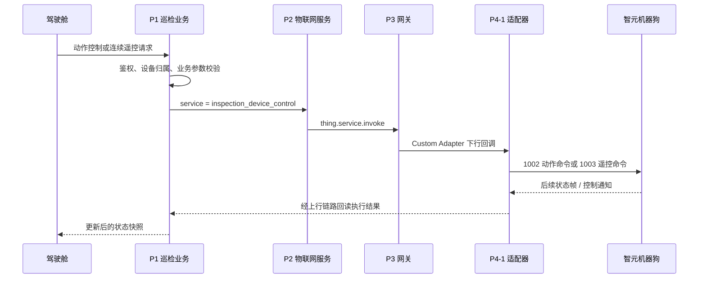

# 智元机器狗：从协议到驾驶舱的上下行集成闭环

> 本文以已落地代码为依据，说明机器狗一个核心能力应如何穿过 P4-1、P3、P2、P1 并回到驾驶舱。它是可复用的集成经验，不替代厂商协议、完整 TSL 或具体部署手册。

## 适用范围与非目标

适用于智元机器狗的状态上报、控制指令和驾驶舱状态回读的端到端对接。这里的“闭环”指：前端操作能送达设备侧，设备随后通过上行状态或通知让前端获得可判断的结果。

本文不声明以下事项已经完成：P3 的实际 Custom Adapter 部署配置、P2 的产品 TSL 与 Data Rule 运行态配置、以及实机联调结果。这些都必须按验收证据单独确认。

## 分层职责与契约归属

| 边界 | 负责内容 | 不应承担的内容 |
| --- | --- | --- |
| 厂商设备 | WebSocket / APDU 协议、命令执行和原始状态 | 平台物模型与业务 DTO |
| P4-1 `ad-iot-codec-adapter-robotDog-zhiyuan` | 协议握手、心跳、APDU 编解码、厂商字段到标准 `identifier` 的映射 | 业务状态聚合、前端展示语义 |
| P3 `c-iot-gateway` | Custom Adapter 生命周期，以及标准上下行消息的接入与转发 | 把厂商协议细节泄漏给 P1 |
| P2 `c-iot-server` | 产品、TSL、服务参数校验、`thing.service.invoke` 和 Data Rule | 机器狗业务状态快照 |
| P1 `c-drone-inspection` | 业务 DTO、状态合并、WebSocket/REST 回读、控制权限和业务语义 | 直接解析 APDU |
| 驾驶舱 | 根据状态展示与发起用户操作 | 将“命令已受理”误作“设备已执行” |

关键原则是单向归属：厂商字段只在 P4-1 消化；物模型标识和类型由 P2 管理；业务状态与交互语义由 P1 管理。跨层只传递稳定契约，不传递内部实现对象。

## 上行：设备状态如何到达驾驶舱

已在 P4-1 映射中使用的稳定标识包括：

| 方向 | 标识 | 用途 |
| --- | --- | --- |
| 属性上报 | `inspection_device_status_report` | 握手、状态体及设备信息等状态类 APDU 的物模型入口 |
| 事件上报 | `inspection_alarm_report` | 告警类上报 |
| 事件上报 | `inspection_control_notification_report` | 控制权获取/释放等通知 |

`1004` 状态帧具有增量更新特征。P4-1 只负责把已收到的协议字段转换为标准上行消息；P1 再将合法字段合并为完整的 `RobotDogStatusSnapshot`，并在内容发生变化时推送 `robot_dog_status_snapshot`。因此，前端不应把单帧缺失字段解释为默认值或离线。

设备在线性也是独立语义：不能仅凭某个状态字段推断在线，需要按平台的设备会话/在线状态链路核验。

## 下行：驾驶舱控制如何回到设备

P1 当前将动作控制和连续遥控分别暴露为机器狗控制接口；它们最终调用 P2 服务 `inspection_device_control`。P4-1 还识别 `inspection_config_command`，用于配置类下行命令。

这里必须区分两种结果：

- **平台已受理**：P1/P2/P3/P4-1 已接受并尝试发送该指令。
- **设备已执行**：必须由后续 `1004` 状态、控制通知或厂商定义的执行反馈确认。

P4-1 的 Custom Adapter 下行不等待设备执行回包，因此接口同步响应只能表达“已受理/未受理”，不能承诺动作成功。紧急停止、控制权、持续遥控等高风险操作还应在 P1 明确权限、持续时间和失联后的处置规则。

## 接入顺序与最小验收面

不要以“接口已调通”替代闭环验收。启用一个能力前，至少应按依赖关系完成以下证据：

1. P2 已有对应产品、TSL 标识、类型和服务参数；上行需要进入业务时，Data Rule 的目标与消息契约可追溯。
2. P4-1 已对目标 APDU 或服务标识实现双向映射，并有正常与非法输入的编码/解码测试。
3. P3 已加载正确的 Custom Adapter，并确认实例、路由和设备身份能落到目标适配器。
4. P1 已消费目标业务消息，能将状态写入并提供 REST 或 WebSocket 回读；下行已校验用户、项目和设备归属。
5. 联调同时观察“命令受理”和“后续状态变化”；只得到 HTTP 成功或 MQ 成功不能通过验收。

新增型号、新协议能力或新驾驶舱设计时，执行更完整的[设备接入核心上下行对接任务清单](../context/domain/device-integration-task-checklist.md)。

## 可追溯证据与待确认项

已核实的代码/测试证据：

- P4-1 映射与下行编码：`ZhiyuanUpstreamMapper`、`ZhiyuanDownstreamEncoder`、`ZhiyuanRobotDogCustomProtocolAdapter`，以及 `ZhiyuanTslContractTest`、`ZhiyuanDownstreamEncoderTest`。
- P1 控制、状态快照和驾驶舱推送：`RobotDogControlController`、`InspectionRobotDogControlServiceImpl`、`InspectionRobotDogStatusBusinessServiceImpl`。
- P2/P3 的通用物模型、Data Rule 与 Custom Adapter 边界，见 [设备物模型 TSL 与上下行契约](../repositories/c-iot-server/device-thing-model-tsl.md) 和 [协议实例与编解码选择](../repositories/c-iot-gateway/protocol-instance-and-codec-selection.md)。

仍为 `pending_verification` 的运行态项：P2 实际 TSL/Data Rule 内容与启用状态、P3 实例化与 Jar 配置、真实设备的握手/重连/执行反馈、以及前端最终交互策略。

## 相关资料

- [智元机器狗适配器映射与边界](../repositories/ad-iot-codec-adapter-robotDog-zhiyuan/zhiyuan-robot-dog-adapter-mapping.md)
- [机器狗状态快照与驾驶舱 WebSocket](../repositories/c-drone-inspection/robot-dog-status-snapshot-websocket.md)
- [通用设备状态进入物模型的完整链路](device-state-thing-model-end-to-end.md)
