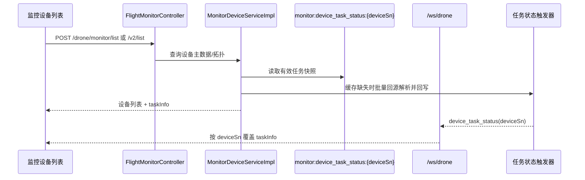
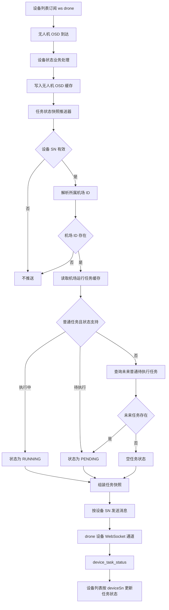
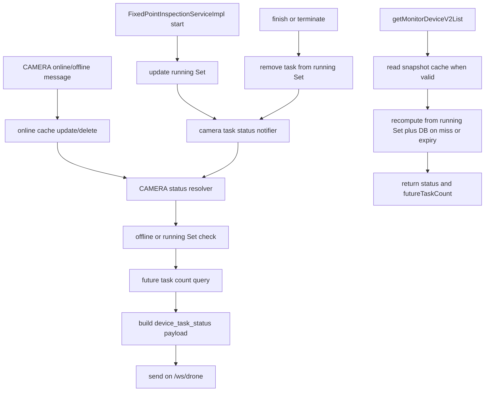

# P1 设备列表任务状态 WebSocket 链路

> 主题：`/ws/drone`，`biz_code=device_task_status`。  
> 证据状态：当前代码核对（2026-08-10）；本文描述现状，不是目标设计。

## 范围与结论

本文说明监控中心设备列表任务状态消息的触发入口、任务状态来源、载荷组装和 WebSocket 推送边界，并补充 HTTP 首次列表如何与实时消息闭环。

结论先行：设备列表的初始任务信息与实时变更均以 `monitor:device_task_status:{deviceSn}` 快照为收口。旧版 `POST /drone/monitor/list` 和 2.0 `POST /drone/monitor/v2/list` 在组装列表时读取/回源同一任务解析器并返回 `taskInfo`；任务事件则按设备 SN 通过 `/ws/drone` 的 `device_task_status` 增量覆盖卡片。无人机 OSD 仍是常规刷新入口，计划删除/变更、任务控制等路径也会触发无人机刷新；CAMERA 使用独立的固定点位任务解析器和触发入口。

## 设备列表初始展示与实时闭环



| 初始列表 | 任务字段 | 解析边界 |
|---|---|---|
| `POST /drone/monitor/list` | 机场/无人机旧版行中的 `taskInfo` | 当前实现为子无人机任务快照；机场本身不填充。通过 `DeviceTaskStatusNotifier#resolveAndCacheBatch` 按机场 ID 批量解析并缓存。 |
| `POST /drone/monitor/v2/list` | 每个 CAMERA/DRONE 卡片的 `taskInfo` | 优先读 `monitor:device_task_status:{deviceSn}`，缺失时 CAMERA/DRONE 分别批量回源并回写；DOCK 不填充。 |

前端应以 `deviceSn`（旧版使用 `droneDeviceSn`，2.0 使用卡片 `deviceSn`）作为合并键：首次 HTTP 响应建立设备卡片，后续 `device_task_status` 载荷覆盖 `taskInfo`；空任务快照用于清除残留任务。HTTP 列表不是 WebSocket 的替代通道，WebSocket 也不负责补发整份设备主数据。

## 全流程图



## 触发前提

| 前置 | 当前行为 | 代码证据 |
|---|---|---|
| 上游消息 | 必须先进入 `InspectionDeviceStatusBusinessServiceImpl#handleSubDeviceTelemetry`，即被识别为无人机子设备遥测 | `InspectionDeviceStatusBusinessServiceImpl#handleSubDeviceTelemetry` |
| OSD 处理顺序 | 先刷新/写入无人机 OSD 快照，再调用任务状态推送器 | `setOsd(device.getDeviceSn(), osd)` 后调用 `notifyDeviceTaskStatus(...)` |
| 设备 SN | 为空时直接返回，不发送 WebSocket | `DeviceTaskStatusNotifier#notifyDeviceTaskStatus` |
| 所属机场 ID | 优先使用 `context.getDockDeviceId()`；为空时通过 `getFathDeviceByChildSn(deviceSn)` 反查；仍无法得到机场 ID 时不发送 | `resolveDockId` |
| 连接通道 | 使用 `webSocketMessageService.sendBatch(deviceSn, ...)`，由 WebSocket 服务按设备 SN 选择设备类型连接；无人机设备进入 `drone` 通道，对应 `/ws/drone` | `IWebSocketMessageService`、`WebSocketMessageServiceImpl#sendBatch(String, ...)` |

无人机 OSD 路径没有独立的定时补偿任务，也没有基于任务状态字段的去重；前置条件满足时，每个有效无人机 OSD 都会尝试发送一次任务状态快照。任务计划删除/变更及部分任务控制路径会在事务提交后调用 `notifyByDockId`，不必等待下一条 OSD；是否覆盖所有任务状态转移仍以具体调用方核对为准。

## 任务状态解析规则

任务状态以**机场设备维度**读取，推送目标仍是当前无人机 SN：

1. 读取 `IWaylineRedisService#getRunningTaskId(dockId)`。
2. 如果缓存任务类型是普通任务 `NORMAL`：
   - `EnumTaskBizStatus.IN_PROGRESS` → `EnumDeviceTaskStatus.RUNNING`，编码 `2`。
   - `EnumTaskBizStatus.TO_BE_EXECUTED` → `EnumDeviceTaskStatus.PENDING`，编码 `1`。
3. 缓存为空、缓存任务是手动任务、或缓存状态不是上述两种时，查询该机场未来执行时间大于当前时间的普通待执行任务：
   - 查到任务 → `PENDING`。
   - 查不到任务 → 发送空任务状态，用于清除设备列表残留状态。
4. 任务存在时补充任务快照字段：计划、任务、执行时间、进度、飞行里程、航线里程和算法识别计数。

### `wayline_task_running:{dockId}` 的维护边界

这里读取的“机场运行任务缓存”不是机场全部任务的缓存，也不是未来任务队列，而是**每个机场一个 `WaylineTaskDTO` 的当前运行/最近控制上下文**：

- 维度是机场 `dockId`，不是无人机 SN；一个机场同一时刻只维护一个缓存对象。
- 任务开始、暂停、恢复、DRC/手动控制、任务进度及部分 IoT 控制路径会调用 `setRunningTask` 更新它。
- `setRunningTask` 采用非空字段合并覆盖，分批上报的进度、航点、距离、业务状态等字段会合并到同一个对象；普通写入不设置 TTL。
- 任务结束通常先写入 `ending=true` 并设置短期过期，随后由显式清理删除；因此终态缓存可能短暂存在，但不应视为仍在运行。
- 缓存至多代表一个当前/最近任务快照，即使其中暂存 `TO_BE_EXECUTED`，也不等于保存了该机场全部未来任务。

未来任务的完整集合仍在任务表中。状态解析只有在运行缓存为空、缓存为手动任务或缓存状态不支持时，才回查该机场 `executeTime > now` 的普通 `TO_BE_EXECUTED` 任务，并按执行时间升序取最早的一条作为 `PENDING`；没有则推送空状态。因此，设备列表任务状态的“未来任务”兜底来自数据库查询，而不是 Redis 运行任务缓存。

任务状态枚举当前只有：

| `deviceTaskStatus` | 描述 | 来源 |
|---|---|---|
| `1` | 任务待执行 | 普通任务待执行或未来待执行任务 |
| `2` | 任务执行中 | 普通任务运行缓存为 `IN_PROGRESS` |
| `null` | 空状态 | 没有运行任务且没有未来待执行普通任务 |

完成、终止、失败、暂停等任务终态不会直接映射为新的设备任务状态；它们通常通过运行任务缓存失效/清理后，下一次 OSD 触发重新解析为空状态或未来待执行状态。

## 推送载荷与设备列表关系

`DeviceTaskStatusPushDTO` 的核心字段如下：

| 字段 | 含义 |
|---|---|
| `deviceId` | 所属机场设备 ID |
| `deviceSn` | 当前推送目标设备 SN，通常为无人机 SN |
| `deviceTaskStatus` | `1`、`2` 或 `null` |
| `deviceTaskStatusDesc` | 状态描述 |
| `planId`、`taskId`、`taskName` | 任务/计划标识和名称 |
| `taskExecuteTime`、`taskProgress` | 执行时间和进度 |
| `flightMileage`、`waylineMileage`、`algorithmRecognitionCount` | 任务统计扩展字段 |

这是按设备 SN 定向的消息，不是顶部统计那种全局刷新消息。前端设备列表应使用外层消息的 `deviceSn` 或载荷中的 `deviceSn` 定位卡片，再用快照覆盖任务状态和相关展示字段。HTTP 列表中的 `MonitorDeviceTaskInfoDTO` 与该载荷共享计划、任务、状态、执行时间、算法计数和未来任务数量字段；无人机额外映射进度、飞行里程和航线里程。

## 实时性、兜底与风险边界

- **正常实时路径：** 无人机 OSD 到达 → OSD 缓存更新 → 任务状态快照解析 → `device_task_status` 推送。
- **未接入任务触发器的状态变更：** 当前不会单独触发 `device_task_status`；需等下一条无人机 OSD 才会刷新。已接入计划删除/变更和任务控制的路径会在事务提交后刷新关联无人机，但不是所有任务状态转移都已由本文证明覆盖。
- **设备离线：** 当前在线/离线消息和顶部业务状态链路不会直接触发 `device_task_status`；若设备列表需要离线时清理任务状态，需另行设计消息契约或补偿入口。
- **任务状态缓存/数据库读取异常：** `DeviceTaskStatusNotifier` 当前没有独立异常降级；异常可能影响当前 OSD 消息处理，需结合上游消费重试策略排查。
- **没有专属对账任务：** `MonitorBusinessStatusReconciliationTask` 只负责顶部业务统计，不负责 `device_task_status` 的补发。

## CAMERA 任务状态扩展（已实施）

### 可行性结论

CAMERA 已复用现有 `/ws/drone` 通道和 `device_task_status` 业务码，但没有复用“机场运行任务缓存 + 无人机 OSD”解析链。CAMERA 由 `CameraTaskStatusNotifier` 按固定点位任务和设备运行 Set 解析；无人机仍由 `DeviceTaskStatusNotifier` 按机场运行任务和 OSD 解析。

固定点位任务的执行中判定可以复用 `FixedPointInspectionServiceImpl#acquireDeviceWorking` 写入的集合：

```text
fixed_point_device_running_tasks:{cameraDeviceId}
```

该集合是设备维度的 Redis Set，任务 `start` 在至少一个通道启动成功后 `SADD taskId`；`finish`、`terminate` 以及启动失败收尾会移除任务 ID，集合为空时删除 Key。因此 `isDeviceWorking(deviceId)` 作为“当前存在执行中任务”的判定是合适的，但它依赖结束清理成功，不应把一个三天快照缓存当作执行中状态的唯一事实。

### 未来任务数量的正确口径

用户给出的 SQL 需要调整关联条件：`wayline_plan.device_id` 在当前模型中是计划执行机场 ID，不是 CAMERA ID；CAMERA 与固定点位任务的关联在 `fixed_point_task_channel.device_id`。同时，按通道 JOIN 直接 `count(1)` 会将同一任务按通道数重复计数，应该按任务去重，并过滤固定点位、待执行和未删除记录：

```sql
SELECT COUNT(DISTINCT wt.task_id)
FROM wayline_task wt
INNER JOIN wayline_plan wp ON wp.plan_id = wt.plan_id
INNER JOIN fixed_point_task_channel fptc ON fptc.task_id = wt.task_id
WHERE wp.is_deleted = 0
  AND wt.is_deleted = 0
  AND fptc.is_deleted = 0
  AND fptc.device_id = #{cameraDeviceId}
  AND wt.task_type = 3
  AND wt.task_biz_status = 1
  AND wp.plan_start_time > NOW()
```

其中 `3` 对应固定点位任务，`1` 对应待执行；最终实现应优先使用枚举参数或 MyBatis-Plus 条件，避免把数字散落在 SQL 中。若产品定义“未来”按任务执行时间而不是计划开始时间，应改用固定点位任务实际使用的计划时间字段并补充对应测试。

### 触发和读取设计



当前职责边界：

1. `start`、`finish`、`terminate` 在任务状态和设备运行 Set 更新完成后，按受影响的 `deviceId` 触发 CAMERA 任务状态通知；不依赖无人机 OSD 刷新 CAMERA。
2. CAMERA 在线/离线事件继续复用已有在线缓存事件链，但不覆盖任务语义：每次都重新读取运行 Set 和未来任务数量，离线时同样可能返回 `RUNNING`、`PENDING` 或空任务状态；物理在线态仍由既有设备状态消息表达。
3. `getMonitorDeviceV2List` 已增加 CAMERA、DRONE 的任务状态和 `futureTaskCount` 字段；缓存缺失时按设备集合批量聚合未来任务，DOCK 不填充该字段。
4. `monitor:device_task_status:{deviceSn}` 保存最新任务快照并设置三天 TTL，仅作为读优化；过期或缺失时回源 `running Set + task table` 重算，不能把快照作为执行中唯一事实。
5. `device_task_status` 通过 `DeviceTaskStatusBaseDTO` 保持公共字段；现有无人机使用 `DeviceTaskStatusPushDTO`，CAMERA 使用 `CameraTaskStatusPushDTO`，新增 `futureTaskCount` 为兼容性字段。

### 主要风险与验收点

- **设备关联风险：** 必须验证 `fixed_point_task_channel.device_id` 与监控 CAMERA 的 `deviceId` 是同一主数据 ID；不能使用计划的 `device_id`。
- **重复计数风险：** 一个任务包含多个视频通道时，未来数量必须 `COUNT(DISTINCT wt.task_id)`。
- **并发任务风险：** 运行 Set 支持同一 CAMERA 多个任务，状态只要判断集合非空；结束一个任务不能清掉其他任务。
- **缓存残留风险：** `start` 部分通道失败、服务重启或结束补偿失败时，要用任务表/通道状态回收运行 Set，并覆盖通知幂等测试。
- **实时性验收：** CAMERA online/offline、固定点位 start/finish/terminate 均能在不等待无人机 OSD 的情况下推送 `device_task_status`；DRONE 计划创建、更新、删除及 OSD 会刷新任务快照；已覆盖 CAMERA 状态解析、DTO/既有任务状态回归测试。

## 证据

- 触发入口：`InspectionDeviceStatusBusinessServiceImpl#handleSubDeviceTelemetry`。
- 状态解析和推送：`DeviceTaskStatusNotifier#notifyDeviceTaskStatus`、`#resolveStatus`。
- 业务码：`BizCodeEnum.DEVICE_TASK_STATUS`。
- 载荷：`DeviceTaskStatusPushDTO`。
- 初始列表：`FlightMonitorController#getMonitorDeviceList` → `MonitorDeviceServiceImpl#getMonitorDeviceList` → `MonitorDeviceListDTO#taskInfo`；2.0 入口为 `getMonitorDeviceV2List` → `MonitorDeviceV2ListDTO#taskInfo`。
- 旧版列表任务批量解析：`MonitorDeviceServiceImpl#enrichLegacyTaskStatus` → `DeviceTaskStatusNotifier#resolveAndCacheBatch`。
- 通道：`IWebSocketMessageService#sendBatch(String, ...)`、`WebSocketMessageServiceImpl#sendBatch(String, ...)`。
- 测试：`DeviceTaskStatusNotifierTest`、`InspectionDeviceStatusBusinessServiceImplTest`。
