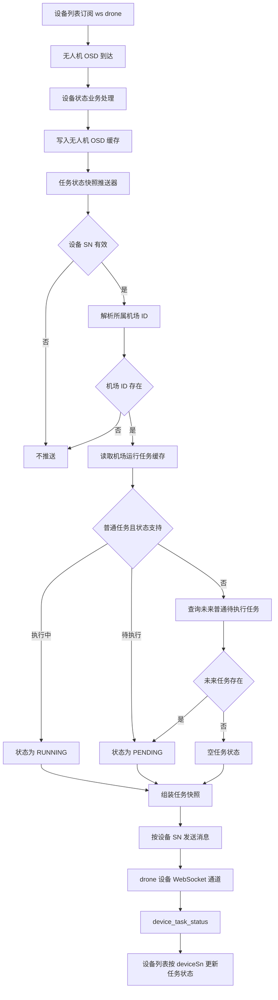

# P1 设备列表任务状态 WebSocket 链路

> 主题：`/ws/drone`，`biz_code=device_task_status`。  
> 证据状态：当前代码核对（2026-08-07）；本文描述现状，不是目标设计。

## 范围与结论

本文说明监控中心设备列表任务状态消息的触发入口、任务状态来源、载荷组装和 WebSocket 推送边界。

结论先行：当前 `device_task_status` 不是任务表或任务缓存发生变化后独立触发的消息，而是**无人机子设备 OSD 到达时顺带刷新的一份任务状态快照**。每次有效的无人机 OSD 处理都会调用 `DeviceTaskStatusNotifier`，按无人机 SN 找到所属机场，再读取机场维度的运行任务缓存或查询未来待执行任务，最后按无人机设备 SN 推送给 `/ws/drone` 通道。CAMERA、DOCK 的 OSD 当前不会进入这条任务状态推送路径。

## 全流程图

## 触发前提

| 前置 | 当前行为 | 代码证据 |
|---|---|---|
| 上游消息 | 必须先进入 `InspectionDeviceStatusBusinessServiceImpl#handleSubDeviceTelemetry`，即被识别为无人机子设备遥测 | `InspectionDeviceStatusBusinessServiceImpl#handleSubDeviceTelemetry` |
| OSD 处理顺序 | 先刷新/写入无人机 OSD 快照，再调用任务状态推送器 | `setOsd(device.getDeviceSn(), osd)` 后调用 `notifyDeviceTaskStatus(...)` |
| 设备 SN | 为空时直接返回，不发送 WebSocket | `DeviceTaskStatusNotifier#notifyDeviceTaskStatus` |
| 所属机场 ID | 优先使用 `context.getDockDeviceId()`；为空时通过 `getFathDeviceByChildSn(deviceSn)` 反查；仍无法得到机场 ID 时不发送 | `resolveDockId` |
| 连接通道 | 使用 `webSocketMessageService.sendBatch(deviceSn, ...)`，由 WebSocket 服务按设备 SN 选择设备类型连接；无人机设备进入 `drone` 通道，对应 `/ws/drone` | `IWebSocketMessageService`、`WebSocketMessageServiceImpl#sendBatch(String, ...)` |

这条链路没有独立的定时补偿任务，也没有基于任务状态字段的去重；前置条件满足时，每个有效无人机 OSD 都会尝试发送一次任务状态快照。

## 任务状态解析规则

任务状态以**机场设备维度**读取，推送目标仍是当前无人机 SN：

1. 读取 `IWaylineRedisService#getRunningTaskId(dockId)`。
2. 如果缓存任务类型是普通任务 `NORMAL`：
   - `EnumTaskBizStatus.IN_PROGRESS` → `EnumDeviceTaskStatus.RUNNING`，编码 `2`。
   - `EnumTaskBizStatus.TO_BE_EXECUTED` → `EnumDeviceTaskStatus.PENDING`，编码 `1`。
3. 缓存为空、缓存任务是手动任务、或缓存状态不是上述两种时，查询该机场未来执行时间大于当前时间的普通待执行任务：
   - 查到任务 → `PENDING`。
   - 查不到任务 → 发送空任务状态，用于清除设备列表残留状态。
4. 任务存在时补充任务快照字段：计划、任务、执行时间、进度、飞行里程、航线里程和算法识别计数。

任务状态枚举当前只有：

| `deviceTaskStatus` | 描述 | 来源 |
|---|---|---|
| `1` | 任务待执行 | 普通任务待执行或未来待执行任务 |
| `2` | 任务执行中 | 普通任务运行缓存为 `IN_PROGRESS` |
| `null` | 空状态 | 没有运行任务且没有未来待执行普通任务 |

完成、终止、失败、暂停等任务终态不会直接映射为新的设备任务状态；它们通常通过运行任务缓存失效/清理后，下一次 OSD 触发重新解析为空状态或未来待执行状态。

## 推送载荷与设备列表关系

`DeviceTaskStatusPushDTO` 的核心字段如下：

| 字段 | 含义 |
|---|---|
| `deviceId` | 所属机场设备 ID |
| `deviceSn` | 当前推送目标设备 SN，通常为无人机 SN |
| `deviceTaskStatus` | `1`、`2` 或 `null` |
| `deviceTaskStatusDesc` | 状态描述 |
| `planId`、`taskId`、`taskName` | 任务/计划标识和名称 |
| `taskExecuteTime`、`taskProgress` | 执行时间和进度 |
| `flightMileage`、`waylineMileage`、`algorithmRecognitionCount` | 任务统计扩展字段 |

这是按设备 SN 定向的消息，不是顶部统计那种全局刷新消息。前端设备列表应使用外层消息的 `deviceSn` 或载荷中的 `deviceSn` 定位卡片，再用快照覆盖任务状态和相关展示字段。

## 实时性、兜底与风险边界

- **正常实时路径：** 无人机 OSD 到达 → OSD 缓存更新 → 任务状态快照解析 → `device_task_status` 推送。
- **任务状态变更不产生 OSD：** 当前不会单独触发 `device_task_status`；需等下一条无人机 OSD 才会刷新。
- **设备离线：** 当前在线/离线消息和顶部业务状态链路不会直接触发 `device_task_status`；若设备列表需要离线时清理任务状态，需另行设计消息契约或补偿入口。
- **任务状态缓存/数据库读取异常：** `DeviceTaskStatusNotifier` 当前没有独立异常降级；异常可能影响当前 OSD 消息处理，需结合上游消费重试策略排查。
- **没有专属对账任务：** `MonitorBusinessStatusReconciliationTask` 只负责顶部业务统计，不负责 `device_task_status` 的补发。

## 证据

- 触发入口：`InspectionDeviceStatusBusinessServiceImpl#handleSubDeviceTelemetry`。
- 状态解析和推送：`DeviceTaskStatusNotifier#notifyDeviceTaskStatus`、`#resolveStatus`。
- 业务码：`BizCodeEnum.DEVICE_TASK_STATUS`。
- 载荷：`DeviceTaskStatusPushDTO`。
- 通道：`IWebSocketMessageService#sendBatch(String, ...)`、`WebSocketMessageServiceImpl#sendBatch(String, ...)`。
- 测试：`DeviceTaskStatusNotifierTest`、`InspectionDeviceStatusBusinessServiceImplTest`。

