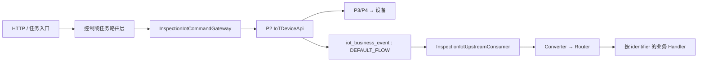

# P1：巡检业务平台关键入口地图

> **证据等级：代码核对已确认。** 本页只覆盖 P1 与 P2/P3/P4 交互的设备命令和 IoT 上行；普通查询与后台 CRUD 不展开。

## 总览

P1 的跨服务入口分为三层：HTTP/任务场景入口负责权限和业务编排；`InspectionIotCommandGateway` 是统一出站门面；`InspectionIotUpstreamConsumer` 是统一入站门面。

## 一、设备指令下行

### 1. 机场远程调试：最高优先级入口

| 项目 | 内容 |
| --- | --- |
| HTTP 入口 | `POST /drone/control/actions/command` |
| Controller | `DockController#createControlJob` |
| 请求 | `RemoteDebugParam`：`id`、`command`、可选 `action` |
| 业务路由 | `DockControlRouteServiceImpl#controlDockDebug` |
| 统一出站 | `InspectionIotCommandGatewayImpl#controlDockDebug` |
| 跨服务出口 | P2 `IoTDeviceApi.invokeDeviceService` |

该入口用于返航、重启、开关机、舱盖、充电等远程调试命令。它不是直接发 MQTT：权限、日志、设备校验和业务语义在 P1 完成，协议编码与实际投递由 P2 → P3 → P4 完成。

`cover_force_close` 属高风险舱盖操作；调用前必须结合机场 OSD 的 `drone_in_dock` 与现场确认评估，不能仅以 HTTP 成功作为设备安全依据。

### 2. 同一机场控制域的相关入口

下列接口也由 `DockControlRouteServiceImpl` 收口到 Gateway。修改控制命令、设备选择或回执语义时，应与远程调试一并评估。

| 类型 | HTTP 入口 | 目的 |
| --- | --- | --- |
| 指点飞行 | `/drone/control/actions/flyToPoint/start`、`stop`、`update` | 开始、停止、更新目标点 |
| 一键起飞 | `/drone/control/actions/takeoffToPoint` | 起飞并飞向目标点 |
| 控制权 | `/drone/control/actions/authority/flight`、`remove`、`payload` | 飞行/负载权限申请与释放 |
| 负载控制 | `/drone/control/actions/payload/commands` | 相机、云台等负载命令 |
| 空中航线 | `/drone/control/inFlightWaylineDeliver`、`Stop`、`Recover` | 飞行中航线下发、暂停、恢复 |

### 3. DRC 直接控制入口

| 项目 | 内容 |
| --- | --- |
| HTTP 前缀 | `/drone/drc` |
| Controller | `DrcCommandController` |
| 路由层 | `DrcControlRouteServiceImpl` |
| 统一出站 | `InspectionIotCommandGatewayImpl` |

主要接口：`/joystick`、`/emergencyStop`、`/emergencyLand`、`/heartBeatDown`、`/enterMode`、`/osd/session/start`、`/osd/session/stop`。

DRC 不是单条普通控制命令：路由层负责控制权、DRC 模式、会话与心跳编排；Gateway 才构造下行 IoT 命令。修改摇杆、心跳、OSD 频率或会话生命周期时，必须同时阅读 [DJI OSD 与设备指令链路](../../flows/dji-osd-command-flow.md)。

### 4. 非 HTTP 的任务命令入口

`controller/admin/waylineTask/taskHandler/command/TaskCommandExec` 直接依赖 `InspectionIotCommandGateway`。它是航线任务状态机到设备任务命令的关键内部入口；任务执行、暂停、恢复或资源处理变更时不可只检查 `DockController`。

### 5. 命令统一门面：P1 出站边界

`InspectionIotCommandGatewayImpl` 负责设备/目标 SN 校验、场景命令 DTO 构造、部分配置/缓存解析及调用结果标准化。机场控制、DRC、直播、喊话器和任务处理器都通过该门面出站。

**维护规则：** 新增设备命令优先扩展“业务路由层 → Gateway 命令语义 → P2 identifier/P3-P4 编码”完整链路，不要在 Controller 内直接调用 IoT RPC 或自行拼装协议报文。

## 二、设备数据上行

### 1. 统一 RocketMQ 消费入口

| 项目 | 内容 |
| --- | --- |
| 类 | `com.xmkj.business.iot.consumer.InspectionIotUpstreamConsumer` |
| 配置 | `inspection.iot.upstream.topic` / `inspection.iot.upstream.tag` |
| 默认值 | `iot_business_event` / `DEFAULT_FLOW` |
| 上游 | P2 Data Rule 的 RocketMQ action |
| 下游 | `InspectionIotMessageConverter#convertAll` → `InspectionIotMessageRouter#route` |

Consumer 不承载具体业务：它会将一条原始消息展开为多个内部物模型消息，再按 `identifier` 路由。格式、必填字段、字段类型或 payload 不合法时确认消费以避免持续重试；已知 Handler 抛出的业务异常则交由 MQ 框架重试。

### 2. Router：上行数据分流边界

`InspectionIotMessageRouter` 启动时收集全部 `InspectionIotMessageHandler`，以 `identifier` 建立唯一映射。重复 identifier 会使应用启动失败；未知 identifier 会记录错误后确认消费，避免适配器先升级时阻塞当前消费组。

### 3. Handler 分类

| 分类 | 关键 Handler | 作用 |
| --- | --- | --- |
| 状态与遥测 | `DeviceStatusPropertyHandler`、`DrcOsdPropertyHandler` | 普通 OSD、DRC 高频 OSD、缓存与前端状态联动 |
| 控制结果 | `CommandReplyHandler`、`ControlNotificationReportHandler`、`RemoteDebugProgressReportHandler` | 同步回执、控制通知和远程调试进度 |
| 任务与飞行 | `TaskProgressReportHandler`、`PointFlightProgressReportHandler`、`FlighttaskResourceGetRequestHandler` | 任务进度、指点飞行、任务资源请求 |
| 拓扑与配置 | `TopologyUpdateRequestHandler`、`StorageConfigRequestHandler` | 机场—子机拓扑与设备配置协同 |
| 媒体与告警 | `MediaReportHandler`、`AlarmReportHandler` | 媒体上报和告警业务入口 |

新增 P4 identifier 或 P2 Data Rule 时，必须确认 P1 是否已有对应 Handler；没有时需新增类型、Handler 和测试，不能依赖未知 identifier 的“确认消费”行为。

## 三、推荐排障顺序

1. **指令没有到设备：** HTTP/任务入口 → 路由层 → Gateway → P2 RPC → P3/P4 编码与 MQTT。
2. **设备消息未生效：** P2 Data Rule → Consumer 的 Topic/Tag → Converter → Router → 对应 Handler。
3. **OSD/DRC 异常：** 先读 [DJI OSD 与设备指令链路](../../flows/dji-osd-command-flow.md)，区分普通 OSD、State 与 DRC OSD。

缓存读取、分包 OSD 合并、运行任务状态和 DRC 会话边界见 [P1 缓存设计](cache-design.md)。

## 代码证据

以下路径相对 P1 仓库根目录：

- `b-inspection-platform-core/.../control/controller/DockController.java`
- `b-inspection-platform-core/.../control/controller/DrcCommandController.java`
- `b-inspection-platform-core/.../control/impl/DockControlRouteServiceImpl.java`
- `b-inspection-platform-core/.../control/impl/DrcControlRouteServiceImpl.java`
- `b-inspection-platform-core/.../iot/impl/InspectionIotCommandGatewayImpl.java`
- `b-inspection-platform-iot/.../iot/consumer/InspectionIotUpstreamConsumer.java`
- `b-inspection-platform-iot/.../iot/convert/InspectionIotMessageConverter.java`
- `b-inspection-platform-iot/.../iot/router/InspectionIotMessageRouter.java`
