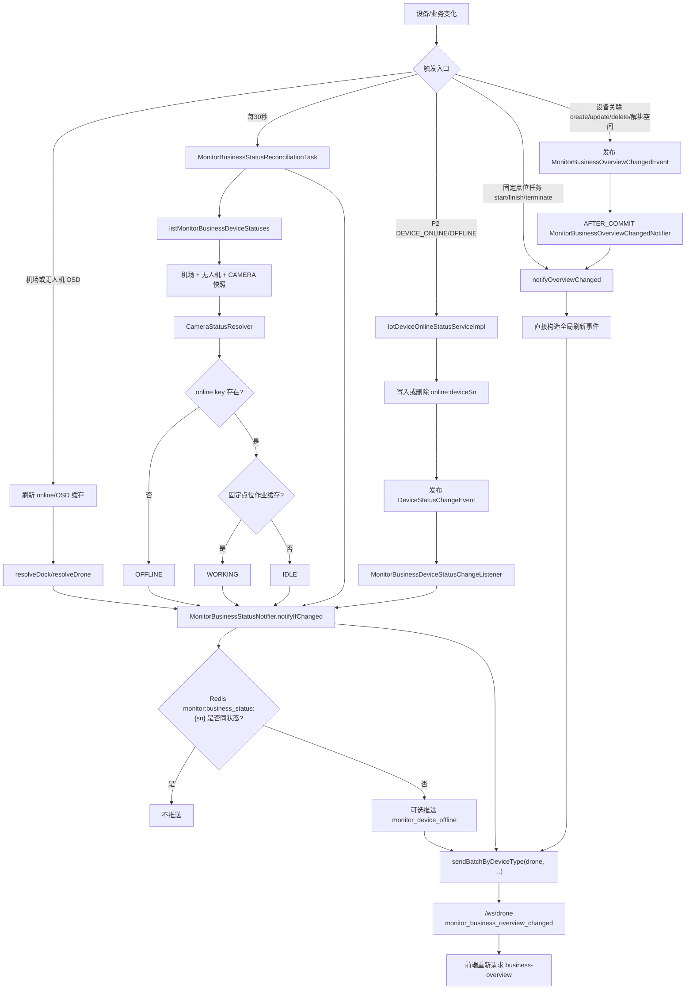

# P1 监控中心顶部统计刷新 WebSocket 链路

> 主题：`/ws/drone`，`biz_code=monitor_business_overview_changed`。  
> 证据状态：当前代码核对（2026-08-14）；本文描述现状，不是目标设计。

## 范围与结论

本文只解释“顶部业务统计变化后通知前端重新拉取”的触发前置、状态计算、去重和推送出口；不展开 WebSocket 鉴权、前端重连和统计接口之外的业务消息。

结论先行：`CAMERA` 已纳入顶部统计。它由 `category_code='CAM'` 且已绑定空间的设备投影进入统计快照，并由 `CameraStatusResolver` 计算 `WORKING/IDLE/OFFLINE`。CAMERA 没有专属 OSD 即时推送入口；当前状态变化由三条路径共同覆盖：在线/离线消息实时事件、固定点位任务开始/结束的全局刷新通知，以及每 30 秒一次的对账任务。在线/离线的判断前提是 `online:{cameraSn}` Redis key 被 IoT 业务事件维护。设备空间关联的创建、更新、删除和空间解绑会改变统计集合，P1 在同一业务事务提交后直接发送全局业务统计刷新，不等待 OSD 或对账任务。

## 全流程图



## 触发前提 → 业务态变更 → 最终推送

这条链路可以按三个层次理解：

### 1. 触发前提

| 设备/场景 | 触发前提 | 是否直接进入实时路径 |
|---|---|---|
| DOCK | 收到有效机场 OSD，刷新 `online:{dockSn}` 和 `osd:{dockSn}` | 是；按机场业务状态规则计算 |
| DRONE | 收到有效无人机 OSD，刷新 `online:{droneSn}` 和 `osd:{droneSn}` | 是；按无人机模式/业务规则计算 |
| CAMERA 任务态 | 固定点位任务执行 `start/finish/terminate`，维护设备作业缓存 | 是；发送全局统计刷新通知 |
| 设备空间关联 | 创建、更新、删除、批量操作、缺失投影清理或空间解绑成功，使设备进入或离开 `space_code IS NOT NULL` 统计集合 | 是；事务提交后发送全局统计刷新通知 |
| DOCK/DRONE/CAMERA 在线态 | 收到 P2 `DEVICE_ONLINE/OFFLINE`；P1 先写入/删除 `online:{sn}`，再发布 `DeviceStatusChangeEvent` | 是；在线时继续读取缓存和业务规则判定最终状态 |
| 所有统计设备 | 实时事件丢失、缓存过期、服务重启或设备集合发生变化 | 由 `MonitorBusinessStatusReconciliationTask` 兜底，固定间隔 30 秒执行 |

这里的“在线”只是状态解析的前置条件，不等于最终业务态。在线设备还必须继续读取 OSD、模式、固定点位作业等业务数据，才能得到 `WORKING/IDLE/ABNORMAL/...`。

### 2. 业务态变更

- DOCK/DRONE：OSD 事件到达后，读取写入后的有效缓存快照，经过对应 Resolver/Mapper 计算最终业务态。
- CAMERA：在线时由固定点位作业缓存决定 `WORKING` 或 `IDLE`；在线 key 不存在则为 `OFFLINE`。
- 在线/离线消息：消息只负责改变物理在线缓存并触发重新计算；在线不会直接等价于 `IDLE`，仍需经过设备自身业务规则。
- `MonitorBusinessStatusReconciliationTask` 使用与顶部统计相同的快照口径重新计算，承担最终一致性补偿。

### 3. 最终推送

所有实时路径和对账路径最终都汇聚到 `MonitorBusinessStatusNotifier`：

1. 读取 `monitor:business_status:{deviceSn}` 做最终业务态去重。
2. 状态相同：不重复推送。
3. 状态变化：推送设备离线消息（仅 `OFFLINE`）并向 `drone` 类型通道发送 `monitor_business_overview_changed`。
4. 固定点位任务、设备空间关联和设备集合变化属于全局刷新场景，不绑定单个状态缓存，直接发送 `deviceSn=null` 的刷新事件。
5. 前端收到刷新提示后重新请求 `business-overview`，消息本身不携带完整统计结果。

因此，正常情况下实时事件均成功消费、缓存更新、业务规则计算和 WebSocket 发送时，顶部统计可以实时保持；对账任务用于覆盖消息丢失、缓存自然过期和异常恢复场景，而不是正常路径的唯一触发器。

## 关键前置与判断

| 阶段 | 当前行为 | 代码证据 |
|---|---|---|
| 设备是否进入统计 | DOCK、DRONE、CAMERA 均来自 `manage_device` 投影查询，统一要求 `is_deleted=0`、对应 `category_code` 且 `space_code IS NOT NULL`；拓扑缓存不参与统计集合判定 | P1 `MonitorDeviceServiceImpl#listMonitorBusinessDeviceStatuses`；`IDeviceMonitorMapper.xml#selectMonitorDockV2List/selectMonitorDroneV2List/selectMonitorCameraV2List` |
| CAMERA 状态 | 无 `online:{sn}` ⇒ `OFFLINE`；有 key 且 `isDeviceWorking(deviceId)` 为真 ⇒ `WORKING`；否则 `IDLE` | `CameraStatusResolver#resolve` |
| 统计聚合 | `getMonitorBusinessOverview` 遍历快照，按 `MonitorBusinessStatus` 累加 | `MonitorDeviceServiceImpl#getMonitorBusinessOverview` |
| 状态变化去重 | `notifyIfChanged` 读取 `monitor:business_status:{deviceSn}`；相同状态直接返回；不同状态才发顶部刷新，并写入新状态 | `MonitorBusinessStatusNotifier#notifyIfChanged` |
| 全局刷新 | `notifyOverviewChanged` 不比较状态、不带设备 SN，仅发 `{source, deviceSn:null}`；P1 设备空间关联变更及 P2 投影创建（已绑定）、更新、删除或分类迁出均在事务提交后触发 | `DeviceAssociationService`；`MonitorBusinessOverviewChangedNotifier`；`MonitorBusinessStatusNotifier#notifyOverviewChanged`；`DeviceProjectionRealtimeSyncService`；`DeviceProjectionSyncTask` |
| 推送出口 | `sendBatchByDeviceType("drone", ...)`；接口契约说明该参数映射 `/ws/{deviceType}`，即 `/ws/drone` | `IWebSocketMessageService#sendBatchByDeviceType` |

## CAMERA 的状态变化能否被感知

可以，但要区分“纳入统计”和“触发时效”：

- **纳入统计：已确认。** CAMERA 会参与 `working/idle/offline/...` 计数，已有单元测试覆盖机场、无人机和 CAMERA 的聚合。
- **固定点位作业变化：已确认会触发。** `FixedPointInspectionServiceImpl.start/finish/terminate` 在业务操作后发送全局刷新事件；前端收到后重新拉取统计。该事件本身不携带 CAMERA，也不依赖状态去重。
- **在线/离线变化：已确认有对账感知。** 每 30 秒 `MonitorBusinessStatusReconciliationTask` 重算包含 CAMERA 的快照，再进入 `notifyIfChanged`；前提是 P2 的 `DEVICE_ONLINE/OFFLINE` 事件能正确维护 `online:{cameraSn}`。首次对账或状态未变化时会被 Redis 去重，不一定每轮推送。
- **在线/离线消息实时感知：已接入。** P1 消费 `DEVICE_ONLINE/OFFLINE` 后先写入/删除 `online:{deviceSn}`，再发布 `DeviceStatusChangeEvent`；监控监听器读取同一份统计快照，按设备业务规则计算最终状态并进入 `notifyIfChanged`。对账任务仍保留作为消息丢失、缓存过期和服务重启后的兜底。
- **不是 CAMERA 专属即时推送：** 当前未发现 CAMERA OSD/状态 Handler 直接调用 `notifyIfChanged`；因此不能把 CAMERA 的每次底层报文变化理解为即时 WebSocket 刷新。

## 载荷与前端动作

事件业务码为 `monitor_business_overview_changed`，载荷类型为 `MonitorBusinessOverviewChangedPayload`：

```json
{"source":"MANAGE_DEVICE|OSD|DEVICE_ONLINE_EVENT|DEVICE_OFFLINE_EVENT|FIXED_POINT_TASK_START|FIXED_POINT_TASK_FINISH|FIXED_POINT_TASK_TERMINATE|RECONCILIATION","deviceSn":"设备SN或null"}
```

该事件是“刷新提示”，不是完整统计结果；前端应收到后重新请求监控业务概览接口（`FlightMonitorController#getMonitorBusinessOverview`）。

## 证据与待核实项

- 代码证据：P1 `DeviceAssociationService`、`MonitorBusinessOverviewChangedNotifier`、`MonitorBusinessStatusNotifier`、`MonitorBusinessStatusReconciliationTask`、`MonitorDeviceServiceImpl`、`CameraStatusResolver`、`FixedPointInspectionServiceImpl`、`IDeviceMonitorMapper.xml`、`IWebSocketMessageService`。
- 测试证据：`DeviceAssociationServiceTest`、`MonitorBusinessOverviewChangedNotifierTest`、`MonitorBusinessStatusNotifierTest`、`MonitorBusinessStatusReconciliationTaskTest`、`MonitorDeviceServiceImplTest`、`CameraStatusResolverTest`。
- `IotDeviceOnlineStatusServiceImpl` 与 `MonitorBusinessDeviceStatusChangeListener` 证明 P1 已具备“消息 → 缓存 → 领域事件 → 顶部刷新”的代码链路；CAMERA 是否在实际部署中持续产生对应 P2 `DEVICE_ONLINE/OFFLINE` 事件，仍需联调或运行日志确认（`pending_verification`）。
- 仍需前端联调确认收到事件后确实重新请求 `business-overview`；后端这里只能证明发送契约和刷新语义。
