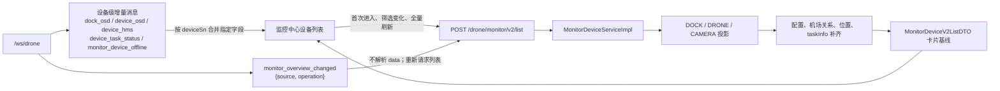
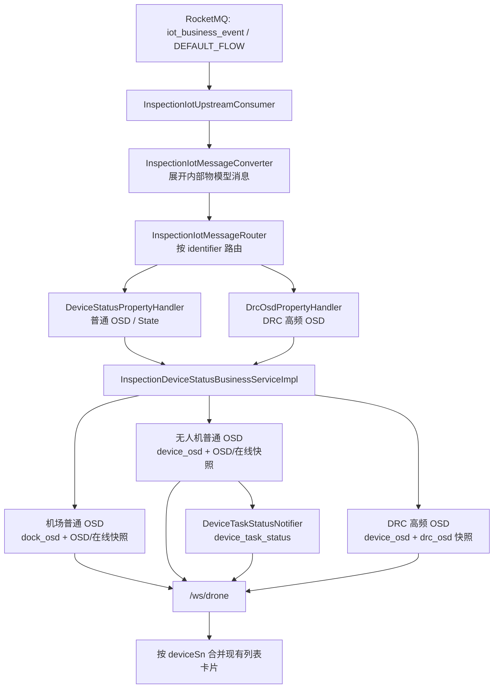

# P1 监控中心设备核心列表与刷新模型

> **证据等级：代码核对已确认（2026-08-13）**。本文描述 P1 当前后端契约，供监控中心前端梳理 `/drone/monitor/v2/list` 的初始查询、WebSocket 局部更新和全局刷新依赖。P1 仓库当前不包含监控前端实现，前端实际订阅代码仍需另行核实。

## 范围与核心接口

监控中心左侧设备卡片的初始数据入口是：

```text
POST /drone/monitor/v2/list
FlightMonitorController#getMonitorDeviceV2List
```

Controller 只接收 `MonitorDeviceV2ListReq` 并委托 `MonitorDeviceService#getMonitorDeviceV2List`。服务按 `deviceCategory` 查询 DOCK、DRONE、CAMERA 投影，按请求条件过滤，再补齐：

- 无人机与所属机场关系（`dockDeviceId`、`dockDeviceSn`）；
- 设备配置、通道、型号和空间名称；
- 卡片位置（无人机优先最后一次有效定位，缺失时回退所属机场空间）；
- CAMERA/DRONE 的任务状态快照。

当前返回模型是 `MonitorDeviceV2ListDTO`。设备实时字段不直接平铺在列表 DTO 中；任务字段位于 `taskInfo`，因此前端应把初始列表视为“卡片基线”，再按设备 SN 合并 WebSocket 数据。

## 接口与刷新链路总览



上图的边界是：HTTP 返回负责重建设备卡片集合，设备级 WebSocket 只更新已存在卡片的指定字段，全局事件只作为重新查询信号。`monitor_business_overview_changed` 属顶部业务统计链路，不触发本接口的全量刷新。

## 前端刷新总原则

1. 首次进入或需要重建卡片集合时，请求 `/drone/monitor/v2/list`，以返回列表覆盖本地设备集合。
2. 局部 WebSocket 消息按 `deviceSn` 定位设备卡片，只更新该 `biz_code` 约定的字段；未列出的字段不得被空值覆盖。
3. 收到全局 `monitor_overview_changed` 时，不使用消息 `data` 直接改卡片；重新请求列表（同时按页面需要重新请求 `/drone/monitor/overview`）。
4. `device_osd`、`dock_osd`、`device_hms` 和 `device_task_status` 的消息均是设备级推送，订阅和合并键必须与列表中的逻辑设备 `deviceSn` 一致。无人机卡片还要保留 `dockDeviceSn` 关系，不能把无人机消息错误合并到机场卡片。

## 局部刷新矩阵

| WebSocket `biz_code` | 设备定位 | 局部更新字段 | 当前 `data` 语义与证据 |
|---|---|---|---|
| `dock_osd` | 机场 `deviceSn` | `businessStatus`、`modeCode`、`droneInDock`、`flighttaskStepCode` | 普通机场 OSD 再包装后的遥测对象；`businessStatus` 是 P1 展示字段，不是 DJI 原始字段。入口：`InspectionDeviceStatusBusinessServiceImpl#handleHostTelemetry`。 |
| `device_osd` | 无人机 `deviceSn` | `businessStatus`、`modeCode`、`battery`、`latitude`、`longitude` | 普通无人机 OSD 和 DRC 高频 OSD 共用 `biz_code`。DRC 高频 OSD 缺少完整业务状态判定字段，当前 `businessStatus` 为 `null`，不能据此清空普通 OSD 已有状态。入口：`handleSubDeviceTelemetry`、`handleDrcOsd`。 |
| `device_hms` | 产生告警的设备 `sn` | `level`、`messageZh`、`messageEn` | `DeviceHmsDTO` 告警对象；后端同时聚合/更新 HMS 记录。入口：`InspectionAlarmBusinessServiceImpl#handle`。 |
| `device_task_status` | 任务状态对应设备 `deviceSn` | `deviceTaskStatus`、`deviceTaskStatusDesc`、`taskExecuteTime`、`taskEndTime`、`taskName`、`taskId`、`flightMileage`、`waylineMileage`、`algorithmRecognitionCount`、`taskProgress`、`planId`、`futureTaskCount` | 设备任务状态快照。DRONE 和 CAMERA 均使用此 `biz_code`；初始 `/v2/list` 中对应字段位于 `taskInfo`。入口：`DeviceTaskStatusNotifier`、`CameraTaskStatusNotifier`。 |
| `monitor_device_offline` | 离线设备 `deviceSn` | `data` | 当前 `MonitorBusinessStatusNotifier` 推送的是业务状态枚举值，通常为 `OFFLINE`，不是完整设备对象。前端应按设备键将业务状态更新为离线；若需要其他字段，仍以列表或缓存查询为准。 |

### `device_task_status` 与初始列表的映射

`MonitorDeviceV2ListDTO.taskInfo` 当前包含任务状态、描述、计划/任务 ID、任务名、执行时间、算法识别数、未来任务数，以及 CAMERA 的 `taskEndTime`、DRONE 的 `taskProgress`、`flightMileage`、`waylineMileage`。因此前端合并 `device_task_status` 时，应更新 `taskInfo` 子对象，而不是在卡片根对象新增一套平铺字段。

## P1 上行数据到设备列表增量的链路

下图从 P1 接收到 P2 Data Rule 已投递的上行消息开始；P2 如何产生该 RocketMQ 消息，以及 P3/P4 的协议处理，见 [DJI OSD 上行数据链路](../../flows/dji-osd-upstream-flow.md)。



普通无人机 OSD 写入普通 `osd:{deviceSn}` 快照后才触发 `DeviceTaskStatusNotifier`；DRC OSD 使用独立 `drc_osd:{droneSn}` 快照，且其 `device_osd.data.businessStatus` 当前为 `null`。因此，设备列表的增量合并不能让 DRC 消息清空普通 OSD 的业务状态。

## 影响范围

| 变更或异常发生点 | 对 `/v2/list` 的影响 | 需要同时核对的链路/边界 |
|---|---|---|
| DOCK、DRONE、CAMERA 投影、空间归属或设备关联 | 改变卡片集合、关系、筛选结果或位置回退依据 | `MonitorDeviceServiceImpl` 的三个投影查询与补齐逻辑；成功事务后的 `monitor_overview_changed`；设备主数据投影同步链路。 |
| 普通机场/无人机 OSD | 不重查列表，更新已有卡片的状态、模式、电量或坐标；无人机还可更新任务快照 | `InspectionIotUpstreamConsumer` → 状态 Handler → `InspectionDeviceStatusBusinessServiceImpl`；普通 `osd:{deviceSn}` 和在线快照。 |
| DRC 高频 OSD | 不重查列表，按无人机 SN 更新位置等字段；不能用其空 `businessStatus` 覆盖普通 OSD 状态 | `DrcOsdPropertyHandler`、`handleDrcOsd`、`drc_osd:{droneSn}`；DRC 与普通 OSD 快照隔离。 |
| 无人机或 CAMERA 任务状态 | 初始查询与实时消息都影响卡片 `taskInfo` | `monitor:device_task_status:{deviceSn}`、`DeviceTaskStatusNotifier`、`CameraTaskStatusNotifier`；按设备 SN 合并。 |
| 离线或最终业务状态变化 | `monitor_device_offline` 只更新设备离线状态；顶部业务统计另走刷新消息 | `MonitorBusinessStatusNotifier`、`monitor_business_overview_changed`；不把离线载荷当完整卡片。 |
| 地图标注、电子围栏、设备关联或设备投影同步 | 通过 `monitor_overview_changed` 触发前端重查列表 | `MonitorOverviewChangedEvent` → 事务提交后 `MonitorOverviewChangedNotifier`；事件 `data` 不是设备增量。 |

## 全局刷新

| `biz_code` | 推送通道 | 消息 `data` | 前端动作 |
|---|---|---|---|
| `monitor_overview_changed` | `/ws/drone` | `{source, operation}` | 重新请求 `/drone/monitor/v2/list`；若左上角基础统计也在当前页面，同时请求 `GET /drone/monitor/overview`。不要把 `source`/`operation` 当作统计数或设备增量。 |

当前已核实的触发来源包括地图标注、电子围栏和设备关联/空间归属变化；通知在事务提交后广播，批量操作通常只产生一次刷新事件。详细链路见 [监控中心左上角基础统计刷新 WebSocket](monitor-overview-websocket.md)。

## 与业务状态统计的边界

设备 OSD 业务状态变化还可能触发 `monitor_business_overview_changed`，它不是本页列出的设备列表局部字段消息。列表卡片的 `businessStatus` 由 `dock_osd`/`device_osd` 局部消息更新；顶部业务统计应按其独立事件重新请求业务概览接口，不能用 `monitor_overview_changed` 替代。

## 联调必验项

- 列表首次加载、按 DOCK/DRONE/CAMERA 分类查询和筛选条件变化时，确认 `/v2/list` 返回集合覆盖策略。
- 以机场 SN、无人机 SN、CAMERA SN 分别验证局部消息的设备定位；检查无人机的 `dockDeviceSn` 不被局部消息覆盖。
- 验证 DRC 高频 `device_osd` 的 `businessStatus=null` 不会清空普通 OSD 已有业务状态。
- 验证 `device_task_status` 的字段合并到 `taskInfo`，并覆盖任务结束时间、里程、进度和未来任务数。
- 验证 `monitor_device_offline.data` 的实际序列化值，并确认离线消息不会被误解析为完整设备对象。
- 验证 `monitor_overview_changed` 只触发重新查询；事务回滚时不应刷新。

## 代码证据

- Controller：`b-inspection-platform-core/src/main/java/com/xmkj/business/core/controller/admin/monitor/controller/FlightMonitorController.java`
- 列表组装：`b-inspection-platform-core/src/main/java/com/xmkj/business/core/service/monitor/impl/MonitorDeviceServiceImpl.java`
- 列表 DTO：`b-inspection-platform-core/src/main/java/com/xmkj/business/core/controller/admin/monitor/model/dto/MonitorDeviceV2ListDTO.java`
- 任务嵌套 DTO：`MonitorDeviceTaskInfoDTO.java`
- OSD 推送：`InspectionDeviceStatusBusinessServiceImpl.java`
- HMS 推送：`InspectionAlarmBusinessServiceImpl.java`
- 任务推送：`DeviceTaskStatusNotifier.java`、`CameraTaskStatusNotifier.java`
- 离线推送：`MonitorBusinessStatusNotifier.java`
- 全局刷新：`MonitorOverviewChangedNotifier.java`、`MonitorOverviewChangedEvent.java`
