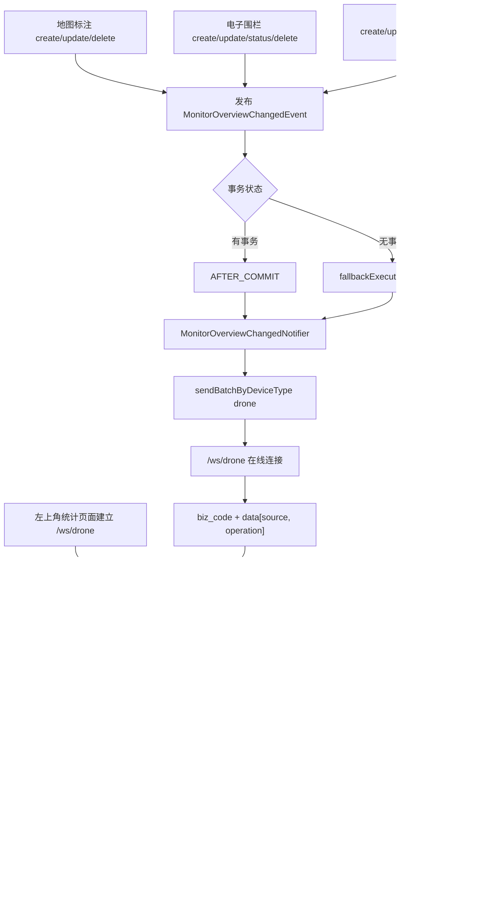

# P1 监控中心左上角基础统计刷新 WebSocket 链路

> 主题：`/ws/drone`，`biz_code=monitor_overview_changed`。  
> 证据状态：当前代码核对（2026-08-07）；本文描述现状，不是目标设计。

## 范围与结论

本文说明监控中心左上角基础统计的变更触发、事务事件、WebSocket 推送和刷新接口边界。这里的基础统计与 `monitor_business_overview_changed` 业务状态统计是两条不同链路。

结论先行：P1 不在 WebSocket 消息中计算或携带统计数字。地图标注、电子围栏或设备空间关联发生成功变更后，业务事务发布 `MonitorOverviewChangedEvent`；事务提交后由 `MonitorOverviewChangedNotifier` 向 `drone` 类型通道广播 `monitor_overview_changed`，前端收到后重新请求 `GET /drone/monitor/overview`，以接口返回值覆盖左上角统计。

## 全流程图



## 触发入口与事务边界

| 触发数据 | 触发操作 | 事件 source | 代码证据 |
|---|---|---|---|
| 地图标注 | `create`、`update`、`deleteById`、`updateStatus` | `MAP_ELEMENT` | `MapElementServiceImpl` |
| 电子围栏 | `createFlightZone`、`updateFlightZone`、`updateFlightZoneStatus`、`deleteFlightZone` | `FLIGHT_ZONE` | `FlightZoneServiceImpl` |
| 设备接入/空间归属 | 关联、批量关联、更新、删除、批量删除、缺失设备清理、解绑空间 | `MANAGE_DEVICE` | `DeviceAssociationService` |

这些入口在持久化操作成功后发布事件；事务回滚时不会进入正常的提交后监听路径。批量设备操作在一个业务事务内只发布一次事件。`MonitorOverviewChangedEvent` 的 `operation` 当前使用 `CREATE`、`UPDATE`、`DELETE`、`UNBIND_SPACE` 等字符串，消息消费者不应据此增量修改数字，而应重新拉取概览。

## 推送出口与消息载荷

`MonitorOverviewChangedNotifier#onChanged` 使用 `@TransactionalEventListener(phase = AFTER_COMMIT, fallbackExecution = true)`，调用 `IWebSocketMessageService#sendBatchByDeviceType("drone", ...)`。该接口把 `deviceType` 映射为 `/ws/{deviceType}`，因此目标通道为 `/ws/drone`；没有在线连接时服务直接记录并返回，不缓存待发消息。

外层消息结构由 `WebSocketMessageResponse` 统一封装：

```json
{
  "biz_code": "monitor_overview_changed",
  "deviceSn": "drone",
  "version": "1.0",
  "timestamp": 1710000000000,
  "data": {
    "source": "MAP_ELEMENT",
    "operation": "UPDATE"
  }
}
```

`data` 是刷新提示，不是统计快照。统计数字唯一应以 `GET /drone/monitor/overview` 返回为准。

## 左上角统计接口口径

`FlightMonitorController#getMonitorOverview` 暴露 `GET /drone/monitor/overview`，调用 `MonitorDeviceService#getMonitorOverview` 返回：

| 字段 | 当前计算口径 |
|---|---|
| `accessDeviceCount` | `listMonitorBusinessDeviceStatuses().size()`，即 `manage_device` 中活动且已绑定空间的 DOCK、DRONE、CAMERA 投影数量 |
| `mapAnnotationCount` | 地图标注表记录数 |
| `electronicFenceCount` | 电子围栏表记录数 |

其中 `accessDeviceCount` 会复用监控设备快照构建逻辑；集合统一要求 `is_deleted = 0 AND space_code IS NOT NULL`，拓扑缓存不参与统计集合判定，仅用于拓扑展示、父子关系和能力补充。它不是简单的 IoT 设备总数。详情以 `MonitorDeviceServiceImpl#listMonitorBusinessDeviceStatuses` 及 `IDeviceMonitorMapper` 的三个投影查询为准。

## 联调必验项

- 前端连接路径确实为 `/ws/drone`，并按外层 `biz_code` 分发；不要把它与 `monitor_business_overview_changed` 混用。
- 收到消息后重新请求 `GET /drone/monitor/overview`，不要使用 `data` 直接当作统计值。
- 分别验证标注、电子围栏、设备关联/解绑空间的成功操作；事务回滚不应刷新。
- 验证批量设备操作只触发一次刷新事件，以及无 WebSocket 在线连接时不会影响业务写入。
- `accessDeviceCount` 变化还受设备拓扑、空间绑定和快照查询口径影响；若前端显示与接口不一致，先核对该快照来源。

## 证据与边界

- 事件与监听：`MonitorOverviewChangedEvent`、`MonitorOverviewChangedNotifier`、`MonitorOverviewChangedPayload`。
- 触发入口：`MapElementServiceImpl`、`FlightZoneServiceImpl`、`DeviceAssociationService`。
- 统计接口：`FlightMonitorController#getMonitorOverview`、`MonitorDeviceServiceImpl#getMonitorOverview`。
- WebSocket 契约：`IWebSocketMessageService#sendBatchByDeviceType`、`WebSocketMessageServiceImpl`、`DeviceWebSocketConfigurer`、`WebSocketMessageResponse`。
- P1 仓库当前未包含监控前端实现；“收到消息后重新请求接口”是前后端联调契约，前端实际订阅与刷新代码需在前端仓库另行核实（`pending_verification`）。
