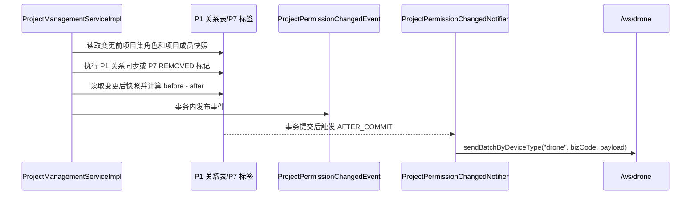

# P1 项目权限失效 WebSocket 广播

> 证据等级：P1 当前代码与 `ProjectManagementServiceTest` 已核对（2026-08-20）。本文记录已实现的项目权限失效广播链路；项目管理域的关系所有权和删除语义以 [项目集与项目管理设计](../../decisions/project-set-project-management.md) 为准。

## 范围与结论

项目或项目集移除、项目编辑导致成员被移除、项目集编辑导致角色或项目授权减少时，P1 通过现有 `/ws/drone` 全局前端通道广播业务码 `project_permission_changed`。消息数据是数组，前端根据 `userId` 选择自己的记录。

本链路不新增 WebSocket 路由、用户级会话索引、数据库表或 P7 调用；发送能力复用 `IWebSocketMessageService#sendBatchByDeviceType`。该通道是全局广播，消息中的用户 ID 和项目编码对连接到该通道的客户端可见，这是当前已确认的安全边界。

## 消息契约

```json
{
  "biz_code": "project_permission_changed",
  "timestamp": 0,
  "data": [
    {"userId": 1001, "projectCodeList": ["PROJECT-001"]}
  ]
}
```

| 字段 | 语义 |
| --- | --- |
| `biz_code` | 固定为 `project_permission_changed`，来自 P1 `BizCodeEnum.PROJECT_PERMISSION_CHANGED`。 |
| `userId` | 项目集关系中的业务用户 ID，供前端匹配当前登录用户。 |
| `projectCodeList` | 该用户在本次变更中失效的项目编码增量；项目集级完全移除时包含其原有项目。 |

只有至少一个用户存在失效项目编码时才发布事件。事件数组包含变更前后关系快照中的用户并集；当前实现对没有失效编码的并集用户保留空数组，但若整次变更没有任何失效编码，则不广播。

## 触发与判定链路



### 权限快照规则

`ProjectManagementServiceImpl#projectAccessSnapshot` 是广播差集的核心判定：

1. `INS_PM_ADMIN` 角色用户获得当前有效直属项目集的全部项目编码。
2. `project_member` 中的用户获得对应项目编码。
3. 角色和项目成员的结果按用户 ID 合并；同一用户的多个来源使用集合去重。
4. 失效列表为 `beforeAccess[userId] - afterAccess[userId]`。
5. 项目集移除的 after 快照为空；项目移除的 after 快照排除被移除项目。

因此，角色继承仍由项目集管理员角色和项目成员关系共同表达，不在 WebSocket DTO 中重复返回角色。项目编码仍使用 P1 `project_code`，与 `wayline_task.project_id` 保持同一业务标识。

### 触发入口

| 业务操作 | 操作标识 | 失效判定 |
| --- | --- | --- |
| 编辑项目集 | `PROJECT_SET_UPDATED` | 编辑前后项目集角色和各项目成员关系的项目编码差集。 |
| 编辑项目 | `PROJECT_UPDATED` | 编辑前后所属项目集快照的项目编码差集。 |
| 移除项目 | `PROJECT_REMOVED` | 被移除项目从 after 快照中排除。 |
| 移除项目集角色 | `PROJECT_SET_ROLE_REMOVED` | 删除角色后重新计算该项目集快照。 |
| 移除项目集 | `PROJECT_SET_REMOVED` | after 快照为空，相关用户失去全部项目编码。 |

创建操作、只修改名称/描述/坐标/空间且未造成项目权限失效的操作不会产生广播。

## 事务与失败边界

- 项目管理服务在事务内发布 `ProjectPermissionChangedEvent`。
- `ProjectPermissionChangedNotifier` 使用 `@TransactionalEventListener(phase = AFTER_COMMIT)`，所以事务回滚或前置任务状态校验失败时不会发送。
- WebSocket 发送异常由通知器记录项目集编码、操作和人数，不回滚已经提交的项目关系。
- 当前事件仅覆盖 P1 项目关系变化；P6 系统角色变化不经过该事件链路。
- `/ws/drone` 既有全局连接安全边界未改变；若未来要求用户级隐私隔离，应另行设计认证通道和按用户会话路由，不能仅扩展业务码。

## 代码证据

以下路径相对 P1 仓库根目录：

- `b-inspection-platform-common/src/main/java/com/xmkj/business/common/enums/BizCodeEnum.java`
- `b-inspection-platform-common/src/main/java/com/xmkj/business/common/project/model/ProjectPermissionWsDTO.java`
- `b-inspection-platform-core/src/main/java/com/xmkj/business/core/service/project/impl/ProjectManagementServiceImpl.java`
- `b-inspection-platform-core/src/main/java/com/xmkj/business/core/service/project/ProjectPermissionChangedEvent.java`
- `b-inspection-platform-core/src/main/java/com/xmkj/business/core/service/project/ProjectPermissionChangedNotifier.java`
- `b-inspection-platform-core/src/test/java/com/xmkj/business/core/service/project/ProjectManagementServiceTest.java`

## 验证

已运行：

```text
mvn -pl b-inspection-platform-core -am "-Dtest=ProjectManagementServiceTest" "-Dsurefire.failIfNoSpecifiedTests=false" test
```

结果：27 tests，0 failures，0 errors。测试覆盖项目移除权限差集、事件发布和 `drone` 通道业务码复用。
