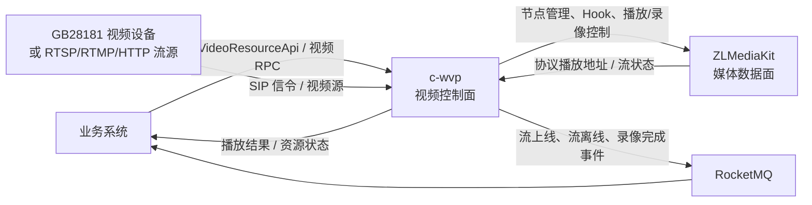

# P3-1：视频流管理平台网关关键入口地图

> **证据等级：代码与仓库说明核对已确认（2026-09-03）。** 本页描述 `c-wvp` 已实现的视频控制边界；生产部署拓扑、视频 API 的调用服务与媒体节点路由策略仍须按运行配置和调用方核实。

## 范围

`c-wvp` 是视频控制面网关：以 GB28181/SIP 管理视频设备和通道，管理 ZLMediaKit（ZLM）媒体节点、拉流/推流资源、播放会话、协议播放地址及录像生命周期，并将受管资源的流状态和录像完成事件发布给业务系统。

它**不**承载 ZLM 的实际媒体转发、转协议或转码数据面，也不负责巡检任务编排、IoT 遥测处理或设备控制协议转换。视频控制成功不等于媒体数据已经可播放；仍须核对 ZLM 节点、设备/流源网络和播放地址。

## 按任务读取

| 场景 | 首选入口 | 阅读顺序 |
| --- | --- | --- |
| 国标设备、通道、实时预览或云台控制 | `xmkj/controller/VideoRpcController.java` | 设备/通道校验 → SIP 播放邀请或 PTZ → `IMediaServerService` 返回播放地址。 |
| 业务侧视频资源、拉流/推流创建或资源播放 | `xmkj/controller/VideoResourceRpcController.java` | `VideoResourceApi` 契约 → `VideoResourceArchiveService` → 拉流/推流服务或通道播放 → ZLM 流状态与协议 URL。 |
| 开始、停止或查询录像 | `xmkj/service/VideoResourceRecordingService.java` | 资源定位 → ZLM 录像 API → Redis 中的录像状态 → 云录像记录查询。 |
| 流上线/离线或录像完成后业务侧未感知 | `xmkj/mq/MediaEventMqProducer.java` | ZLM 媒体事件 → 资源归属解析 → RocketMQ 媒体事件发布 → 目标业务消费者与其订阅配置。 |
| 媒体节点不可用、播放 URL 缺失或 RTP 会话异常 | `media/`、`src/main/resources/application.yml` | 默认媒体节点 → ZLM REST/Hook 配置 → RTP/播放会话 → 设备或流源网络。 |

## 已确认的控制链路

- `VideoResourceRpcController` 实现 `c-video-api` 的 `VideoResourceApi`，覆盖资源查询、拉流/推流资源维护、播放与停止、录像控制和媒体配置读取。
- `VideoRpcController` 提供国标设备通道查询、设备通道播放/停止、流地址查询与 PTZ 控制；播放地址可按 WS-FLV、FLV、HLS、WebRTC、RTSP 或 RTMP 选择实际可用协议。
- `VideoResourceRecordingService` 调用 ZLM 的开始/停止录像能力，并以业务 ID 与视频资源 ID 维护录像状态；录像完成事件由 `MediaEventMqProducer` 在可解析资源归属时发布。
- `MediaEventMqProducer` 只为已归档的拉流或推流资源发布流状态消息；没有资源归属的底层流事件不会被当作业务视频资源事件。

## 接口与数据边界

- `c-wvp` 维护视频资源到流标识、媒体节点、拉流/推流配置、通道和录像之间的映射；调用方不应自行拼接媒体节点地址替代资源查询或播放接口。
- ZLM 负责媒体数据传输、协议分发和转码等能力；`c-wvp` 通过节点管理、REST/Hook 与播放/录像控制对接它。ZLM 具体端口、密钥、节点数量与部署关系属于运行配置，不在本页固化。
- RocketMQ 媒体事件是异步状态通知，不替代播放、录像控制接口的同步结果；消费者、Topic 的实际授权与重试语义按消息契约和运行配置核实。

## 代码证据

以下路径相对 `c-wvp` 仓库根目录：

- `README.md`：GB28181、部标 808/1078、设备/通道、级联、流媒体节点和录像能力说明。
- `pom.xml`：Spring Boot、SIP、Redis、RocketMQ、WebSocket 与 `c-video-api` 依赖。
- `src/main/java/com/genersoft/iot/vmp/xmkj/controller/VideoResourceRpcController.java`：视频资源 API 的实现与播放、录像控制。
- `src/main/java/com/genersoft/iot/vmp/xmkj/controller/VideoRpcController.java`：视频通道、实时播放、停止播放与 PTZ 控制。
- `src/main/java/com/genersoft/iot/vmp/xmkj/service/VideoResourceRecordingService.java`：ZLM 录像生命周期。
- `src/main/java/com/genersoft/iot/vmp/xmkj/mq/MediaEventMqProducer.java`：流状态和录像完成事件发布。

## 待核实项

- 生产环境的 `c-video-api` 调用方、版本兼容策略及访问鉴权边界。
- ZLM 与 `c-wvp` 是同机还是独立/集群部署，以及节点选择与故障转移策略。
- 各业务消费者对流状态和录像完成事件的订阅、幂等和补偿实现。
