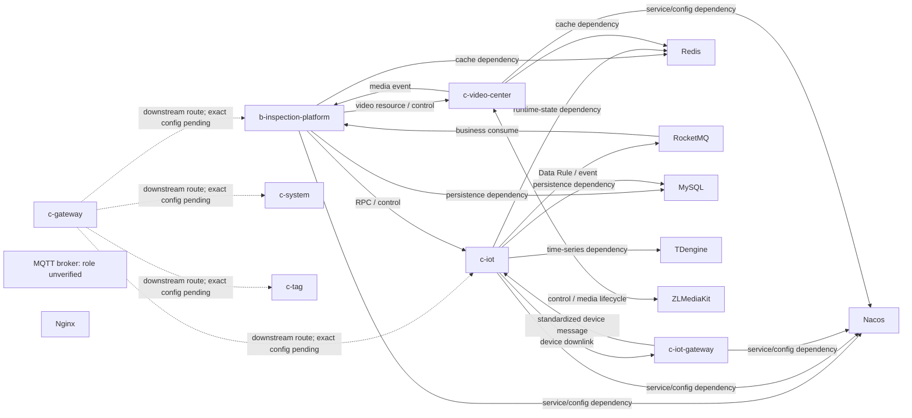

# company-dev Deployment Architecture V1

## Scope and evidence boundary

This page is the durable, non-sensitive deployment map for the logical `company-dev` environment. It records only
that a user-authorized read-only Docker inventory observed the listed deployment units. Current lifecycle state,
physical target, container identity, image, endpoint, port, mount, and log location are snapshot data and remain in
ignored `.runtime.local/company-dev/` files.

## Repository to runtime map

| Repository | Logical service or component | Runtime form | `company-dev` | Confidence |
| --- | --- | --- | --- | --- |
| `c-drone-inspection` | `b-inspection-platform` | service container | observed | Docker inventory + source mapping |
| `c-iot-server` | `c-iot` | service container | observed | Docker inventory + source mapping |
| `c-iot-gateway` | `c-iot-gateway` | service container | observed; lifecycle is snapshot-only | Docker inventory + source mapping |
| `c-wvp` | `c-video-center` | service container | observed | Docker inventory + source mapping |
| `ad-iot-codec-adapter-dji` | DJI adapter | embedded / in-process component | source-confirmed only | source mapping; runtime loading not observed |
| `ad-iot-codec-adapter-robotDog-zhiyuan` | robot-dog adapter | embedded / in-process component | unknown | repository role only |
| `c-gateway` | `c-gateway` | service container | observed | Docker inventory + source mapping |
| `c-system` | `c-system` | service container | observed | Docker inventory + source mapping |
| `c-tag` | `c-tag` | service container | observed | Docker inventory + source mapping |
| `star-framework` | shared framework capability | build-time dependency provider | not a deployment unit | source and dependency evidence |

## Middleware map

| Logical middleware | Classification | `company-dev` evidence | Boundary |
| --- | --- | --- | --- |
| MySQL | verified deployed | container observed | relational persistence |
| Redis | verified deployed | container observed | runtime/cache dependency; ownership remains service-specific |
| Nacos | verified deployed | container observed | service discovery and configuration access |
| RocketMQ | verified deployed | nameserver and broker containers observed | asynchronous message boundary |
| Nginx | verified deployed | reverse-proxy containers observed | ingress/proxy role; precise routing is snapshot-only |
| ZLMediaKit | verified deployed | container observed | media data plane used by video-control domain |
| TDengine | verified deployed | container observed | time-series persistence boundary requires per-service confirmation |
| MQTT / EMQX | unknown runtime role | MQTT-named container observed | broker implementation, health, and clients not verified |

## Logical topology

Solid arrows are source-confirmed logical calls, events, or dependencies; dotted gateway arrows only state that a
downstream route is expected and require route-configuration verification. The Docker inventory proves deployment
presence only where stated above; it does not prove every edge is active in the current snapshot. `star-framework` is
intentionally absent because it is a build-time capability provider, not a runtime deployment unit.
