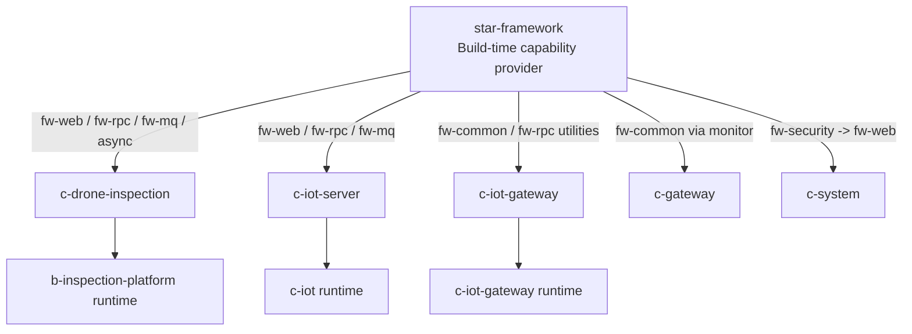

# Shared Framework Capability Provenance

## 范围与模型

本页回答无人机巡检平台当前源码中的 trace、MDC、日志、Feign、MQ 与异步能力由谁提供，以及哪些服务消费了
它们。`star-framework` 是 Build-time Dependency / Cross-cutting Capability Provider，不是 Runtime
Service；部署拓扑不得把它当成容器、JAR 或网络节点。

源码结论与 runtime 结论分开表述。`star-framework` 当前 checkout 为 `2.3.0-SNAPSHOT`，而业务仓库声明的版本并不完全
相同；除 `v2.1.0` 和 `v2.2.2` tag 中已直接核验的类外，不能把当前 branch 直接当成任何运行容器的
精确实现。

## Dependency 与版本漂移

| Repository | 声明的 framework version | Relevant modules / source seam | Confidence |
| --- | --- | --- | --- |
| `c-drone-inspection` | `2.3.0-SNAPSHOT` | 直接依赖 `fw-web`、`fw-rpc`、`fw-mq`、`fw-async-task`；下载任务提交 `AsyncTaskClient` | source dependency verified；运行 JAR version unknown |
| `c-iot-server` | `2.3.0-SNAPSHOT` | 直接依赖 `fw-web`、`fw-rpc`、`fw-mq`；`IotBusinessEventProducer` 使用 `StarMQProducer` | source dependency verified；运行 JAR version unknown |
| `c-iot-gateway` | `2.2.0` | 直接依赖 `fw-rpc`；`fw-web` 被注释禁用；HTTP/MQTT/TCP/Custom 入口直接调用 framework MDC utility | source dependency and entry ownership verified；运行容器未启动 |
| `c-gateway` | `2.1.1` BOM | `fw-monitor` 传递引入 `fw-common`；Reactor MDC/ SkyWalking hook 与 access logging 由自身实现 | source seam verified；`2.1.1` exact framework tag unavailable |
| `c-system` | `2.3.0` | `fw-security` 传递依赖 `fw-web`；直接使用 `MdcTracerUtils` 并声明 Feign API | source dependency verified；`2.3.0` immutable release mapping needs verification |

`star-framework` `v2.1.0` 已包含 HTTP `RequestIdTraceFilter`，`v2.2.2` 已包含 Feign
`RequestIdFeignInterceptor` 与 MQ `MqTraceUtils`。这为 `c-iot-gateway` `2.2.0` 的相关 framework capability 提供版本
下限证据；Snapshot、`2.1.1` 和未标记的 `2.3.0` 仍须以构建产物或 repository commit 核验。

## Shared Framework Capability Map

| Capability | Provider | Consumers | Runtime effect | Confidence |
| --- | --- | --- | --- | --- |
| MDC key / ID utility | `star-framework` `MdcConstants` / `MdcTracerUtils` (`traceId`) | `c-drone-inspection`、`c-iot-server`、`c-iot-gateway`、`c-gateway`、`c-system` 源码均可达或直接调用 | 在当前线程读取或创建 traceId | source verified；per-container JAR version unknown |
| Servlet HTTP ingress | `star-framework` `fw-web` `RequestIdTraceFilter` | `c-drone-inspection`、`c-iot-server`；`c-system` 经 `fw-security -> fw-web` | 复用入站 `X-Request-Id`，缺失时创建 MDC 值并写 response header | code capability verified；runtime header behavior not verified |
| `c-iot-gateway` HTTP ingress | `c-iot-gateway` `TraceIdWebFilter` on framework utility | `c-iot-gateway` | 生成/复用 MDC 值并返回 header | source verified；current test runtime not running |
| `c-iot-gateway` MQTT / TCP / Custom ingress | `c-iot-gateway` handlers on framework utility | `c-iot-gateway` | 按协议消息边界创建并清理本进程 MDC | source verified；not a framework protocol propagation feature |
| Feign HTTP propagation | `star-framework` `fw-rpc` `RequestIdFeignInterceptor` | `c-drone-inspection`、`c-iot-server`、`c-iot-gateway`、`c-system` 声明 `fw-rpc` | 将当前或新建 traceId 写入 outbound `X-Request-Id` | framework v2.1/v2.2 code verified；runtime chain and bean override not verified |
| Reactive gateway context | `c-gateway` `MdcSubscriber` / `LogHooks` | `c-gateway` | 从 SkyWalking Reactor context 写 MDC；access log 取 framework utility value | source verified；not `fw-web` behavior |
| Framework async task | `star-framework` `DefaultAsyncTaskClient` | `c-drone-inspection` download task submission | 保存 `traceId`，执行时写入并恢复 MDC | current framework `2.3.0-SNAPSHOT` and source seam verified；other async mechanisms unknown |
| RocketMQ header propagation | `star-framework` `StarMQProducer` / `MqTraceUtils` | `c-iot-server` `IotBusinessEventProducer` | producer adds `X-Request-Id`; utility can restore it for consumers | code capability and producer seam verified；end-to-end consumer use not verified |
| Logging pattern | Business repository Logback files | `c-drone-inspection`、`c-iot-server`、`c-iot-gateway`、`c-gateway`、`c-system` | records MDC `traceId` if the executing thread has one | source and bounded runtime output verified；not a framework supplied configuration |
| Exception / response | `star-framework` `fw-web` global exception / `CommonResult` | `c-drone-inspection`、`c-iot-server`、`c-system` web stack | common response and exception handling capability | dependency capability verified；per-service activation not reviewed here |

The arrows from `star-framework` are dependency/provenance relationships, not runtime network calls or deployment edges.

## Bounded Runtime Evidence

在用户授权的当前测试环境只读检查中，`b-inspection-platform`、`c-iot`、`c-gateway` 与 `c-system`
为运行容器；其 stdout 采样分别观察到 trace-shaped 值，P5 的近期 stdout 还出现 `X-Request-Id` 文本。此结果
证明这些容器当前至少有部分日志带 trace context，不证明它们的 framework artifact 版本、HTTP header 传播或跨服务
traceId 一致性。

`c-iot-gateway` 容器存在但为 `exited`。这是测试环境为避免两个 IoT Gateway 同时接收设备数据的有意部署
选择，而不是本轮故障结论；因此 P3 的 MQTT/TCP/Custom/HTTP trace 行为在当前环境均为 runtime not verifiable。
本页不保存主机、日志路径、业务日志或容器镜像等易变/敏感细节。

## Review Conclusions

### Question 1 — traceId owner

不存在单一 owner。`star-framework` 统一拥有 `traceId` key、生成 utility、Servlet filter、Feign interceptor、MQ helper 和
framework async task mechanism；`c-iot-gateway` 拥有 HTTP、MQTT、TCP、Custom 的 ingress 语义与何时创建/清理 context；
`c-gateway` 拥有 Reactive/SkyWalking context bridge。`c-drone-inspection`、`c-iot-server`、`c-system` 的 Servlet ingress
主要依赖 framework starter capability。结论是 **Gateway + shared framework 分层，且 `c-gateway` 另有一套 Reactive bridge**。

### Question 2 — `c-drone-inspection`、`c-iot-server`、`c-iot-gateway` 是否同一套日志与 trace 行为

不是完整的同一套。三者共享 `star-framework` 的 MDC key/utility，`c-drone-inspection` 与 `c-iot-server` 使用
`fw-web`，`c-iot-gateway` 使用 framework utility 加自身入口 handler；但 Logback pattern 是各仓库维护，
`c-iot-gateway` 禁用了 `fw-web` 并自建 HTTP、MQTT、TCP、Custom 逻辑。版本也有前两者 `2.3.0-SNAPSHOT` 与
`c-iot-gateway` `2.2.0` 的漂移。日志显示均可出现 traceId 是已观察事实；跨 Feign、异步或
RocketMQ 后仍是同一个值尚无 runtime evidence。

### Question 3 — Phase 2 `runtime-diagnose` 可依赖的 invariants

| Invariant | Guaranteed by code | Observed at runtime | Diagnostic use |
| --- | --- | --- | --- |
| `c-drone-inspection` / `c-iot-server` / `c-system` Servlet ingress has a traceId | framework starter capability; exact deployed artifact needs verification | their logs show trace-shaped values, header handling not sampled | usable as local-log correlation, not as universal header guarantee |
| `c-iot-gateway` HTTP ingress has a traceId | gateway filter + framework utility | not verifiable: gateway intentionally stopped | source-only until gateway runs |
| `c-iot-gateway` MQTT/TCP/Custom handler has a traceId during handling | gateway handler code + framework utility | not verifiable | local gateway log correlation only |
| Feign preserves the same traceId | framework interceptor is capable when active | not verified across any service pair | do not assume without paired request/response evidence |
| Framework async task preserves traceId | framework `AsyncTaskClient` path, used by inspection download flow | not verified | scoped to that task mechanism; not generic `@Async`/`CompletableFuture` |
| RocketMQ preserves traceId | only when framework `StarMQProducer` and matching restore helper are used | not verified | IoT business-event producer is a candidate; direct template paths are excluded |
| MQTT/TCP/custom propagates traceId across processes | not guaranteed | not verified | use device/request/message identifiers in addition to traceId |
| Log output contains `traceId` | business Logback patterns render MDC value | inspection/IoT/API gateway/system stdout samples contain trace-shaped context | missing value means no context was set on that execution path |

## Evidence

- `star-framework`: `MdcConstants`, `MdcTracerUtils`, `RequestIdTraceFilter`,
  `RequestIdFeignInterceptor`, `MqTraceUtils`, `DefaultAsyncTaskClient`, and tags `v2.1.0` / `v2.2.2`.
- `c-drone-inspection`: root/module POMs, `DownloadRecordServiceImpl`, `DownloadRecordResolveAsyncTaskHandler`, and bootstrap Logback.
- `c-iot-server`: root/module POMs, `IotBusinessEventProducer`, `DeviceMessageLogStore`, video RocketMQ consumers, and bootstrap Logback.
- `c-iot-gateway`: root/module POMs, `TraceIdWebFilter`, `IotMqttUpstreamHandler`, `IotTcpUpstreamHandler`,
  `CustomUpstreamCallbackHandler`, and bootstrap Logback.
- `c-gateway` / `c-system`: root/module POMs, Reactor MDC/access-log classes, `AdminAuthServiceImpl`, and their Logback files.
- Runtime: user-authorized read-only Docker inventory and stdout aggregate checks in the current test environment; no payload was retained.
